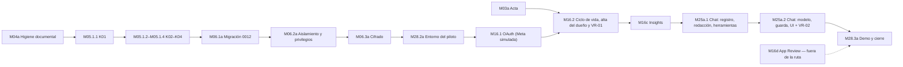

# Ruta `meta_first` — Roadmap (Enmienda 1) y plan de ejecución

**Versión:** 1.0 — 2026-09-24
**Estado:** `APROBADO PARA EJECUCIÓN`. `M04a` está cerrada y `G-DOCS` fue aprobado por el usuario el 2026-09-24. La siguiente microfase habilitada es `M05.1.1`.
**Base:** spec `meta_first` v1.0 (decisiones DEC-01 a DEC-21), revisión del repositorio en `main@247cae8`, la sesión de revisión en la que se tomaron esas decisiones y las correcciones T01 a T16 de la revisión externa. No quedan decisiones abiertas. Q-04 es un parámetro que se fija con mediciones en `M16c`.

Este documento reemplaza al `plan.md` anterior y contiene, además, el texto de la **Enmienda 1**. Desde `M04a`, `docs/ROADMAP.md` (v2.3) está archivado fuera del repositorio por decisión del usuario, y la Parte I de este documento es el roadmap vigente de la ruta: encabeza la jerarquía de fuentes de `AGENTS.md`. Tiene tres partes:

- **Parte I — Enmienda 1 al ROADMAP.** Qué cambia respecto de la versión 2.3 y las microfases de la ruta, con la plantilla operativa del ROADMAP.
- **Parte II — Plan de ejecución.** Para cada microfase: pasos, archivos, criterios que se verifican y trampas conocidas.
- **Parte III — Transversales.** Decisiones, intervenciones del usuario, verificación, hipótesis, riesgos y condiciones de parada.

Antes de `M04a`, `AGENTS.md` ponía a `docs/ROADMAP.md` por encima de la spec y de este plan, y obligaba a frenar. `M04a` resuelve esa contradicción: archiva el ROADMAP y pone esta Parte I en su lugar.

---

# Parte I — Enmienda 1 al ROADMAP v2.3

## I.1 Qué cambia y por qué

**Motivo.** Antes de construir la Rama A completa (`ads_catalog`: Meta, Tiendanube y GA4), la ruta valida con un dueño real un corte vertical: conectar Meta Ads en modo lectura, sincronizar gasto e impresiones diarios y consultarlos en un chat cuyas cifras siempre son verificables.

**Alcance del piloto (DEC-01).** Un usuario, una empresa y una cuenta publicitaria. El criterio de salida es que el dueño real de la cuenta piloto, con rol de tester en la app de Meta, complete con su propio login este recorrido: registro → conexión → sincronización → pregunta al chat. Además tiene que quedar evidencia redactada.

**Relación con el ROADMAP v2.3 (archivado):**

| Microfase original | En esta ruta | Relación |
|---|---|---|
| `M03` — Acta de producto, datos y privacidad | `M03a` — Acta de datos reales de Meta y del chat | Acota `M03` a lo que la ruta usa |
| `M04` (cerrada) | `M04a` — Higiene documental previa | Nueva |
| `M05.1.1` a `M05.1.4` (K01 a K04) | Las mismas | Se ejecutan con los ajustes de la spec |
| `M05.1.5` a `M05.1.12` | Diferidas | No las necesita la ruta |
| `M06.1`, `M06.2` | `M06.1a`, `M06.2a` | Acotadas a las tablas de la ruta |
| `M06.3` — Cifrado y rol acotado del worker | `M06.3a` | Mantiene el rol acotado (opción C) y las funciones `worker_api`, **sin worker** |
| `M07` — Jobs y worker | Diferida (D2) | La sincronización es manual |
| `M08.3` | No es dependencia de la ruta | Diferida |
| `M16.1` — OAuth Meta, solo `ads_catalog` | `M16.1` de la ruta | Permiso único `ads_read`, token de system user de integración |
| `M16.2` — Selección y ciclo de vida | `M16.2` de la ruta | Incluye VR-01 |
| `M16b` | Sin cambios | Fuera de la ruta |
| — | `M16c` — Insights diarios | Nueva |
| — | `M16d` — App Review y Business Verification | Nueva, **fuera de la ruta**: hace falta recién para escalar |
| `M25.1` a `M25.5` — Chat | `M25a.1`, `M25a.2` | Chat acotado a gasto e impresiones |
| `M28.2` — Despliegue | `M28.2a` — Entorno del piloto | Adelanta un despliegue mínimo |
| `M28.3` — Guion de demostración | `M28.3a` — Demo con el dueño y cierre | Nueva |

**Lo que no cambia:** el cierre `PASS` de M00, la selección de la Rama A, H-M00-01, las correcciones de M04 y el contrato de ejecución del ROADMAP, que desde `M04a` vive en `AGENTS.md` (una microfase por vez, evidencia reproducible, sin secretos en el chat, sin commits ni despliegues sin pedido explícito).

**Lo que la ruta no construye:**

- escrituras sobre Meta;
- onboarding público;
- más de una cuenta por empresa;
- workers, colas o programación automática;
- Tiendanube y GA4;
- reportes publicados;
- métricas derivadas, recomendaciones y explicaciones causales;
- base vectorial.

## I.2 Mapa de la ruta

- `M03a` se puede redactar en paralelo desde el principio, pero su aprobación es el gate que habilita el primer dato real: el alta del dueño y su autorización en `M16.2`.
- La primera autorización real ocurre en `M16.2`, cuando ya existen la selección de cuenta, el vencimiento de pendientes y la desconexión. Así, una credencial real nunca queda pendiente entre sesiones de implementación (T10).
- `M28.2a` va antes de `M16.1` porque la URI de redirección de Meta necesita el dominio fijo del piloto.

## I.3 Gates

| Gate | Se aprueba en | Habilita |
|---|---|---|
| `G-DOCS` | `M04a` | `M05.1.1` |
| `G-K01` | `M05.1.1` | `M05.1.2` a `M05.1.4` |
| `G-K02-K04` | `M05.1.4` | `M06.1a` |
| `G-DB-META` | `M06.2a` | `M06.3a` |
| `G-CRYPTO` | `M06.3a` | `M28.2a` |
| `G-ENTORNO` | `M28.2a` | `M16.1` |
| `G-ACTA-META` | `M03a` | Primer dato real: alta y autorización del dueño en `M16.2` |
| `G-OAUTH` | `M16.1` | `M16.2` |
| `G-VR01` | `M16.2` | `M16c` |
| `G-SYNC` | `M16c` | `M25a.1` |
| `G-CHAT-BASE` | `M25a.1` | `M25a.2` |
| `G-VR02` | `M25a.2` | `M28.3a` |
| `G-DEMO` | `M28.3a`, al completar la demostración | Cierre de la ruta. El piloto sigue hasta su fin, y entonces se ejecuta CA-67 (DEC-20) |

## I.4 Microfases

Plantilla del ROADMAP v2.3. El detalle de los pasos está en la Parte II. Los CA y DEC remiten a la spec v1.0.

### M04a — Higiene documental previa a la ruta

| Campo | Contenido |
|---|---|
| **ID** | `M04a` — ≤8 h |
| **Objetivo** | Dejar el repositorio en condiciones de ejecutar la ruta: sin datos reales en la documentación, con rutas correctas, con una única fuente normativa vigente y con los artefactos de la ruta comiteados. |
| **Implementación requerida** | Registrar los hallazgos nuevos en `HALLAZGOS.md`. Poner esta Parte I en el primer lugar de la jerarquía de `AGENTS.md`, trasladar allí el contrato de ejecución y corregir las rutas de `AGENTS.md` y de `m04-1-auditoria.md`. Quitar las referencias que presentan `docs/ROADMAP.md` como vigente. Ubicar spec, plan y revisión en `docs/FASES/FASE1/meta_first/`. |
| **Procedimiento del asistente** | Verificar `git status`. Editar sin copiar los datos reales en ningún artefacto nuevo. Verificar con búsquedas por patrón, no por valor. No reescribir el historial. |
| **Evidencia de cierre** | Diff de los archivos tocados. Salida vacía de la búsqueda por patrón. Lista de hallazgos registrados. |
| **Criterio de aceptación** | Ningún archivo del árbol contiene identificadores completos de cuentas publicitarias, nombres de negocios de terceros ni montos reales. `AGENTS.md` apunta a rutas que existen y pone esta Parte I en el primer lugar de la jerarquía. Ninguna fuente activa cita `docs/ROADMAP.md` como vigente. |
| **Pruebas** | Búsqueda por patrón sin resultados. Búsqueda de `ROADMAP.md` en fuentes activas sin referencias como vigente. `npm run verify`. |
| **Condición para avanzar** | `G-DOCS` aprobado por el usuario. |
| **Dependencias / habilita** | — / `M05.1.1` |
| **Intervención requerida del usuario** | Aprobar la Enmienda 1 (`G-DOCS`). Decidir, por separado, la visibilidad del repositorio y la reescritura del historial. |

### M05.1.1 — K01 `TenantContext`

| Campo | Contenido |
|---|---|
| **ID** | `M05.1.1` — ≤8 h |
| **Objetivo** | Fijar la identidad de tenant que consumen todas las operaciones del conector. |
| **Implementación requerida** | Contrato K01 con `user_id` verificado, `company_id` resuelto por membresía, `role = owner` y `request_id`. Una función de servidor lo construye a partir de `getClaims()` y de `requireCompanyMembership()`. Nunca acepta un tenant enviado por el navegador (CA-00, CA-00b). |
| **Procedimiento del asistente** | Pruebas primero. Schema Zod cerrado. Constructor `server-only`. Fixtures sintéticos. |
| **Evidencia de cierre** | Pruebas en verde y contrato exportado. |
| **Criterio de aceptación** | Un contexto solo existe si usuario, membresía y empresa coinciden. |
| **Pruebas** | Claim ausente, empresa manipulada, membresía inexistente, rol inválido y campo extra. |
| **Condición para avanzar** | `G-K01`. |
| **Dependencias / habilita** | `G-DOCS` / `M05.1.2` |
| **Intervención requerida del usuario** | Ninguna. |

### M05.1.2 — K02 `OAuthAttempt`

| Campo | Contenido |
|---|---|
| **ID** | `M05.1.2` — ≤8 h |
| **Objetivo** | Contrato del intento de autorización, de un solo uso. |
| **Implementación requerida** | CA-01 a CA-05, incluida CA-02b: el intento queda atado al actor, a la empresa y al navegador mediante el hash de un nonce guardado en cookie. |
| **Procedimiento del asistente** | Pruebas primero con fixtures inválidos. Primitivas compartidas en `contract/primitives.ts`. |
| **Evidencia de cierre** | Pruebas en verde. |
| **Criterio de aceptación** | El contrato no admite el `state` en claro, exige vencimiento y rechaza URLs de retorno fuera de la allowlist. |
| **Pruebas** | `state` en claro; vencimiento ausente; URL externa; proveedor distinto de `meta`; vinculación al navegador ausente. |
| **Condición para avanzar** | Pruebas en verde. |
| **Dependencias / habilita** | `G-K01` / `M05.1.3` |
| **Intervención requerida del usuario** | Ninguna. |

### M05.1.3 — K03 `IntegrationConnection`

| Campo | Contenido |
|---|---|
| **ID** | `M05.1.3` — ≤8 h |
| **Objetivo** | Contrato de la conexión, con separación entre el registro interno y el DTO público. |
| **Implementación requerida** | CA-06 (reescrito), CA-07 a CA-09 y CA-09b. Estados: `pending_selection`, `active`, `needs_reauth` y `disconnected`. Moneda en ISO 4217 y zona en IANA, obligatorias salvo en `pending_selection`. |
| **Procedimiento del asistente** | Pruebas de serialización del DTO y de los errores redactados. No se prueba "rechazar texto con forma de token" en todos los campos. |
| **Evidencia de cierre** | Pruebas en verde. |
| **Criterio de aceptación** | El DTO no tiene ningún campo de credencial. Las transiciones no declaradas se rechazan. |
| **Pruebas** | Transición inválida; moneda o zona inválida fuera de `pending_selection`; error que incluye una URL con parámetros. |
| **Condición para avanzar** | Pruebas en verde. |
| **Dependencias / habilita** | `M05.1.2` / `M05.1.4` |
| **Intervención requerida del usuario** | Ninguna. |

### M05.1.4 — K04 `SecretCredential`

| Campo | Contenido |
|---|---|
| **ID** | `M05.1.4` — ≤8 h |
| **Objetivo** | Contrato de la credencial cifrada. |
| **Implementación requerida** | CA-10 a CA-13, CA-11b (AAD con empresa, conexión y proveedor) y CA-11c (tipo de token, app emisora, permisos y expiración nullable). |
| **Procedimiento del asistente** | Pruebas primero. Ningún fixture con forma de token real. |
| **Evidencia de cierre** | Pruebas en verde y barrel de exportación. |
| **Criterio de aceptación** | No existe ningún campo de texto plano. Falta IV, etiqueta o versión de clave y el contrato no valida. |
| **Pruebas** | Cada campo obligatorio ausente; credencial sin conexión. |
| **Condición para avanzar** | `G-K02-K04`. |
| **Dependencias / habilita** | `M05.1.3` / `M06.1a` |
| **Intervención requerida del usuario** | Ninguna. |

### M06.1a — Migración `0012`: rol, esquema, tablas y funciones

| Campo | Contenido |
|---|---|
| **ID** | `M06.1a` — ≤8 h |
| **Objetivo** | Crear la base del conector según DEC-03 y DEC-04: credenciales inaccesibles para los usuarios y toda escritura mediante `worker_api`. |
| **Implementación requerida** | Esquema `worker_api` no expuesto. Rol `praxa_integrations` (`LOGIN`, `NOBYPASSRLS`, sin contraseña en la migración). Tablas `public.oauth_attempts`, `public.integration_connections` y `private.integration_credentials`, en cascada desde `companies` (CA-68), con RLS y `force row level security` (CA-14), `revoke all` explícito antes de cada grant y restricciones por estado (CA-08). Intentos con propósito (CA-02c). Marca de purga pendiente (CA-38). Funciones `SECURITY DEFINER` de `worker_api`. Matriz de privilegios en el encabezado. |
| **Procedimiento del asistente** | Seguir el patrón de `0001` y `0004`: `set search_path = ''`, objetos calificados, `revoke all` y grants operación por operación. No modificar migraciones existentes (CB-03). |
| **Evidencia de cierre** | Migración aplicada al proyecto de pruebas; salida de `db:check:test` y `db:push:test`. |
| **Criterio de aceptación** | CA-02c, CA-03, CA-07, CA-08, CA-14 a CA-18 y CA-68. Cada función verifica que el actor sea miembro de la empresa y que la conexión pertenezca a ella. |
| **Pruebas** | Las de `M06.2a`. |
| **Condición para avanzar** | Migración aplicada al proyecto de pruebas sin errores. |
| **Dependencias / habilita** | `G-K02-K04` / `M06.2a` |
| **Intervención requerida del usuario** | Fijar la contraseña del rol en el proyecto de pruebas, fuera del repositorio. |

### M06.2a — Aislamiento, privilegios y procedimiento de cierre

| Campo | Contenido |
|---|---|
| **ID** | `M06.2a` — ≤8 h |
| **Objetivo** | Probar en la base, no en el código, el aislamiento, la matriz de privilegios y el borrado completo de una empresa. |
| **Implementación requerida** | pgTAP `08` (aislamiento con dos empresas sintéticas), `09` (privilegios como `anon`, `authenticated` y el rol de C; transiciones y purga) y `10` (procedimiento de cierre CA-67 sobre una empresa con reporte). `test:app` con la lectura efectiva de las tablas nuevas por la Data API. Conexión del rol de C en pruebas solo por `PRAXA_INTEGRATIONS_TEST_DB_URL`, verificada contra el proyecto desechable. |
| **Procedimiento del asistente** | Ejecutar sobre el proyecto de pruebas. Registrar el resultado de la hipótesis sobre el `RESTRICT` de `reports` (`0003`). |
| **Evidencia de cierre** | Salida de `test:policies` y de `test:app`. |
| **Criterio de aceptación** | CA-19 a CA-22. El rol de C no lee ninguna tabla. `authenticated` no ejecuta `worker_api`. El cierre deja cero filas de la empresa. |
| **Pruebas** | `npm run test:policies`, `npm run test:app` y `npm run verify`. |
| **Condición para avanzar** | `G-DB-META`. Si el cierre falla por el `RESTRICT`, se registra un hallazgo y se diseña la corrección en una migración nueva, sin modificar `0003`. |
| **Dependencias / habilita** | `M06.1a` / `M06.3a` |
| **Intervención requerida del usuario** | Ninguna. |

### M06.3a — Cifrado, cliente acotado y documentación de la excepción

| Campo | Contenido |
|---|---|
| **ID** | `M06.3a` — ≤8 h |
| **Objetivo** | Cifrar y descifrar credenciales en el servidor, y acceder a `worker_api` solo desde un módulo `server-only`. |
| **Implementación requerida** | Llavero `PRAXA_CREDENTIAL_KEYS` y versión actual. AES-256-GCM con IV aleatorio y AAD. Rotación (CA-25). Cliente `pg` del rol de C. `pg` pasa a `dependencies`. Extensión de `no-privileged-credentials`. Actualización de `SECURITY.md` y `ARCHITECTURE.md`. |
| **Procedimiento del asistente** | Pruebas primero. Recorrer el árbol para verificar CA-26. |
| **Evidencia de cierre** | Pruebas en verde y diff de la documentación. |
| **Criterio de aceptación** | CA-21 y CA-23 a CA-27, con CA-27 en su versión reescrita. |
| **Pruebas** | Ciclo completo; clave incorrecta; texto alterado; AAD distinto; versión ausente del llavero; rotación; credencial fuera del módulo permitido. |
| **Condición para avanzar** | `G-CRYPTO`. |
| **Dependencias / habilita** | `G-DB-META` / `M28.2a` |
| **Intervención requerida del usuario** | Generar las claves del llavero y cargarlas en `.env.local`. |

### M28.2a — Entorno del piloto

| Campo | Contenido |
|---|---|
| **ID** | `M28.2a` — ≤8 h |
| **Objetivo** | Tener una URL pública estable, con la base, la autenticación y el email funcionando, antes de registrar la redirección de Meta (DEC-07, DEC-08, DEC-18). |
| **Implementación requerida** | Proyecto de Vercel con dominio fijo y variables del servidor. Migraciones aplicadas al proyecto `app`. `site_url` y redirecciones de Supabase Auth. SMTP propio con el dominio verificado (SPF y DKIM). Verificación de que `worker_api` no está expuesto. |
| **Procedimiento del asistente** | Guiar y verificar; no ejecutar acciones de cuenta en nombre del usuario. Documentar la configuración sin valores secretos. |
| **Evidencia de cierre** | Lista de verificación completada, con capturas redactadas. |
| **Criterio de aceptación** | Un registro de prueba con una dirección que no pertenece al equipo de Supabase recibe el email de confirmación. El login funciona sobre el dominio. `/app/integraciones` responde por HTTPS. |
| **Pruebas** | Prueba de humo manual; `npm run verify`. |
| **Condición para avanzar** | `G-ENTORNO`. |
| **Dependencias / habilita** | `G-CRYPTO` / `M16.1` |
| **Intervención requerida del usuario** | Casi toda la microfase: cuentas, dominio, DNS, SMTP, variables y la contraseña del rol en el proyecto `app`. |

### M03a — Acta de datos reales de Meta y del chat

| Campo | Contenido |
|---|---|
| **ID** | `M03a` — ≤8 h |
| **Objetivo** | Declarar, antes del primer dato real, qué se guarda, para qué, dónde, por cuánto tiempo y quién lo ve. |
| **Implementación requerida** | Redactar `docs/FASES/FASE1/M03a/acta-meta.md` con el contenido mínimo de la sección III.6. Alinear la línea 181 de `SECURITY.md`. |
| **Procedimiento del asistente** | Redactar a partir de las decisiones. No afirmar cumplimiento legal: marcar lo que requiere evaluación profesional. |
| **Evidencia de cierre** | Acta aprobada por el usuario. |
| **Criterio de aceptación** | El acta cubre todos los puntos de III.6 y no contradice DEC-01 a DEC-18. |
| **Pruebas** | Revisión cruzada contra la spec. |
| **Condición para avanzar** | `G-ACTA-META`. |
| **Dependencias / habilita** | — (se redacta en paralelo) / primer dato real: alta y autorización del dueño en `M16.2` |
| **Intervención requerida del usuario** | Aprobar el acta. Informar al dueño lo que el acta le exige comunicar. |

### M16.1 — OAuth con Facebook Login for Business

| Campo | Contenido |
|---|---|
| **ID** | `M16.1` — ≤8 h |
| **Objetivo** | Implementar la autorización del dueño y el guardado cifrado de un token de system user válido, probado contra Meta simulada. |
| **Implementación requerida** | Constante de versión v26.0. Cliente HTTP con redacción y clasificación de errores, incluidas transporte y desconocido (CA-39). Rutas `iniciar` y `callback` con propósito `initial` o `reauth` (CA-28 a CA-34, CA-29b y CA-30 corregida). Creación de la conexión en `pending_selection` con la credencial cifrada. |
| **Procedimiento del asistente** | Pruebas con Meta simulada. **Sin autorización real**: esa ocurre en `M16.2` (T10). |
| **Evidencia de cierre** | Pruebas en verde. |
| **Criterio de aceptación** | CA-28 a CA-34, con CA-29b. |
| **Pruebas** | Unitarias y `test:app`. |
| **Condición para avanzar** | `G-OAUTH`. |
| **Dependencias / habilita** | `G-ENTORNO`, P-01 a P-03 / `M16.2` |
| **Intervención requerida del usuario** | P-01 a P-03 en Meta. |

### M16.2 — Selección de cuenta, ciclo de vida, alta del dueño y VR-01

| Campo | Contenido |
|---|---|
| **ID** | `M16.2` — ≤8 h |
| **Objetivo** | Pasar de `pending_selection` a `active` con una cuenta confirmada y probada, y completar VR-01 con el dueño real. |
| **Implementación requerida** | Listado paginado de cuentas delegadas (H-01). Confirmación de cuenta, moneda y zona, con verificación de vencimiento en la base (CA-37). Vencimiento de pendientes (DEC-17). Reautorización con generación esperada (CA-37c). Desconexión reanudable con revocación (CA-38, H-03). Escrituras en vuelo (CA-38c). |
| **Procedimiento del asistente** | Pruebas con Meta simulada. Después, el alta del dueño y VR-01. |
| **Evidencia de cierre** | VR-01 redactada: una respuesta real de Insights, registrada como cantidad de filas y campos presentes, sin montos. H-01 a H-03 resueltas. |
| **Criterio de aceptación** | CA-35 a CA-40, incluidas CA-37b, CA-37c y CA-38c. |
| **Pruebas** | Unitarias, `test:policies` y `test:app`. |
| **Condición para avanzar** | `G-VR01`. Si P-01 a P-04 no se pueden cumplir, se frena y se presenta la alternativa con User Access Token y sus consecuencias antes de cambiar DEC-02. |
| **Dependencias / habilita** | `G-OAUTH`, `G-ACTA-META`, P-04 / `M16c` |
| **Intervención requerida del usuario** | Abrir el registro, acompañar el alta del dueño y cerrar el registro. Coordinar con el dueño la autorización, la selección y la confirmación. |

### M16c — Sincronización manual de Insights diarios

| Campo | Contenido |
|---|---|
| **ID** | `M16c` — ≤8 h |
| **Objetivo** | Obtener gasto e impresiones diarios con snapshots inmutables, cobertura explícita y publicación atómica. |
| **Implementación requerida** | Migración `0013`: ejecuciones con arrendamiento y token de posesión, snapshots, días de snapshot y la tabla de cobertura `meta_daily_coverage` (CA-43), con captura parcial persistida (CA-43b). Funciones de `worker_api` para iniciar, publicar y fallar una ejecución, solo desde la ejecución vigente (CA-59). Precisión de punta a punta (CA-44b). Paginación, límites y reintentos. Botón de sincronización manual. |
| **Procedimiento del asistente** | Pruebas primero con Meta simulada. Fijar Q-04 con mediciones reales y registrarlo en la spec. |
| **Evidencia de cierre** | Pruebas en verde y una sincronización real redactada. |
| **Criterio de aceptación** | CA-41 a CA-47b, CA-44b y CA-56 a CA-60. |
| **Pruebas** | Unitarias, `test:policies` y `test:app`. |
| **Condición para avanzar** | `G-SYNC`. |
| **Dependencias / habilita** | `G-VR01` / `M25a.1` |
| **Intervención requerida del usuario** | Ninguna, salvo coordinar una sincronización real con el dueño. |

### M25a.1 — Chat: registro por consulta, redacción y herramientas

| Campo | Contenido |
|---|---|
| **ID** | `M25a.1` — ≤8 h |
| **Objetivo** | Tener todo lo determinístico del chat antes de conectar el modelo. |
| **Implementación requerida** | Migración `0014` con el registro por consulta (DEC-10, DEC-11, DEC-13). Redacción (CA-66). Herramientas cerradas con cálculo en SQL y valores como texto (CA-44b, CA-48, CA-49). Límites del chat (CA-70). Registro y voto por `worker_api` (CA-38c). |
| **Procedimiento del asistente** | Pruebas primero. |
| **Evidencia de cierre** | Pruebas en verde. |
| **Criterio de aceptación** | CA-48, CA-49, CA-61 a CA-66, CA-69 y CA-70. |
| **Pruebas** | Unitarias y `test:policies`. |
| **Condición para avanzar** | `G-CHAT-BASE`. |
| **Dependencias / habilita** | `G-SYNC` / `M25a.2` |
| **Intervención requerida del usuario** | Ninguna. |

### M25a.2 — Chat: modelo, afirmaciones verificadas, UI y VR-02

| Campo | Contenido |
|---|---|
| **ID** | `M25a.2` — ≤8 h |
| **Objetivo** | Que el dueño reciba respuestas en lenguaje natural cuyas cifras están vinculadas y verificadas contra resultados de herramientas (DEC-19). |
| **Implementación requerida** | Adaptador de DeepInfra (DEC-16) con esquema estricto. Orquestador. Salida `text` + `claims` y validación del servidor (CA-50, CA-50b, CA-50c). UI con período, zona, cobertura, frescura, aviso de registro, botones de utilidad y reintento (CA-51 a CA-55). Acceso al chat en la navegación. |
| **Procedimiento del asistente** | Pruebas obligatorias de CA-50b con fixtures sintéticos. Congelar el conjunto de evaluación antes de correr VR-02, con los umbrales de DEC-21. |
| **Evidencia de cierre** | Pruebas en verde e informe de VR-02 contra sus criterios. |
| **Criterio de aceptación** | CA-50 a CA-55 y VR-02 aprobada con los umbrales de DEC-21. |
| **Pruebas** | Unitarias adversarias y transcripciones reproducibles sintéticas. |
| **Condición para avanzar** | `G-VR02`. Si VR-02 falla, primero se diagnostica la causa. Cambiar de host es el último recurso y exige actualizar configuración, pruebas y `M03a`, además de `llm.ts`. |
| **Dependencias / habilita** | `G-CHAT-BASE` / `M28.3a` |
| **Intervención requerida del usuario** | Crear la cuenta de DeepInfra y cargar la clave. |

### M28.3a — Demo con el dueño y cierre del piloto

| Campo | Contenido |
|---|---|
| **ID** | `M28.3a` — ≤8 h |
| **Objetivo** | Cumplir el criterio de salida (DEC-01). La microfase se cierra al completar la demostración (DEC-20). Al finalizar el piloto, se borra todo con CA-67. |
| **Implementación requerida** | Guion de la demo. Recorrido completo del dueño con el usuario creado en `M16.2`. Evidencia redactada. Paso a Supabase Pro cuando el dueño use el piloto sin acompañamiento (DEC-08). Procedimiento de cierre del piloto con CA-67, que se ejecuta al finalizar el piloto. |
| **Procedimiento del asistente** | Preparar el guion y la lista de verificación. Durante la demo, no tocar datos reales fuera de la aplicación. |
| **Evidencia de cierre** | Lista de verificación de la demo, redactada. Al finalizar el piloto, lista de verificación de CA-67. |
| **Criterio de aceptación** | El dueño completó el recorrido con su propio login. Al finalizar el piloto, y después de CA-67, no quedan filas de la empresa y el usuario está eliminado. |
| **Pruebas** | La lista de verificación. |
| **Condición para avanzar** | `G-DEMO` al completar la demostración. |
| **Dependencias / habilita** | `G-VR02` / — |
| **Intervención requerida del usuario** | Coordinar con el dueño, ejecutar los pasos de CA-67 que requieren dashboard y quitar al dueño como tester. |

### M16d — App Review y Business Verification (fuera de la ruta)

| Campo | Contenido |
|---|---|
| **ID** | `M16d` |
| **Objetivo** | Que dueños sin rol en la app puedan conectar. Necesario para escalar, no para la demo. |
| **Implementación requerida** | Business Verification, Advanced Access para `ads_read` y para `public_profile`. |
| **Condición para avanzar** | No bloquea ninguna microfase de la ruta. |
| **Intervención requerida del usuario** | Todo: trámites, verificación del negocio y del dominio, y App Review. |

---

# Parte II — Plan de ejecución

Cada microfase es una sesión. Al terminarla se corre la verificación, se registra la evidencia y se frena: no se encadena la siguiente sin un pedido explícito. Las rutas de archivos que no existen todavía son **sugeridas**; si al implementar aparece una mejor ubicación dentro del mismo módulo, se registra el cambio y no se considera desvío.

## Precondiciones de toda la ruta

1. `G-DOCS` está aprobado: la Enmienda 1 (Parte I) está comiteada en este documento y `AGENTS.md` la pone primera en la jerarquía.
2. `git status` está limpio, o los cambios ajenos quedaron preservados.
3. En las microfases con base de datos, `npm run db:check:test` apunta al proyecto desechable. Las pruebas nunca se corren contra el proyecto `app` (CB-04).
4. Ningún secreto se pega en el chat. Las claves van en `.env.local`, en las variables de Vercel o en el dashboard de Supabase.
5. Ningún diff, log, fixture ni evidencia contiene tokens, secretos, montos reales ni identificadores completos de cuentas (CB-02).
6. Los despliegues al entorno del piloto (el push que dispara Vercel y el `db:push` de una migración al proyecto `app`) se hacen solo con un pedido explícito del usuario, siempre después de haber verificado la migración en el proyecto de pruebas.
7. Los CA y DEC que se citan remiten a la spec v1.0. Si una microfase cambia un criterio, se actualizan la spec y este plan en la misma sesión.

---

## II.1 `M04a` — Higiene documental previa

| Paso | Acción | Archivos | Verificación |
|---:|---|---|---|
| 1 | ~~Redactar las líneas 82 y 92 de `docs/ROADMAP.md`~~. Sin efecto: el usuario quitó el ROADMAP del árbol. Solo se verifica que el árbol no contenga los datos | — | Búsqueda por patrón `act_[0-9]{6,}` sin resultados en todo el árbol (`git ls-files -co --exclude-standard`) |
| 2 | Registrar los hallazgos de la sección III.7, sin repetir datos reales. Si los IDs sugeridos chocan con los existentes, seguir la numeración vigente | `docs/HALLAZGOS.md` | Cada hallazgo tiene ID, impacto, evidencia y microfase asignada |
| 3 | Corregir `docs/microfases/<ID>/` por la estructura real `docs/FASES/FASE1/<MF>/`. Poner la Parte I de este plan primera en la jerarquía y trasladar a `AGENTS.md` el contrato de ejecución del ROADMAP v2.3 | `AGENTS.md`, `docs/_templates/prompt-implementacion.md` | Las rutas citadas existen |
| 4 | Corregir la cita del nombre anterior del roadmap | `docs/FASES/FASE1/MF04/m04-1-auditoria.md` | — |
| 5 | ~~Incorporar la Parte I en `docs/ROADMAP.md` como v2.4~~. Reemplazado: la Parte I queda como roadmap vigente dentro de este plan. Se quitan las referencias que presentan `docs/ROADMAP.md` como vigente | Este plan, `spec.md`, `README.md`, `docs/README.md`, `docs/_templates/microfase.md`, `.claude/agents/auditor-gate.md`, `.claude/agents/revisor-microfase.md`, `.env.example` (comentario) | Ninguna fuente activa cita `docs/ROADMAP.md` como vigente |
| 6 | Ubicar spec, plan y revisión en `docs/FASES/FASE1/meta_first/` (los enlaces relativos de la spec y de la revisión asumen ese nivel) | `docs/FASES/FASE1/meta_first/` | Los enlaces resuelven |
| 7 | Actualizar el estado del proyecto | `docs/PROJECT_STATE.md` | Refleja la ruta y la próxima microfase |

**Cierre:** `npm run verify` y aprobación de `G-DOCS`.

**Redefinición aprobada por el usuario (2026-09-24).** El usuario quitó `docs/ROADMAP.md` del árbol en `af1babd` porque no lo sigue por ahora. Con su aprobación, los pasos 1 y 5 se reemplazan como figura arriba, el contrato de ejecución pasa a `AGENTS.md` y el paso 5 incluye archivos fuera de la tabla original.

**Trampa conocida.** Para verificar el paso 1, se busca **por patrón**, nunca por el valor. Un `grep` con el identificador real deja una copia en el historial de la terminal y en la evidencia. Y corregir el HEAD no borra el dato del historial de Git: esa decisión es del usuario y no forma parte de esta microfase.

---

## II.2 `M05.1.1` — K01 `TenantContext`

| Paso | Acción | Archivos | Verificación |
|---:|---|---|---|
| 1 | Pruebas primero: claim ausente, empresa manipulada, membresía inexistente, rol inválido y campo extra | `tests/unit/tenant-context.test.ts` | Fallan en rojo por la razón esperada, no por errores de importación |
| 2 | Schema Zod cerrado: `user_id`, `company_id`, `role = owner`, `request_id` | `src/modules/tenant/context.ts` | CA-00 |
| 3 | Constructor `requireTenantContext()` con `import 'server-only'`. Usa `requireUserForAction()` y `requireCompanyMembership()` y genera `request_id` con `crypto.randomUUID()` | mismo archivo | CA-00b |

**Cierre:** `npm run verify`.

**Trampa conocida.** El constructor no recibe parámetros que vengan del cliente. Si una Server Action necesita el K01, lo construye adentro; nunca lo recibe como argumento.

---

## II.3 `M05.1.2` a `M05.1.4` — Contratos K02 a K04

Sin base de datos ni red. TypeScript y Zod, con el estilo de `src/modules/reporting/contract/`.

| Paso | Acción | Archivos | Verificación |
|---:|---|---|---|
| 1 | Pruebas primero: fixtures inválidos de los tres contratos | `tests/unit/integration-contracts.test.ts` | Rojo esperado |
| 2 | Primitivas: proveedor, estados, allowlist de retorno, clase de error, error redactado | `src/modules/integrations/contract/primitives.ts` | — |
| 3 | K02 `OAuthAttempt`, con `browser_binding_hash`, `actor_user_id` y `company_id` | `src/modules/integrations/contract/oauth-attempt.ts` | CA-01 a CA-05 y CA-02b |
| 4 | K03: registro interno y DTO público **separados** | `src/modules/integrations/contract/connection.ts` | CA-06 a CA-09b |
| 5 | K04, con AAD y metadatos del token | `src/modules/integrations/contract/credential.ts` | CA-10 a CA-13 y CA-11b/c |
| 6 | Barrel de exportación | `src/modules/integrations/contract/index.ts` | — |
| 7 | Pruebas de serialización: el DTO no expone campos de credencial y un error con URL sale redactado | mismo archivo de pruebas | CA-06 y CA-09 |

**Cierre:** `npm run verify`.

**Trampa conocida.** CA-06 se cumple por construcción: el DTO es otro tipo, no el registro filtrado. Si el DTO se arma con un `omit` sobre el registro, un campo nuevo del registro aparece en el DTO sin que nadie lo decida.

---

## II.4 `M06.1a` — Migración `0012`

Una sola migración nueva: `supabase/migrations/0012_integrations.sql`. No se toca ninguna existente.

| Paso | Acción | Verificación |
|---:|---|---|
| 1 | Encabezado con la matriz de privilegios de la sección 7 de la spec | CA-16/17 |
| 2 | `create schema worker_api`; `revoke all on schema worker_api from public, anon, authenticated`; `alter default privileges in schema worker_api revoke execute on functions from public` | Base de CA-21 |
| 3 | `create role praxa_integrations login nobypassrls noinherit` **sin contraseña**; `grant usage on schema worker_api to praxa_integrations` | Rol de C |
| 4 | Enums: `integration_provider` (`meta`), `connection_status` (`pending_selection`, `active`, `needs_reauth`, `disconnected`) | CA-05 y CA-07 |
| 5 | `public.oauth_attempts`: `company_id` (cascada), `actor_user_id`, `purpose` (`initial` o `reauth`), `expected_connection_id`, `expected_generation`, `state_hash`, `browser_binding_hash`, `return_path`, `expires_at`, `consumed_at` | CA-01 a CA-03 y CA-02c |
| 6 | `public.integration_connections`: `company_id` (cascada), `provider`, `status`, `external_account_id`, `client_business_id`, `currency`, `timezone`, `credential_generation`, `pending_expires_at`, `purge_requested_at`, `current_sync_run_id`, `last_error_class`, `last_error_message`. `check`: moneda, zona y cuenta obligatorias **solo** en `active` y `needs_reauth`; nulas permitidas en `pending_selection` y en `disconnected` | CA-07, CA-08, CA-09, CA-09b y CA-38 |
| 7 | Índice único parcial: una conexión viva (`pending_selection`, `active`, `needs_reauth`) por empresa. Unicidad sobre `(company_id, provider, external_account_id)` | CA-18 |
| 8 | `private.integration_credentials`: `connection_id` (PK, cascada), `company_id`, `ciphertext`, `iv`, `auth_tag`, `key_version`, `token_type`, `issued_for_app_id`, `granted_scopes`, `expires_at` nullable | CA-10 a CA-13 y CA-15 |
| 9 | En cada tabla nueva: `revoke all ... from public, anon, authenticated` explícito; `enable row level security` y `force row level security`. Política de `select` en conexiones con `private.is_company_member(company_id)`. Recién después, `grant select on public.integration_connections to authenticated`. Ningún otro grant | CA-14, CA-16 y CA-20 |
| 10 | Funciones de `worker_api` (lista abajo), todas `SECURITY DEFINER`, `set search_path = ''`, con `revoke all ... from public, anon, authenticated` y `grant execute ... to praxa_integrations` una por una | CA-21 |

**Funciones de `worker_api`.** Todas reciben `p_actor_user_id` y `p_company_id` y verifican en `public.company_members` que el actor pertenezca a la empresa. Las que reciben `p_connection_id` verifican además que la conexión sea de esa empresa.

| Función | Qué hace |
|---|---|
| `create_oauth_attempt` | Crea el intento con propósito, hash del `state`, hash de vinculación al navegador y vencimiento. `initial` solo si la empresa no tiene conexión viva; `reauth` guarda la conexión y la generación esperadas |
| `consume_oauth_attempt` | En **una sola sentencia** `update … where state_hash = … and browser_binding_hash = … and actor_user_id = … and company_id = … and consumed_at is null and expires_at > now() returning …`. Devuelve el intento, con su propósito, o un error tipado |
| `create_pending_connection` | Crea la conexión en `pending_selection` con `pending_expires_at` a 30 minutos (DEC-17) y guarda la credencial cifrada |
| `get_credential` | Devuelve el texto cifrado, el IV, la etiqueta y la versión, para descifrar en Node |
| `confirm_connection` | Pasa de `pending_selection` a `active` con cuenta, moneda y zona, solo si el probe fue exitoso (lo informa el servidor) y si `pending_expires_at > now()`, verificado en la base |
| `replace_credential` | Reautorización (CA-37c): solo si la generación actual es la esperada por el intento `reauth`; incrementa `credential_generation` |
| `mark_needs_reauth` | Transición con la clase de error |
| `begin_disconnect` | Pasa a `disconnected`, incrementa la generación y fija `purge_requested_at`. Primer paso de CA-38. Idempotente |
| `purge_connection` | Idempotente. Borra la credencial y los datos de la conexión y, al final, la fila de la conexión. Paso 3 de CA-38. Las migraciones `0013` y `0014` la reemplazan con `create or replace` para sumar sus tablas |
| `list_pending_purges` | Conexiones de la empresa que hay que purgar: pendientes vencidas y `disconnected` con la purga sin terminar. La usa la purga perezosa y reanudable |
| `count_credentials_by_key_version` y `rewrap_credential` | Rotación de claves (CA-25) |

**Cierre:** `npm run db:check:test` y `npm run db:push:test`.

**Trampa conocida.** Se agrega `force row level security` porque lo exigía la aceptación de `M06.2` en el ROADMAP v2.3 (`relforcerowsecurity`), no porque las migraciones existentes lo usen: ninguna de las once lo hace (H-E1-05). `force` no restringe a funciones `SECURITY DEFINER` cuyo dueño tiene `bypassrls`, como `postgres` en Supabase. Lo que protege `worker_api` es el chequeo dentro de cada función.

**Segunda trampa.** `private.is_company_member()` lanza una excepción sin `auth.uid()`. Por la conexión del rol de C no hay JWT, así que dentro de `worker_api` la pertenencia se verifica por `p_actor_user_id` contra `company_members`.

**Tercera trampa.** Las transiciones de estado se hacen cumplir en la función, no en Zod. Zod valida lo que manda tu código; la base valida lo que llega por cualquier vía.

---

## II.5 `M06.2a` — Aislamiento, privilegios y cierre

| Paso | Acción | Archivos | Verificación |
|---:|---|---|---|
| 1 | Aislamiento con dos empresas sintéticas: A no lee, modifica ni borra filas de B en ninguna tabla nueva | `supabase/tests/08_integration_isolation.test.sql` | CA-19 |
| 2 | Privilegios como `anon`, `authenticated` y `praxa_integrations`: el rol de C ejecuta sus funciones y no lee ninguna tabla; `authenticated` no ejecuta `worker_api` ni lee credenciales ni intentos; `PUBLIC` no tiene `EXECUTE` | `supabase/tests/09_integration_privileges.test.sql` | CA-16, CA-17, CA-21 y CA-22 |
| 3 | Transiciones: cada transición no declarada falla; pendiente → desconectada sin metadatos funciona; `confirm_connection` sobre una pendiente vencida falla aunque no haya corrido la purga; `replace_credential` con generación vieja falla; el consumo doble falla; un intento vencido, de otro actor, de otra empresa o con otro hash de vinculación no se consume | mismo archivo o `09b_…` | CA-02c, CA-03, CA-07, CA-08 y CA-37 |
| 3b | Purga: repetir `purge_connection` no falla ni deja datos; una `disconnected` sin purgar aparece en `list_pending_purges`; después de la purga, reconectar la misma cuenta crea una fila nueva sin violar unicidad | mismo archivo | CA-18 y CA-38 |
| 4 | Procedimiento de cierre (CA-67) sobre una empresa sintética **con reporte**, contexto e integración: borrado administrativo de la empresa, borrado del usuario, cero filas restantes | `supabase/tests/10_demo_closure.test.sql` | CA-67 y CA-68 |
| 5 | Lectura efectiva por la Data API: el usuario lee su conexión; no lee la de otra empresa; una llamada RPC a `worker_api` falla | `tests/app/integrations-data-api.test.ts` | Sección 5b de la spec |

**Cierre:** `npm run db:check:test`, `npm run test:policies`, `npm run test:app` y `npm run verify`.

**Trampa conocida.** `05_delete_carveout.test.sql` ya prueba que el borrado administrativo de una empresa arrastra sus versiones de contexto, pero **sin reportes**. La hipótesis abierta es que el `on delete restrict` de `reports` hacia las versiones de contexto (`0003`) haga fallar la cascada según el orden de ejecución. La prueba del paso 4 la resuelve. Si falla, se registra el hallazgo y se corrige en una migración nueva; `0003` no se toca.

**Segunda trampa.** Desde el 2026-10-30, Supabase deja de exponer por defecto las tablas nuevas de `public`. La matriz concede todo explícitamente, pero un grant olvidado produce un error de permisos (`42501`) en la Data API. Por eso el paso 5 lee por la Data API y no solo por SQL. Lo que sí es silencioso es una política RLS que no deja pasar filas, y eso lo cubren los pasos 1 y 2.

**Tercera trampa.** Las pruebas del rol de C usan solo `PRAXA_INTEGRATIONS_TEST_DB_URL`. Si falta, fallan; nunca recurren a la URL de la aplicación (T09). Una prueba omitida por falta de configuración no aprueba el gate (CB-06).

---

## II.6 `M06.3a` — Cifrado y cliente acotado

| Paso | Acción | Archivos | Verificación |
|---:|---|---|---|
| 1 | Pruebas primero: ciclo completo, clave incorrecta, texto alterado, AAD distinto, versión ausente del llavero, rotación | `tests/unit/credential-crypto.test.ts` | Rojo esperado |
| 2 | Lectura del llavero `PRAXA_CREDENTIAL_KEYS` (`versión:clave_base64`, 32 bytes cada una) y de `PRAXA_CREDENTIAL_KEY_CURRENT` | `src/modules/integrations/crypto/keyring.ts` | CA-25 |
| 3 | `seal` y `open` con AES-256-GCM (`node:crypto`), IV aleatorio de 12 bytes por operación, AAD = `company_id`, `connection_id` y proveedor | `src/modules/integrations/crypto/seal.ts` | CA-11b, CA-23 y CA-24 |
| 4 | Cliente `pg` del rol de C con `import 'server-only'`, por el pooler en modo transacción y sin prepared statements con nombre, según la guía de Supabase para node-postgres | `src/modules/integrations/db/worker-api.ts` | — |
| 5 | Repositorio de credenciales sobre `worker_api` | `src/modules/integrations/repository/credentials.ts` | CA-21 |
| 6 | Mover `pg` de `devDependencies` a `dependencies` | `package.json` | `npm run build` |
| 7 | Extender la prueba: `PRAXA_INTEGRATIONS_DB_URL` solo puede aparecer en el módulo del paso 4 | `tests/unit/no-privileged-credentials.test.ts` | CA-27 reescrita |
| 7b | Extender `check-target` para `PRAXA_INTEGRATIONS_TEST_DB_URL`: mismo proyecto que `SUPABASE_TEST_DB_URL`, `SUPABASE_TEST_IS_DISPOSABLE` activo y sin recurrir a `PRAXA_INTEGRATIONS_DB_URL` | `scripts/check-target.mjs`, `tests/unit/sql-test-target.test.ts` | T09 |
| 8 | Recorrido del árbol: ninguna clave, token o código OAuth en código, fixtures o documentación | `tests/unit/no-secrets-in-tree.test.ts` | CA-26 |
| 9 | Documentar la excepción acotada: una credencial, con sus capacidades enumeradas | `docs/SECURITY.md`, `docs/ARCHITECTURE.md` | Revisión |
| 10 | Variables nuevas en `.env.example`, **sin valores** (la prueba existente lo exige) | `.env.example` | `npm run test:unit` |

**Cierre:** `npm run verify`.

**Trampa conocida.** El IV no se deriva de nada ni se reutiliza: se genera al azar en cada operación y se guarda junto al texto cifrado. Reutilizarlo en GCM no debilita el cifrado, lo rompe.

**Segunda trampa.** Una versión de clave que no está en el llavero es un error explícito. Nunca debe terminar en un "no se pudo descifrar" genérico que se confunda con un texto alterado.

---

## II.7 `M28.2a` — Entorno del piloto

Casi todo es intervención del usuario. El asistente guía, verifica y documenta sin valores secretos.

| Paso | Quién | Acción | Verificación |
|---:|---|---|---|
| 1 | Usuario | Crear el proyecto de Vercel conectado al repositorio y asignarle un dominio fijo | Responde por HTTPS |
| 2 | Usuario | Cargar en Vercel las variables del servidor de la sección 5 de la spec y las existentes: `NEXT_PUBLIC_SUPABASE_URL`, `NEXT_PUBLIC_SUPABASE_PUBLISHABLE_KEY` y `NEXT_PUBLIC_SITE_URL` con el dominio del piloto. No cargar `SUPABASE_DB_URL` ni `SUPABASE_TEST_*` ni `PRAXA_INTEGRATIONS_TEST_DB_URL` | Checklist sin valores |
| 3 | Asistente y usuario | Aplicar `0012` al proyecto `app` con `npm run db:check` y `npm run db:push`, después de haberla verificado en el de pruebas. Fijar la contraseña del rol de C en `app` | `db:check` muestra el destino correcto |
| 4 | Usuario | Verificar en el dashboard que `worker_api` no está entre los esquemas expuestos por la Data API | Captura redactada |
| 5 | Usuario | En Supabase Auth del proyecto `app`, cargar `site_url` y las URLs de redirección con el dominio del piloto (en `config.toml` figuran solo las locales) | Captura redactada |
| 6 | Usuario | Contratar un proveedor de email transaccional, verificar el dominio (SPF y DKIM) y configurar el SMTP propio en Supabase | Captura redactada |
| 7 | Usuario | Registro de prueba con una dirección **que no pertenezca al equipo de Supabase** | Llega el email de confirmación y el login funciona |
| 8 | Usuario | Cerrar el registro público hasta el alta del dueño en `M16.2` (DEC-18) | Un registro nuevo es rechazado |
| 8b | Usuario | Con el registro cerrado, recuperación de contraseña completa de la cuenta de prueba: pedido, email y cambio | Las pantallas `forgot-password` y `reset-password` funcionan sobre el dominio |
| 9 | Asistente | Documentar la configuración del entorno sin valores | `docs/FASES/FASE1/meta_first/entorno.md` |

**Cierre:** `G-ENTORNO`.

**Trampa conocida.** Sin SMTP propio, Supabase Auth solo envía emails a las direcciones del equipo de la organización y como máximo dos por hora. Una prueba de registro con tu propia dirección de equipo **pasa y no prueba nada**. Por eso el paso 7 exige una dirección de afuera.

**Segunda trampa.** Plan Hobby de Vercel: la decisión (DEC-08) está tomada con el riesgo declarado. Si lo reconsiderás, la prueba de Pro de 14 días alcanza para cubrir desde este paso hasta VR-01.

---

## II.8 `M03a` — Acta de datos reales

Se redacta en paralelo desde el principio. Tiene que estar aprobada antes del primer dato real: el alta y la autorización del dueño en `M16.2` (pasos 10 y 11). El contenido mínimo está en la sección III.6.

| Paso | Acción | Archivos |
|---:|---|---|
| 1 | Redactar el acta con todos los puntos de III.6 | `docs/FASES/FASE1/M03a/acta-meta.md` |
| 2 | Marcar lo que requiere evaluación profesional, como las transferencias internacionales según la Ley 25.326. No afirmar cumplimiento legal | mismo archivo |
| 3 | Reemplazar la línea 181 de `SECURITY.md` por la política aprobada | `docs/SECURITY.md` |
| 4 | Aprobación del usuario | — |

---

## II.9 `M16.1` — OAuth

**Requiere:** `G-ENTORNO` y P-01 a P-03. Esta microfase **no** hace una autorización real (T10).

| Paso | Acción | Archivos | Verificación |
|---:|---|---|---|
| 1 | Constante `GRAPH_API_VERSION = 'v26.0'` y armado de URLs en un único lugar. Verificar que siga vigente al implementar | `src/modules/integrations/meta/api.ts` | La versión aparece en un solo lugar |
| 2 | Cliente HTTP: timeout, errores tipados, **clasificación por código de Graph** según la tabla de CA-39, con las clases transporte y desconocido, y redacción de tokens, códigos y URLs con parámetros en cualquier error | `src/modules/integrations/meta/client.ts`, `src/modules/integrations/meta/errors.ts` | CA-09, CA-26 y CA-39 |
| 3 | Ruta de inicio: construye K01, decide el propósito (`initial` si no hay conexión viva; `reauth` sobre la conexión existente), genera un `state` de 32 bytes o más y un nonce para la cookie `HttpOnly`, `Secure`, `SameSite=Lax`, crea el intento por `worker_api` y redirige al diálogo con `config_id` y `response_type=code`, **sin `scope`** | `src/app/api/integraciones/meta/iniciar/route.ts` | CA-28, CA-02b y CA-02c |
| 4 | Callback: construye K01 y consume el intento en forma atómica, pasando el hash del nonce de la cookie para que se valide dentro de la sentencia. Maneja la cancelación del dueño | `src/app/api/integraciones/meta/callback/route.ts` | CA-29, CA-33 y CA-34 |
| 5 | Canje del código en el servidor con `META_APP_SECRET`, sin persistirlo ni registrarlo. Redirección inmediata a una URL limpia, con `Referrer-Policy: no-referrer` | `src/modules/integrations/meta/oauth.ts` | CA-30 corregida |
| 6 | `debug_token`: exige validez, app emisora igual a `META_APP_ID` y `ads_read`. Guarda la expiración real, o ausente. `/me?fields=id,client_business_id` | `src/modules/integrations/meta/tokens.ts` | CA-31 y CA-32 |
| 7 | Según el propósito: `initial` crea la conexión en `pending_selection` con la credencial cifrada; `reauth` queda preparada para `replace_credential`, que se completa en `M16.2` | Repositorio de conexiones | CA-29b y CA-35 |
| 8 | Pruebas con Meta simulada: `state` ausente, desconocido, vencido, consumido, de otro actor o de otra empresa; cookie ausente o con otro nonce; código repetido; cancelación; `debug_token` sin `ads_read`; `initial` con conexión viva existente; URL final sin `code` ni `state` | `tests/unit/meta-oauth.test.ts`, `tests/app/meta-oauth.test.ts` | CA-28 a CA-34 |

**Cierre:** `npm run verify` y `npm run test:app`.

**Trampa conocida.** El `state` se compara por hash y se consume en la misma sentencia en la que se valida. Leer, validar y después marcar como consumido en dos consultas deja una ventana para reutilizarlo.

**Segunda trampa.** El código de autorización sí pasa por el navegador: Meta lo manda en la redirección al callback. Lo que se controla es que no se persista, que no se registre y que la URL quede limpia enseguida.

**Tercera trampa.** El callback es un Route Handler, no una Server Action, y el proxy puede no cubrirlo. La identidad y la empresa se verifican dentro del handler construyendo K01, como el resto del código.

**Cuarta trampa.** Si la app es de tipo Business y se abre el diálogo clásico con `scope`, Meta puede responder "Feature unavailable". Con Facebook Login for Business se usa `config_id`.

---

## II.10 `M16.2` — Ciclo de vida, alta del dueño y VR-01

**Requiere para los pasos 10 a 12:** `G-ACTA-META` y P-04.

| Paso | Acción | Archivos | Verificación |
|---:|---|---|---|
| 1 | Listado de cuentas delegadas: `/{id}/assigned_ad_accounts` con `name,currency,timezone_name`, paginando hasta agotar la respuesta | `src/modules/integrations/meta/accounts.ts` | CA-35 y CA-60 |
| 2 | Pantalla de confirmación de cuenta, moneda y zona, aunque haya una sola cuenta. La cuenta se muestra truncada | `src/app/(app)/app/integraciones/` | CA-36 y CA-40 |
| 3 | Probe: una consulta de Insights contra la cuenta elegida antes de `confirm_connection`, que además verifica el vencimiento en la base | `src/modules/integrations/meta/probe.ts` | CA-37 |
| 4 | Purga perezosa y reanudable: al iniciar un intento, al abrir integraciones o al repetir una desconexión, recorre `list_pending_purges` y aplica bloqueo → revocación (si queda credencial) → `purge_connection` | `src/modules/integrations/lifecycle.ts` | CA-37b y CA-38 |
| 5 | Reautorización: el callback `reauth` llama a `replace_credential` con la generación esperada, solo si la cuenta conectada sigue entre las delegadas | mismo archivo | CA-37c |
| 6 | Desconexión: `begin_disconnect` → `GET oauth/revoke` (H-03) → `purge_connection`. La UI indica cómo quitar la app desde las apps conectadas del negocio | `src/modules/integrations/actions.ts`, `src/modules/integrations/meta/revoke.ts` | CA-38 |
| 7 | Transiciones por clase de error: autenticación, permiso, acceso al activo (solo con evidencia de H-04), límite, temporal, transporte, desconocido y error propio | `src/modules/integrations/meta/errors.ts` | CA-39 |
| 8 | UI de estado, reconexión y desconexión | `src/app/(app)/app/integraciones/` | — |
| 9 | Pruebas de ciclo de vida: transiciones inválidas, pendiente vencida, reautorización con generación vieja, desconexión cortada después de `begin_disconnect` y reanudada | `tests/unit/meta-lifecycle.test.ts`, `tests/app/meta-lifecycle.test.ts` | CA-35 a CA-39 |
| 10 | **Alta del dueño** (T10): el usuario abre el registro público, el dueño se registra, confirma el email y crea su empresa en `/onboarding`, y el usuario cierra el registro. La demo reutiliza este usuario | — | Registro rechazado después del cierre |
| 11 | **VR-01:** el dueño autoriza, confirma la cuenta y el probe devuelve una respuesta real | — | Evidencia: cantidad de filas y campos presentes, sin montos ni identificador completo. H-01, H-02 y H-03 resueltas. Medir páginas, llamadas y duración para Q-04 |
| 12 | Si la sesión termina antes de confirmar, la pendiente vence a los 30 minutos y se purga en la próxima visita. No se deja una credencial real pendiente a propósito entre sesiones | — | — |

**Cierre:** `npm run verify`, `npm run test:policies`, `npm run test:app` y VR-01.

**Trampa conocida.** Borrar la credencial local no desinstala la app en el portfolio del dueño ni invalida el token en Meta. Por eso la purga de pendientes y la desconexión intentan revocar primero. Si la revocación falla, la credencial se destruye igual y la falla queda registrada, sin el token.

**Segunda trampa.** No todo `403` es un token vencido. Se clasifica por el código de Graph (190 y subcódigos, 10, 200–299, 4, 17, 341, 613, 80004, 1, 2, 3, 100, 3018), nunca por el estado HTTP. Timeout, error de red, respuesta ilegible y cualquier código no listado dejan la conexión como estaba.

**Tercera trampa.** El alta del dueño necesita el registro abierto, pero `M28.2a` lo dejó cerrado. Se abre solo durante el paso 10 y se cierra enseguida.

**Si fallan P-01 a P-04:** se frena. Se presenta la alternativa con User Access Token (60 días, reautorización, dependencia de la persona que conectó) y sus consecuencias en K04, CA-31 y el riesgo 2, **antes** de cambiar DEC-02.

---

## II.11 `M16c` — Sincronización manual

| Paso | Acción | Archivos | Verificación |
|---:|---|---|---|
| 1 | Migración `0013`, con `revoke all` y `force row level security` en cada tabla y todo en cascada: • `meta_sync_runs`: identificador, token de posesión, arrendamiento vencible y estado; una ejecución vigente por conexión. • `meta_insight_snapshots`: parámetros sin credenciales, `fetched_at`, páginas, completitud y clase de error. • `meta_snapshot_days`: `date`, `spend numeric`, `impressions bigint`. • `meta_daily_coverage`: una fila por conexión y día cubierto, con presencia, valores (nulos si `sin_fila_reportada`), `snapshot_id`, `fetched_at` y `captured_before_day_end`. Solo la cobertura es legible por `authenticated` | `supabase/migrations/0013_meta_insights.sql` | CA-41 a CA-44 y CA-68 |
| 2 | Funciones de `worker_api`: • `start_sync_run`: rechaza si hay una ejecución vigente y desplaza a una vencida. • `publish_snapshot`: en una transacción inserta el snapshot y los días y reemplaza la cobertura de cada día cubierto, solo si la ejecución es la vigente (identificador y token de posesión, arrendamiento sin vencer), la conexión sigue `active` y la generación no cambió. • `fail_sync_run`: exige la misma posesión. `create or replace` de `purge_connection` para sumar las tablas nuevas | misma migración | CA-43, CA-45, CA-58, CA-59 y CA-38c |
| 3 | Función de lectura de cobertura, `SECURITY INVOKER` sobre `meta_daily_coverage`: por día, presencia, estado temporal (`abierto` o `cerrado`, calculado en la zona de la cuenta), captura parcial, procedencia y frescura. Gasto e impresiones salen como texto | misma migración | CA-43b, CA-44b y CA-46 |
| 4 | pgTAP de aislamiento, privilegios y publicación: ejecución desplazada rechazada, publicación después de una desconexión rechazada, snapshot nuevo sin fila donde el anterior tenía valor. Extender `10_demo_closure` con las tablas nuevas | `supabase/tests/11_meta_insights.test.sql`, `10_demo_closure.test.sql` | CA-19, CA-43, CA-59 y CA-67 |
| 5 | Lectura de Insights: nivel `account`, `time_increment=1`, `spend` e `impressions`, `time_range` en fechas de la zona de la cuenta. Paginación por cursor `after` hasta agotar la respuesta o chocar un límite. Relectura de 28 días | `src/modules/integrations/meta/insights.ts` | CA-41, CA-42, CA-47b y CA-56 |
| 6 | Reintentos solo para la clase temporal, con tope y espera, dentro del presupuesto. Un límite de Meta termina la ejecución como incompleta | mismo archivo | CA-57 |
| 7 | Server Action de sincronización y UI: botón, estado de la ejecución, cobertura por día y la limitación declarada de que no hay recolección automática | `src/modules/integrations/actions.ts`, `src/app/(app)/app/integraciones/` | D2 declarada |
| 8 | Fijar Q-04 (ventana máxima, páginas máximas, duración) con lo medido en VR-01 y por debajo de la duración configurada en Vercel. Registrarlo en la spec | spec | Q-04 cerrada |
| 9 | Pruebas con Meta simulada: paginación completa; fallo en la página intermedia; día sin fila; resincronización sin duplicados y con valores actualizados; ejecución A vencida, B inicia y publica, A termina y es rechazada; desconexión durante la ejecución; captura del mediodía vista al día siguiente sin resincronizar; zona horaria con cambio de horario | `tests/unit/meta-insights.test.ts`, `tests/app/meta-sync.test.ts` | CA-41 a CA-47b y CA-56 a CA-60 |
| 10 | Precisión de punta a punta: un gasto que `number` no representa exactamente viaja SQL → API → TypeScript sin cambiar | `tests/app/meta-precision.test.ts` | CA-44b |

**Cierre:** `npm run verify`, `npm run test:policies`, `npm run test:app`, `db:push` de `0013` al proyecto `app` con autorización del usuario, y una sincronización real redactada.

**Trampa conocida.** Un día sin fila no es un día con gasto cero. `sin_fila_reportada` significa que la extracción completa no trajo fila para ese día, y nada más. Tratarlo como cero requiere fundamentar antes la semántica del endpoint (CA-43).

**Segunda trampa.** Los enlaces `paging.next` pueden llevar el token en la URL. Se pagina con el cursor `after` y nunca se guardan ni se registran esos enlaces (CA-41).

**Tercera trampa.** Comparar sumas contra un crudo truncado no prueba completitud: si el crudo está truncado, coincide igual. La completitud es un hecho aparte, registrado en el snapshot (CA-42 y CA-47).

**Cuarta trampa.** Una Server Action no garantiza que la ejecución termine. El arrendamiento vencible evita que una ejecución colgada bloquee para siempre. Pero `active` y generación no alcanzan: una ejecución desplazada puede seguir viva y terminar después. Por eso la publicación exige el token de posesión de la ejecución vigente.

**Quinta trampa.** `numeric` en SQL no alcanza si después viaja como número JSON y se convierte a `number`. Gasto e impresiones salen de SQL como texto.

---

## II.12 `M25a.1` — Chat: registro, redacción y herramientas

| Paso | Acción | Archivos | Verificación |
|---:|---|---|---|
| 1 | Migración `0014`: `chat_query_records` con `company_id` (cascada), `connection_id` nulo si no hay conexión, `question_redacted` (hasta 500 caracteres), `tool_names text[]`, `outcome`, `reason`, `latency_ms`, `requested_model_id`, `reported_model_id` (nulo si el proveedor no respondió), `feedback` (nulo, `useful` o `not_useful`) y `created_at`. `revoke all`, `force row level security` y ningún grant para `authenticated`. Funciones `worker_api.record_query`, que cumple CA-38c, y `worker_api.set_feedback`, que verifica que el registro sea de la empresa. `create or replace` de `purge_connection` para borrar los registros al desconectar (DEC-09) | `supabase/migrations/0014_chat_queries.sql` | CA-38c, CA-62, CA-64, CA-65 y CA-69 |
| 2 | pgTAP de privilegios y aislamiento del registro. Extender `10_demo_closure` | `supabase/tests/12_chat_queries.test.sql` | CA-64 y CA-67 |
| 3 | Pruebas de redacción: cada patrón, montos con separador de miles que no se redactan, tarjetas que no pasan Luhn y quedan tal cual, idempotencia y longitud máxima | `tests/unit/chat-redaction.test.ts` | CA-66 |
| 4 | Función única de redacción: email, teléfono internacional, CUIT/CUIL con guiones, tarjeta con Luhn, CBU/CVU de 22 dígitos, URL, cadena con forma de secreto, `act_` truncado | `src/modules/chat/redaction.ts` | CA-66 |
| 5 | Catálogo cerrado con Zod: `coverage(period)`, `daily_series(metric, period)`, `total(metric, period)` y `connection_status()`, con `metric` en `spend` o `impressions`. Sin SQL, tablas ni `company_id` como argumentos | `src/modules/chat/tools/schema.ts` | CA-48 y CA-49 |
| 6 | Ejecución con el JWT del usuario y bajo RLS. Los totales se calculan en SQL con `numeric` y salen como texto. Las funciones SQL que llama la API rechazan períodos más largos que el máximo de CA-70. Cada valor devuelto tiene un identificador de referencia, su métrica, unidad, moneda, cuenta, período, presencia, estado temporal, captura parcial y `fetched_at` | `src/modules/chat/tools/execute.ts` y funciones de lectura en `0014` | CA-44, CA-44b, CA-49, CA-51, CA-51b y CA-70 |
| 7 | Tipos de resultado apoyados en `periodSchema` y el patrón `knownOr` de reporting. **No** se usa `calculatedMetricEvidenceSchema` tal cual, porque su `value` es `number` y el gasto exige decimal exacto | `src/modules/chat/tools/results.ts` | Reutilización declarada en la spec |
| 8 | Pruebas de herramientas: período con días sin cobertura, totales parciales, captura parcial, días de distintas extracciones con rango de `fetched_at`, empresa ajena, período mayor al máximo llamado directo por la API, registro que llega después de una desconexión | `tests/unit/chat-tools.test.ts`, `tests/app/chat-tools.test.ts` | CA-38c, CA-51, CA-51b, CA-54 y CA-70 |

**Cierre:** `npm run verify`, `npm run test:policies` y `db:push` de `0014` al proyecto `app` con autorización del usuario.

**Trampa conocida.** El texto de la pregunta nunca va a `console.log`. Los logs de ejecución de Vercel lo guardarían fuera del alcance de DEC-09 (CA-63).

---

## II.13 `M25a.2` — Chat: modelo, afirmaciones verificadas, UI y VR-02

| Paso | Acción | Archivos | Verificación |
|---:|---|---|---|
| 1 | Esquema de salida: `text` en lenguaje natural más `claims`, cada uno con `span`, `kind`, `tool_call_id` y ruta, `metric`, `unit`, `currency`, `account_ref` y `period` | `src/modules/chat/output-schema.ts` | CA-50 |
| 2 | Adaptador de DeepInfra: endpoint compatible con OpenAI, modelo `deepseek-ai/DeepSeek-V4.1-Flash`, `response_format` de tipo `json_schema` con `strict`, timeout, tope de tokens de salida, sin registrar contenido. Guarda el identificador solicitado y el informado | `src/modules/chat/llm.ts` | CA-53, CA-53b y CA-70 |
| 3 | Orquestador en dos pasos: el modelo elige herramienta y argumentos (salida estricta); el servidor ejecuta, con un máximo de llamadas por turno; el modelo redacta `text` y `claims` | `src/modules/chat/orchestrator.ts` | CA-50 y CA-70 |
| 4 | Detector de candidatos numéricos: dígitos con `.` o `,`, porcentajes, cantidades en palabras en español, multiplicadores y variaciones, comparativos | `src/modules/chat/numeric-candidates.ts` | CA-50, punto 1 |
| 5 | Validación: todo candidato cubierto por un claim; `observed_value` coincide en valor normalizado, métrica, unidad, moneda, cuenta y período con un resultado del turno actual; comparación cualitativa recalculada; variaciones y ratios rechazados; `user_provided` presente en la pregunta redactada. Normalización es-AR; gasto exacto o redondeado a 0 o 2 decimales half-up; impresiones enteras; sin abreviaturas ni porcentajes | `src/modules/chat/guard.ts` | CA-50 y CA-50c |
| 6 | Presentación: respuesta validada, con período, zona, cobertura, frescura y cuenta truncada. Las cifras del dueño aparecen diferenciadas. Si no valida: abstención controlada y `guard_rejected` | `src/modules/chat/render.ts` | CA-50, punto 7, CA-51 y CA-52 |
| 7 | Server Action del chat: construye K01, aplica los límites de CA-70 (un turno en curso por usuario, duración total), redacta, ejecuta y registra | `src/modules/chat/actions.ts` | CA-61 a CA-65 y CA-70 |
| 8 | UI: conversación solo de sesión; aviso de que las preguntas se registran; botones "útil" y "no útil", también en abstenciones; con el modelo caído, conserva la pregunta y permite reintentar. Acceso al chat en la navegación | `src/app/(app)/app/chat/page.tsx`, `src/components/app-nav.tsx` | CA-51 a CA-53, CA-55, CA-61, CA-65 y CA-69 |
| 9 | Pruebas obligatorias de CA-50b con fixtures sintéticos: cifra inventada; cifra correcta atribuida a otra métrica; y a otro período; comparación sin respaldo; "se duplicó"; cantidad en palabras sin claim; cifra del dueño presentada como observada; herramienta equivocada (evaluación, no guarda); más aislamiento, SQL en la pregunta, modelo caído y salida sin esquema | `tests/unit/chat-guard.test.ts`, `tests/unit/chat-adversarial.test.ts` | CA-50b, CA-53 y CA-54 |
| 10 | **VR-02:** congelar el conjunto de evaluación (respondibles con herramienta, métrica, período y respuesta esperados; y preguntas que exigen abstención) con los umbrales de DEC-21. Correr sobre DeepInfra. Informar contra cada criterio, junto con el identificador y la precisión | `docs/FASES/FASE1/meta_first/vr-02.md` | VR-02 |

**Cierre:** `npm run verify` y VR-02 aprobada.

**Trampa conocida.** Que un número aparezca en algún resultado de herramienta no alcanza: tiene que estar atado a su métrica, cuenta, período, unidad y fuente. Esto es lo que separa la ruta del RAG que el proyecto prohíbe.

**Segunda trampa.** Permitir dígitos no elimina el riesgo: "se duplicó", "la mitad" o "doscientos mil" son afirmaciones numéricas sin dígitos. El detector del paso 4 las trata igual que a las cifras.

**Tercera trampa.** La guarda no garantiza que el texto sin cifras sea fiel ni que la herramienta elegida fuera la correcta. Eso lo mide VR-02, y la spec no lo presenta como garantía.

**Cuarta trampa.** El identificador `deepseek-ai/DeepSeek-V4.1-Flash` no tiene fecha: si el host cambia la precisión o la forma de servirlo, el identificador no cambia. Si pasó tiempo desde la última corrida, VR-02 se repite antes de la demo.

**Quinta trampa, si se cambia a Fireworks.** Se usa chat completions. La Responses API guarda la conversación 30 días por defecto.

---

## II.14 `M28.3a` — Demo con el dueño y cierre

| Paso | Quién | Acción | Verificación |
|---:|---|---|---|
| 1 | Asistente | Guion de la demo y lista de verificación, sin datos reales | `docs/FASES/FASE1/meta_first/demo.md` |
| 2 | Usuario | Confirmar `G-VR02`, que el dueño sigue siendo tester y que tiene control total de su portfolio | Checklist |
| 3 | Dueño | Iniciar sesión con el usuario creado en `M16.2` (no hay alta nueva) | Login sobre el dominio |
| 4 | Dueño | Verificar la conexión o reconectarla si quedó en `needs_reauth` | Conexión `active` |
| 5 | Dueño | Sincronizar y consultar el chat | Respuestas con período, zona, cobertura y frescura |
| 6 | Dueño | Marcar respuestas como útiles o no útiles | Registros con `feedback` |
| 7 | Usuario | Si el dueño va a seguir usándolo sin acompañamiento, pasar Supabase a Pro | DEC-08 |
| 8 | Asistente | Evidencia redactada: pasos completados, conteos de consultas por resultado y motivo, sin preguntas completas, montos ni identificadores | Informe |

**`G-DEMO` se aprueba al completar la demostración (DEC-20).** Después, el dueño puede seguir usando el piloto sin acompañamiento hasta que termine.

**Cierre del piloto (CA-67), al finalizar el piloto:**

| Paso | Quién | Acción |
|---:|---|---|
| 1 | Dueño o usuario | Desconectar Meta desde la app: bloqueo, revocación y borrado de la credencial y de los datos |
| 2 | Usuario | Borrar la empresa desde el SQL editor, con rol administrativo y sin sesión de usuario |
| 3 | Usuario | Borrar el usuario de Supabase Auth |
| 4 | Usuario | Quitar al dueño como tester en Meta y pedirle que quite la app de las apps conectadas de su negocio |
| 5 | Asistente | Verificar que no quedan filas de la empresa. Declarar que las copias nocturnas de Pro pueden conservar datos hasta 7 días |

**Trampa conocida.** El orden no es opcional. `companies.owner_id` tiene `on delete restrict` y `company_context_versions.created_by` referencia a `auth.users` sin acción de borrado: borrar primero el usuario falla.

---

# Parte III — Transversales

## III.1 Decisiones que gobiernan el plan

El detalle y los criterios de aceptación están en la spec v1.0.

| ID | Decisión |
|---|---|
| DEC-01 | Criterio de salida: el dueño real, con rol de tester en la app de Meta, completa el recorrido con su propio login |
| DEC-02 | Token de system user de integración vía Facebook Login for Business (`config_id`), condicionado a P-01 a P-05 |
| DEC-03 | Opción C: credenciales en `private`, acceso solo por `worker_api` con un rol Postgres propio |
| DEC-04 | Opción ii: toda escritura de integraciones pasa por `worker_api`; `authenticated` solo lee, bajo RLS |
| DEC-05 | Snapshots inmutables; presencia y estado temporal como ejes separados; relectura de 28 días, configurable |
| DEC-06 | Chat con herramientas cerradas y salida estructurada, cálculos determinísticos y sin base vectorial |
| DEC-07 | Entorno: Vercel, proyecto `app` de Supabase y dominio fijo |
| DEC-08 | Supabase Free hasta VR-01 y Pro desde el uso sin acompañamiento. Vercel Hobby, con el riesgo de términos declarado |
| DEC-09 | Al desconectar se borra todo lo de la conexión |
| DEC-10 | Sin historial de chat. Un registro por consulta con pregunta, herramientas, resultado, motivo, fecha, latencia y modelo |
| DEC-11 | La pregunta se guarda redactada, y la misma redacción se aplica antes de enviarla al modelo |
| DEC-12 | Los registros no tienen plazo propio; al finalizar el piloto se borra todo con CA-67 |
| DEC-13 | Botones "útil" y "no útil" en cada respuesta |
| DEC-14 | Modelo: DeepSeek V4.1 Flash |
| DEC-15 | Pesos abiertos en un host que no entrena ni guarda entradas en disco. Se aceptan y declaran la excepción de registros para depuración y seguridad y un identificador fijo sin despliegue inmutable (P01). Se revisa antes de escalar |
| DEC-16 | Host: DeepInfra; Fireworks como alternativa, solo por chat completions |
| DEC-17 | Conexión pendiente: vence a los 30 minutos; la purga incluye la revocación |
| DEC-18 | SMTP propio; registro público abierto solo durante el alta del dueño, que ocurre en `M16.2` |
| DEC-19 | Respuestas en lenguaje natural con cifras; cada afirmación numérica vinculada y verificada por el servidor (CA-50). Reemplaza la prohibición de dígitos |
| DEC-20 | `M28.3a` se cierra al completar la demostración; CA-67 se ejecuta al finalizar el piloto |
| DEC-21 | Umbrales de VR-02 adoptados como criterios iniciales |
| D2 | Sin worker: la sincronización es manual y la limitación se declara en la interfaz |
| K01 | `M05.1.1` entra en la ruta como primer contrato |

## III.2 Intervenciones del usuario, en orden

| Microfase | Qué tenés que hacer |
|---|---|
| `M04a` | Aprobar la Enmienda 1. Decidir la visibilidad del repositorio y la reescritura del historial |
| `M03a` (en paralelo) | Aprobar el acta y comunicarle al dueño lo que el acta indique |
| `M06.1a` | Fijar la contraseña del rol `praxa_integrations` en el proyecto de pruebas, fuera del repositorio, y cargar `PRAXA_INTEGRATIONS_TEST_DB_URL` en `.env.local` |
| `M06.3a` | Generar las claves del llavero (32 bytes en base64, por ejemplo con `openssl rand -base64 32`) y cargarlas en `.env.local` |
| Antes de `M16.1` | En Meta: asociar la app a tu business portfolio (P-03), crear la configuración de Login for Business de tipo system user con `ads_read` y cuentas publicitarias (P-01), y registrar la URI de redirección con el dominio del piloto (P-02) |
| `M28.2a` | Proyecto de Vercel con dominio fijo; variables nuevas y existentes (incluida `NEXT_PUBLIC_SITE_URL`); contraseña del rol en el proyecto `app`; verificar que `worker_api` no esté expuesto; configurar `site_url` y redirecciones de Auth; configurar el SMTP propio con SPF y DKIM; registro de prueba con una dirección externa; cerrar el registro; probar la recuperación de contraseña con el registro cerrado |
| Antes de VR-01, en `M16.2` | Agregar al dueño como tester y confirmar que aceptó y que tiene control total de su portfolio (P-04) |
| `M16.2` | Abrir el registro, acompañar el alta del dueño y su empresa, cerrar el registro. Coordinar la autorización y la confirmación de la cuenta |
| `M25a.2` | Crear la cuenta de DeepInfra y cargar `DEEPINFRA_API_KEY` |
| `M28.3a` | Coordinar la demostración. Pasar a Supabase Pro si el dueño lo va a usar sin acompañamiento |
| Fin del piloto | Ejecutar los pasos de CA-67 que requieren dashboard y quitar al dueño como tester |
| Para escalar (fuera de la ruta) | `M16d`: Business Verification, dominio y App Review |

Ninguna clave se pega en el chat.

## III.3 Verificación por microfase

`npm run verify` corre lint, typegen, typecheck, las pruebas `unit` y `component`, y el build. **No** corre pgTAP ni `test:app`, así que cada microfase declara qué más corre:

| Microfase | Además de `npm run verify` |
|---|---|
| `M04a` | Búsqueda por patrón sin resultados |
| `M05.1.1` a `M05.1.4` | — |
| `M06.1a` | `db:check:test`, `db:push:test` |
| `M06.2a` | `db:check:test`, `test:policies`, `test:app` |
| `M06.3a` | — (las pruebas nuevas son `unit`) |
| `M28.2a` | Checklist manual y registro con una dirección externa |
| `M16.1` | `test:app`. Sin autorización real |
| `M16.2` | `test:policies`, `test:app`; alta del dueño y VR-01 |
| `M16c` | `test:policies`, `test:app`; una sincronización real |
| `M25a.1` | `test:policies`; `test:app` de herramientas |
| `M25a.2` | Suite adversaria; VR-02 |
| `M28.3a` | Checklists de la demo y del cierre |

Toda evidencia registra los comandos y sus resultados reales. Nada se declara probado si no se ejecutó (CB-05). Un gate no se aprueba si una prueba requerida se omitió por falta de configuración (CB-06).

## III.4 Verificaciones e hipótesis pendientes

| ID | Qué | Se resuelve en |
|---|---|---|
| P-01 a P-03 | Configuración de Login for Business, URI de redirección y app asociada a tu portfolio | Antes de `M16.1` |
| P-04 | Dueño con portfolio, control total y rol de tester aceptado | Antes de VR-01, en `M16.2` |
| P-05 | Recorrido completo | VR-01, en `M16.2` |
| P-06 | Emails de Supabase Auth a direcciones externas | `M28.2a` |
| H-01 | Permiso que exige `assigned_ad_accounts` | `M16.2` |
| H-02 | `debug_token` sobre un token de system user | `M16.2` (VR-01) |
| H-03 | `oauth/revoke` sobre este tipo de token | `M16.2` |
| H-04 | Código de error cuando se quita la cuenta de la delegación | Opcional, al cierre |
| Cascada | `RESTRICT` de `reports` en la cascada de `companies` | `M06.2a` |
| Q-04 | Límites de la sincronización | `M16c`, con datos de VR-01 |
| VR-02 | Modelo en DeepInfra, contra los criterios de la spec | `M25a.2` |

## III.5 Riesgos, en orden de probabilidad

1. **No se cumplen los prerrequisitos del token de system user.** Por ejemplo, el dueño no tiene control total de su portfolio o no quiere aceptar el rol. Mitigación: verificar P-03 y P-04 antes de escribir código de OAuth. Si fallan, se presenta la alternativa con User Access Token antes de cambiar DEC-02.
2. **La cuenta piloto deja de estar disponible.** Todo el desarrollo usa fixtures sintéticos, y la revocación se prueba de forma explícita.
3. **Pausa de Supabase Free por baja actividad durante el desarrollo.** Se restaura a mano; el paso a Pro llega con el uso autónomo (DEC-08).
4. **Entregabilidad del email.** SPF y DKIM, y una prueba con una dirección externa en `M28.2a`.
5. **Límites de Meta en el tier de desarrollo.** Puntaje máximo de 60, con decaimiento y bloqueo de 300 s. Una sincronización a nivel cuenta hace pocas llamadas; se mide en VR-01.
6. **Meta revisa valores de días recientes.** Relectura de 28 días y estado `abierto`.
7. **La zona de la cuenta no es la de Buenos Aires (H-M00-01).** Fechas siempre en la zona de la cuenta y pruebas con cambio de horario.
8. **El modelo rechaza demasiado o es lento.** VR-02 mide antes de la demo contra criterios fijados de antemano. Si falla, primero se diagnostica (prompt, esquema, herramientas, esfuerzo de razonamiento). Cambiar de host es el último recurso: exige tocar configuración, pruebas y `M03a`, además de `llm.ts`.
9. **El host cambia cómo sirve el modelo sin cambiar el identificador.** Se repite VR-02 antes de la demo.
10. **Términos de Vercel Hobby.** Riesgo declarado; la alternativa es la prueba de Pro.
11. **Supabase deja de exponer tablas nuevas sin grants (2026-10-30).** `test:app` verifica la lectura efectiva.
12. **`M03a` se demora.** Bloquea el alta y la autorización real en `M16.2`, no el trabajo anterior; se redacta en paralelo.
13. **El detector de afirmaciones numéricas rechaza de más.** Palabras como "una" o "primer" pueden confundirse con cantidades. El criterio de rechazos injustificados de VR-02 lo mide, y el detector se ajusta con casos sintéticos, no relajando la validación de `observed_value`.

## III.6 Contenido mínimo de `M03a`

- **Qué datos entran.**
  - Identificador de la cuenta: completo solo en la base; truncado en la UI y en la evidencia.
  - `client_business_id`, moneda y zona.
  - Gasto e impresiones diarios, en snapshots y observaciones.
  - Token cifrado y hashes de los intentos OAuth.
  - Registro por consulta: pregunta redactada, herramientas, resultado, motivo, latencia, modelo y utilidad.
  - Cuenta del dueño en Supabase Auth.
- **Para qué.** La demo del piloto y aprender qué pregunta el dueño y si las respuestas le sirven.
- **Quién accede.** El dueño, a sus datos a través de la app; no ve los registros. El operador, desde el dashboard de Supabase. Nadie más.
- **Terceros que tratan datos.**
  - Meta, como origen.
  - Supabase: base de datos y autenticación. Hay que completar la región del proyecto. Con Pro, copias nocturnas durante 7 días.
  - Vercel: hosting. Los logs de ejecución no contienen preguntas (CA-63).
  - DeepInfra: EE. UU.; no entrena con los datos ni los guarda en disco, pero se reserva registrar porciones para depuración o seguridad. Recibe la pregunta redactada y las cifras de gasto e impresiones.
  - El proveedor de SMTP: recibe el email del dueño.
- **Retención.** DEC-09, DEC-12 y DEC-17. Intentos vencidos purgados. Cierre con CA-67. Copias de seguridad de Pro hasta 7 días.
- **Baja y borrado.** Cómo pide el dueño el borrado, qué se borra y qué no: las copias de seguridad siguen su propio plazo.
- **Transferencias internacionales.** Evaluación según la Ley 25.326. El acta lo marca como punto que requiere revisión profesional.
- **Incidentes.**
  - Filtración de la clave de cifrado: rotación (CA-25), revocación de tokens en Meta y aviso al dueño.
  - Filtración de la clave de DeepInfra: rotarla.
- **Qué se le comunica al dueño y cómo.** Conversación previa a la demo y aviso en la pantalla del chat.

## III.7 Hallazgos a registrar en `M04a`

IDs sugeridos. Si chocan con los existentes, se sigue la numeración vigente.

| ID | Hallazgo | Microfase |
|---|---|---|
| H-E1-02 | La plantilla **y `AGENTS.md`** apuntan a `docs/microfases/<ID>/`, que no existe | `M04a` |
| H-E1-03 | `SECURITY.md` dice que no hay política de retención | `M03a` |
| H-E1-04 | El ROADMAP público contiene el identificador, el nombre y el gasto de la cuenta piloto | `M04a` |
| H-E1-05 | El plan anterior afirmaba que las migraciones usan `force row level security`; ninguna lo hace | `M06.1a` |
| H-E1-06 | No hay flujo de baja, y `on delete restrict` en `companies.owner_id` más `created_by` sin acción impiden borrar el usuario antes que la empresa | `M06.2a`, `M28.3a` |
| H-E1-07 | Hipótesis: el `RESTRICT` de `reports` puede romper la cascada de `companies` | `M06.2a` |
| H-E1-08 | El SMTP por defecto de Supabase solo envía al equipo, y el dueño no podría registrarse | `M28.2a` |
| H-E1-09 | `pg` está en `devDependencies` y la ruta lo usa en producción | `M06.3a` |
| H-E1-10 | `no-privileged-credentials` es una búsqueda de siete nombres, no una invariante | `M06.3a` |
| H-E1-11 | Supabase deja de exponer tablas nuevas de `public` sin grants explícitos (2026-10-30) | `M06.2a` |
| H-E1-12 | `verify` no ejecuta pgTAP ni `test:app` | Todas |
| H-E1-13 | La evidencia de M00 no prueba el flujo del producto: quien autorizó tenía rol en la app | `M16.1` |

## III.8 Qué se ve funcionando al terminar cada microfase

| Al terminar | Lo que se ve |
|---|---|
| `M04a` a `M06.3a` | Nada visible: es cimiento |
| `M28.2a` | La app en el dominio del piloto, con registro por email real |
| `M16.1` | El flujo completo contra Meta simulada, en pruebas |
| `M16.2` | El dueño registrado conecta su cuenta real, con moneda y zona, y puede desconectarla |
| `M16c` | Gasto e impresiones por día, con los huecos y los días abiertos marcados |
| `M25a.1` | Nada visible nuevo |
| `M25a.2` | El chat |
| `M28.3a` | La demostración con el dueño. El piloto sigue hasta su fin |

Si hay que elegir qué llega primero a una demostración, son `M16.1` y `M16.2`: prueban el conector.

## III.9 Condiciones de parada

Frenar y reportar, sin improvisar, ante cualquiera de estas situaciones:

- Una contradicción entre la Parte I de este plan, la spec, el resto del plan o el código.
- La necesidad de tocar un archivo fuera de la tabla de la microfase. Las rutas sugeridas dentro del mismo módulo no cuentan.
- La necesidad de modificar una migración existente.
- La necesidad de una intervención del usuario.
- Una dependencia o un gate sin cerrar.
- La necesidad de un dato real antes de `G-ACTA-META`.
- Un prerrequisito P que no se cumple.
- Una prueba requerida que se omitió por falta de configuración (CB-06).
- Una prueba de privilegios, aislamiento o guarda que falla. No se busca un rodeo: se diagnostica.
- Dos iteraciones de corrección sin converger.

## III.10 Fuentes externas

Las mismas de la spec v1.0:

- Facebook Login for Business: https://developers.facebook.com/documentation/facebook-login/facebook-login-for-business
- Cuentas asignadas a un system user: https://developers.facebook.com/documentation/ads-commerce/marketing-api/reference/system-user/assigned_ad_accounts
- Revocación de tokens de system user: https://developers.facebook.com/docs/business-management-apis/system-users/install-apps-and-generate-tokens/
- Errores de la Graph API: https://developers.facebook.com/docs/graph-api/guides/error-handling
- Límites de la Marketing API: https://developers.facebook.com/documentation/ads-commerce/marketing-api/overview/rate-limiting
- Totales de Insights hasta 37 meses: https://developers.facebook.com/blog/post/2025/10/16/ads-insights-api-metric-availability-updates/
- SMTP de Supabase Auth: https://supabase.com/docs/guides/auth/auth-smtp
- Pausa de proyectos Free: https://supabase.com/docs/guides/platform/free-project-pausing
- Guía de producción de Supabase: https://supabase.com/docs/going-into-prod
- Cambios que rompen compatibilidad en Supabase: https://supabase.com/changelog?types=breaking-change
- Uso comercial en Vercel: https://vercel.com/docs/limits/fair-use-guidelines
- Duración de funciones en Vercel: https://vercel.com/docs/functions/limitations
- Datos en DeepInfra: https://docs.deepinfra.com/account/data-privacy
- Salida estructurada en DeepInfra: https://docs.deepinfra.com/chat/structured-outputs
- Ficha del modelo en DeepInfra: https://deepinfra.com/deepseek-ai/DeepSeek-V4.1-Flash
- Retención de datos en Fireworks: https://docs.fireworks.ai/guides/security_compliance/data_handling
