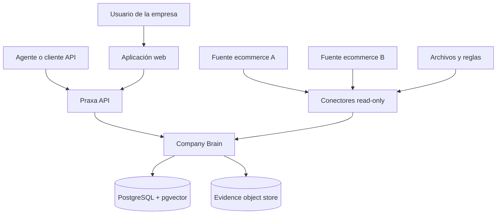
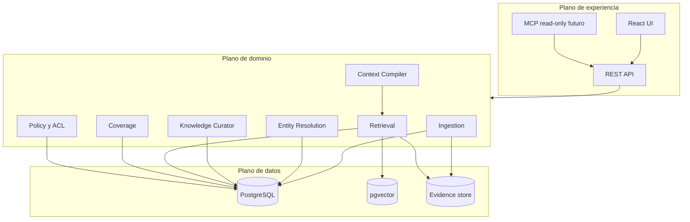
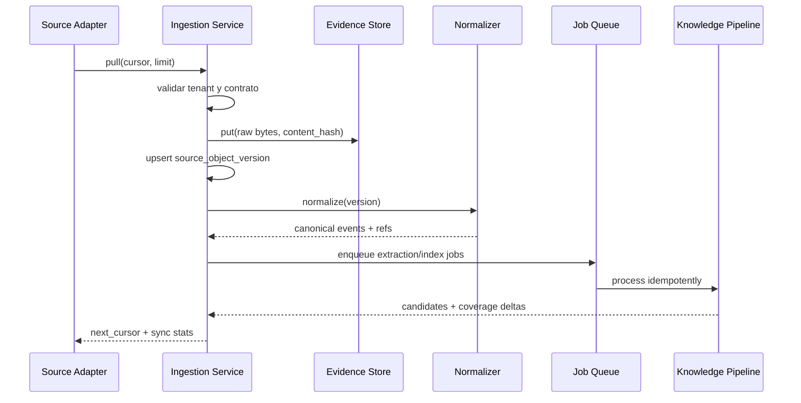
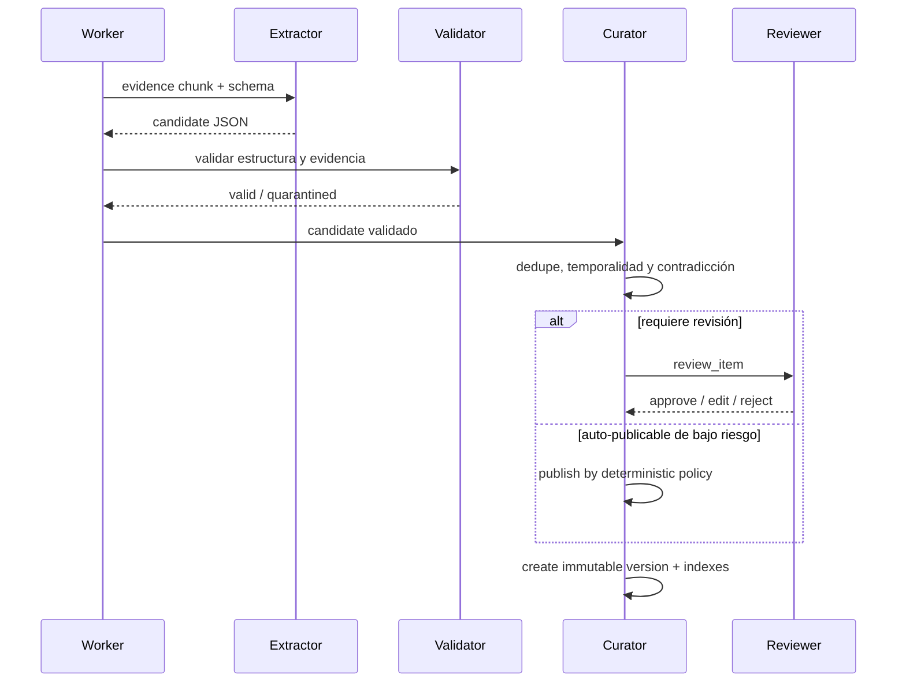
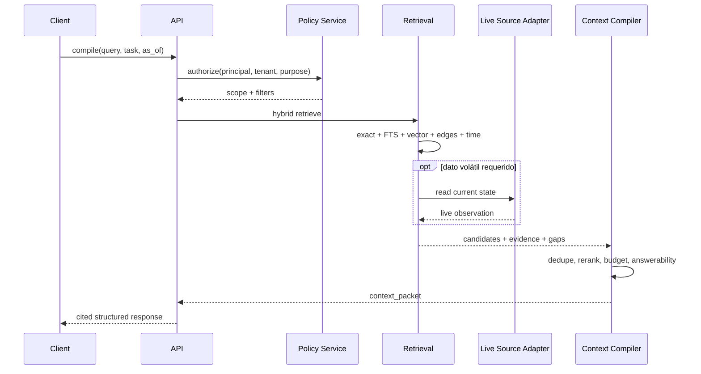
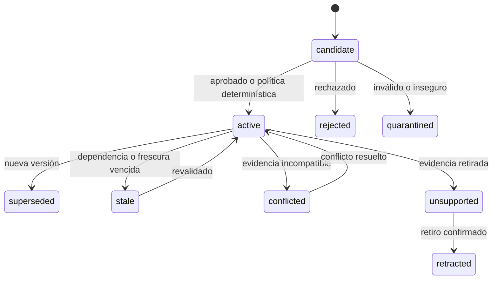

# PRAXA COMPANY BRAIN

## Especificación de producto, arquitectura e implementación v0.1

**Fecha:** 5 de agosto de 2026  
**Estado:** contrato de implementación propuesto  
**Audiencia:** Codex, Claude Code y equipo de desarrollo de Praxa  
**Horizonte:** MVP académico vertical (R0 + VS-01 a VS-07), secuenciado en `docs/plans/company-brain-build-plan.md`; arquitectura preparada para evolucionar sin obligar a construir la plataforma completa<br>
**Equipo:** Simón Alfandari, Matías Guiter, Juan Grimberg y Gonzalo Mayer

> **Instrucción de precedencia.** Para construir el Company Brain, este documento prevalece sobre blueprints, cuadernos, Lean Canvas y diagramas anteriores. Esos materiales conservan valor como visión e investigación, pero no autorizan a ampliar el alcance de la versión actual. Si dos requisitos se contradicen, aplicar en este orden: seguridad e invariantes; alcance v0; contratos de datos y API; decisiones arquitectónicas; backlog; visión futura.

---

## Índice

0. Cómo debe usar este documento un agente de código
1. Resumen ejecutivo
2. Contexto de producto
3. Alcance normativo
4. Principios e invariantes
5. Glosario y modelo mental
6. Caso de demostración canónico
7. Arquitectura objetivo de v0
8. Flujos principales
9. Contrato de conectores
10. Modelo de datos
11. Resolución de entidades
12. Ciclo de vida del conocimiento
13. Retrieval híbrido
14. Context Compiler
15. Contratos externos
16. Arquitectura de IA
17. Seguridad, privacidad y threat model
18. Observabilidad y operación
19. UX mínima
20. Estrategia de pruebas y evaluación
21. Manejo de fallos
22. Estructura del repositorio
23. Estándares de implementación
24. Entorno local, CI y despliegue
25. Plan del MVP vertical (R0 y VS-01 a VS-07)
26. Roles y responsabilidades
27. Definition of Ready y Definition of Done
28. Gates para impedir sobreconstrucción
29. Riesgos residuales y decisiones abiertas
30. Prompt de arranque para Codex o Claude Code
31. Referencias técnicas oficiales
32. Checklist de primera implementación

---

## 0. Cómo debe usar este documento un agente de código

Este documento no es una descripción inspiracional. Es la fuente de verdad para diseñar, implementar y verificar el Company Brain de Praxa.

Antes de escribir código, el agente **DEBE**:

1. Leer completamente las secciones 1 a 14.
2. Identificar la fase (R0 o VS-01 a VS-07) y los tickets autorizados para la iteración.
3. Inspeccionar el repositorio y comparar el estado real con esta especificación.
4. Informar cualquier contradicción, requisito imposible o decisión abierta que bloquee el trabajo.
5. Proponer un plan corto con archivos, migraciones, pruebas y riesgos.
6. Evitar implementar cualquier elemento incluido en “No construir ahora”.

Durante la implementación, el agente **DEBE**:

- Mantener la lógica de dominio fuera de los endpoints y componentes visuales.
- Crear o actualizar pruebas en la misma entrega que el código.
- Preservar compatibilidad de contratos o incluir una migración explícita.
- No introducir bases de datos, brokers, frameworks de agentes ni servicios nuevos sin una ADR aprobada.
- No usar un LLM para cálculos, joins, validaciones, permisos, vigencia, deduplicación o decisiones que puedan expresarse de forma determinística.
- No exponer secretos, tokens de conectores ni datos de otro tenant en prompts, logs o respuestas.

Al terminar una iteración, el agente **DEBE** entregar:

- Resumen de cambios.
- Archivos modificados.
- Migraciones creadas.
- Pruebas ejecutadas y resultado.
- Limitaciones conocidas.
- Criterios de aceptación cumplidos y no cumplidos.
- Próximo ticket desbloqueado.

Las palabras **DEBE**, **NO DEBE**, **DEBERÍA** y **PUEDE** son normativas. “DEBE” y “NO DEBE” son obligatorias para v0; “DEBERÍA” requiere justificar cualquier desvío; “PUEDE” es opcional.

---

# 1. Resumen ejecutivo

Praxa busca que una empresa pueda convertir datos y conocimiento operativo dispersos en contexto verificable y reutilizable por personas y agentes de IA. La visión completa incluye Company Brain, ejecución controlada, supervisión para no técnicos y mejora de procesos. **La construcción actual se limita al Company Brain.**

El Company Brain es un servicio de conocimiento operativo gobernado. Conecta fuentes, conserva evidencia original, normaliza estado empresarial, resuelve entidades equivalentes entre sistemas, registra hechos y reglas con vigencia y procedencia, detecta contradicciones y lagunas, y compila paquetes de contexto pequeños y citados para una tarea concreta.

No es:

- una carpeta de documentos;
- un chatbot con RAG;
- una copia del ERP;
- una base vectorial presentada como “memoria”;
- un agente con credenciales;
- un motor autónomo que convierte cualquier conversación en política o proceso ejecutable.

La cadena conceptual es:


La hipótesis de producto subyacente es que un agente solo puede realizar trabajo empresarial confiable si recibe cuatro cosas que un modelo genérico no posee por sí mismo:

1. el estado operativo correcto;
2. las reglas y procesos vigentes;
3. evidencia y permisos asociados;
4. una forma explícita de admitir contradicción, desactualización o ausencia.

## 1.1 Resultado esperado al completar el MVP vertical

Debe existir una demostración reproducible en la que:

1. Se cargan o sincronizan dos fuentes transaccionales de ecommerce y una pequeña fuente de reglas aprobadas.
2. Praxa conserva los objetos originales y normaliza productos, variantes, publicaciones e inventario.
3. Reconoce que identificadores distintos representan el mismo SKU o variante.
4. Detecta una diferencia de inventario o publicación entre canales.
5. Recupera la regla vigente que determina la fuente autoritativa o el stock de seguridad.
6. Produce un `context_packet` con hechos, regla, estado de cada canal, citas, contradicciones, brechas y nivel de respuesta posible.
7. Un agente controlado consume ese contexto mediante la skill `investigate_inventory_divergence` y registra una propuesta interna no ejecutada.
8. Un usuario puede inspeccionar por qué Praxa llegó a esa conclusión, aprobar o corregir el conocimiento candidato, y dejar una decisión auditada sobre la propuesta.
9. Todas las operaciones quedan aisladas por tenant y registradas en auditoría.

El demo **no modifica ningún sistema externo**. El agente registra una propuesta interna no ejecutada; una persona revisa esa propuesta y deja una decisión auditada. Ninguna acción, real ni simulada, se ejecuta. La calidad del Company Brain se demuestra por la fidelidad, vigencia, procedencia y utilidad del contexto, no por una animación de agente.

---

# 2. Contexto de producto

## 2.1 Problema fundamental

El conocimiento operativo de una empresa no vive en un único sistema. Se reparte entre:

- datos estructurados de ecommerce, marketplace, ERP y logística;
- documentos, planillas y mensajes;
- reglas explícitas;
- decisiones históricas;
- criterios tácitos de empleados y dueños;
- excepciones resueltas de manera diferente según el caso.

Un modelo conectado directamente a una API puede leer el estado de un pedido, pero no necesariamente sabe qué significa, cuál fuente prevalece, qué regla estaba vigente, qué excepción se aprobó o qué información no está autorizada para el solicitante. Un RAG puede encontrar texto parecido, pero no garantiza que el fragmento sea vigente, verdadero, suficiente ni aplicable a esa entidad.

## 2.2 Cadena de problemas de Praxa

- **F1 — Mecanismo raíz:** el conocimiento y contexto de cómo funciona la empresa está fragmentado, incompleto, desactualizado o solo en la cabeza de personas.
- **F2 — Barrera de adopción:** un dueño o responsable no técnico no puede confiar en una IA si no puede verificar la evidencia, conocer los límites y corregir lo aprendido.
- **F3 — Dolor observable:** el equipo repite búsquedas, conciliaciones y decisiones entre sistemas; las excepciones se detectan tarde y cada caso vuelve a resolverse desde cero.

El Company Brain v0 ataca directamente F1, crea la base verificable para F2 y demuestra valor sobre una excepción acotada de F3. No promete resolver todo F3 todavía.

## 2.3 Segmento de referencia, no requisito técnico universal

El segmento provisional es ecommerce multicanal argentino con 15 a 60 empleados, tres o más canales y entre seis y doce sistemas críticos. El early adopter hipotético usa Tiendanube o Shopify, Mercado Libre y WhatsApp, ya intentó automatizar parte de su operación y todavía depende de personas para interpretar reglas y excepciones.

Esta definición orienta el vocabulario, las entidades y el caso de demo. Todavía es una hipótesis comercial. El código no debe incorporar reglas fiscales argentinas ni supuestos de un comercio concreto salvo como configuración o fixture.

## 2.4 Usuario, comprador y actores del sistema

| Actor | Necesidad en Company Brain v0 | Autoridad |
|---|---|---|
| Dueño o responsable | Comprender cobertura, contradicciones y por qué una respuesta es confiable | Puede revisar reglas sensibles y ver auditoría global de su tenant |
| Responsable de operaciones | Consultar estado y reglas, resolver gaps, corregir relaciones | Puede aprobar conocimiento dentro de su área |
| Empleado | Buscar contexto permitido y aportar evidencia | No publica políticas sin revisión |
| Administrador técnico | Configurar fuentes, credenciales y sincronizaciones | No convierte automáticamente datos en reglas de negocio |
| Agente de IA controlado | Pedir contexto task-scoped mediante API y registrar una propuesta interna | No recibe credenciales ni autoridad propia; no accede a PostgreSQL |
| Sistema fuente | Mantener estado transaccional vivo | Sigue siendo system of record de sus datos |

---

# 3. Alcance normativo

## 3.1 Alcance v0 obligatorio

Conforme ADR-011, Company Brain v0 se implementa como un **único corte vertical** de divergencia y riesgo de sobreventa de inventario. El alcance obligatorio de esta sección se realiza dentro de ese vertical: un dominio, una pregunta canónica, una familia de políticas, una skill y un agente controlado.

La arquitectura completa del Company Brain sigue siendo el norte, pero el código de v0 implementa solo el vertical. Regla: **future-compatible, no future-built.**

### A. Ingesta y evidencia

- Contrato uniforme de conectores.
- Importación de JSON y CSV.
- Dos adaptadores transaccionales de ecommerce, reales o simulados, que implementen el mismo contrato.
- Sincronización completa e incremental reproducible.
- Almacenamiento de payload original, hash, versión, timestamps, cursor, ACL de origen y metadatos.
- Idempotencia: repetir una sincronización no crea duplicados semánticos ni versiones falsas.
- Tombstones para bajas o revocaciones.

### B. Estado canónico y resolución de entidades

- Entidades mínimas: `product`, `variant`, `listing`, `inventory_location`, `inventory_snapshot` y `source_account`.
- Referencias externas por sistema.
- Alias y relaciones entre entidades.
- Matching determinístico por IDs y SKU normalizado.
- Cola de revisión para matches ambiguos.
- Posibilidad de deshacer una fusión.

### C. Conocimiento gobernado

- Evidencia y chunks citables.
- Hechos atómicos versionados.
- Reglas o políticas operativas versionadas.
- Estados de conocimiento.
- `valid_time` y `transaction_time`.
- Owner, confianza, origen, motivo de cambio y evidencias.
- Detección básica de contradicciones y gaps.
- Revisión humana para publicar, corregir, rechazar o reemplazar candidatos.

### D. Recuperación y compilación de contexto

- Búsqueda exacta y full-text.
- Búsqueda semántica mediante pgvector.
- Consultas relacionales mediante tablas de edges en PostgreSQL.
- Filtrado temporal.
- Canales de retrieval segmentados con ranking, límites y deduplicación **dentro de cada canal**, conforme ADR-013. No hay fusión global por un único score en v0.
- Selección determinística de la política efectiva desde una versión aprobada y vigente; FTS y vector recuperan el pasaje que la respalda, no deciden qué regla gobierna.
- Filtrado por tenant y ACL antes del retrieval, y reautorización de citas antes de serializar la respuesta.
- `context_packet` task-scoped con citas y answerability, separado en payload determinístico y envelope operativo.
- Respuesta explícita `supported`, `partial`, `conflicted` o `unknown`.

### E. Experiencia y gobernanza mínimas

- Pantalla de cobertura del Brain.
- Explorador de entidades.
- Buscador con citas.
- Cola de revisión de hechos/reglas.
- Vista de contradicciones y gaps.
- Detalle de evidencia y vigencia.
- Auditoría básica.

### F. Calidad, seguridad y operación

- Aislamiento de tenant desde la primera migración.
- Row-Level Security en tablas con datos de cliente.
- Autenticación local de desarrollo y roles mínimos.
- Secretos fuera de la base de datos y del repositorio.
- Logs estructurados, `trace_id` y métricas básicas.
- Dataset de evaluación versionado.
- Pruebas unitarias, integración, seguridad y end-to-end.
- Docker Compose y CI.

### G. Agente controlado y skill de producto v0

Conforme ADR-011, el vertical incluye un consumidor de IA acotado que demuestra que el Brain es consumible:

- Un **único** agente detrás de una interfaz de herramientas pequeña: `resolve_inventory_entity`, `get_inventory_context` y `create_resolution_proposal`.
- Una **única** skill de producto versionada: `investigate_inventory_divergence` v1.
- El agente no recibe credenciales, no accede a PostgreSQL y no ejecuta acciones externas.
- Salida estructurada validada, con límites de tool calls, tokens, tiempo y presupuesto.
- Abstención explícita ante evidencia insuficiente.
- Escrituras **internas** limitadas, append-only y auditadas para propuestas del agente, decisiones humanas y trazas. Una propuesta nunca se presenta como una acción ejecutada.
- Revisión humana y auditoría de la propuesta.

Quedan fuera: runtime o registry genérico de skills, memoria persistente entre ejecuciones, autonomía, multiagente y cualquier escritura en sistemas externos.

## 3.2 Alcance opcional v0.2, solo si v0 está terminado

- Conector read-only real de Mercado Libre o Tiendanube.
- Tool MCP read-only `brain.search`.
- Captura de una respuesta humana como `candidate_fact` mediante formulario o WhatsApp simulado.
- Detección simple de patrones repetidos en eventos.
- Propuesta de una “skill candidate” no ejecutable.
- Comparación contra un baseline RAG vectorial.

## 3.3 No construir ahora

Esta lista excluye la autonomía, la generalización y las escrituras externas. **No** excluye el agente controlado único ni la skill de producto v0 definidos en §3.1.G, que sí forman parte del alcance obligatorio.

- Tool Gateway con escrituras reales.
- Agente autónomo de larga duración.
- Multiagente, subagentes o blackboard.
- Runtime o registry genérico de skills.
- Memoria persistente del agente entre ejecuciones.
- Facturación, conciliación fiscal o acciones en ARCA.
- Aprobación por impacto económico real.
- Rollback contra APIs externas.
- OAuth público completo para múltiples proveedores si no es necesario para el demo.
- Captura de pantalla, audio o vigilancia de empleados.
- Descubrimiento universal de procesos.
- Creación y publicación automática de skills.
- Knowledge graph dedicado como Neo4j.
- Vector DB dedicada como Qdrant, Pinecone o Weaviate.
- Kafka, Temporal, Kubernetes o arquitectura de microservicios.
- App de escritorio, WhatsApp productivo o aplicaciones móviles.
- Benchmarks entre clientes.
- Entrenamiento o fine-tuning de modelos con datos de clientes.
- Reemplazo de sistemas de registro.

## 3.4 Regla de control de alcance

Una funcionalidad entra en v0 solo si es necesaria para demostrar al menos una de estas capacidades:

1. preservar evidencia;
2. unificar estado entre fuentes;
3. gobernar verdad, vigencia o permisos;
4. detectar contradicción o ausencia;
5. compilar contexto verificable.

Si una funcionalidad solo hace que la demo “parezca más agente” pero no mejora una de esas capacidades, queda fuera.

---

# 4. Principios e invariantes

## 4.1 Principios de diseño

1. **Evidencia antes que resumen.** Nunca destruir ni reemplazar el objeto original por una interpretación del modelo.
2. **Estado no es conocimiento.** Un valor actual leído de una API y una regla empresarial son objetos diferentes.
3. **El sistema fuente conserva autoridad.** Saldo, stock, estado de envío o ticket actual deben consultarse en la fuente cuando la frescura requerida lo exija.
4. **El chunk no es verdad.** Los chunks son candidatos recuperables; la unidad gobernada es una versión de hecho o política con evidencia.
5. **Vigencia explícita.** El Brain debe poder diferenciar qué es válido ahora, qué fue válido antes y cuándo lo registró.
6. **Permiso como propiedad del dato.** El filtrado no es una capa cosmética posterior a la búsqueda.
7. **Ausencia es un resultado.** `unknown` es preferible a inventar una respuesta.
8. **LLM dentro de una frontera determinística.** El modelo extrae o propone; el código valida, autoriza, versiona y publica.
9. **Aprendizaje controlado.** Una ejecución, mensaje o inferencia produce candidatos, no políticas activas.
10. **Contexto mínimo suficiente.** El agente recibe los hechos, procesos y evidencias necesarios para la tarea; no una descarga de la empresa.
11. **Vertical primero.** El esquema permite extensión, pero las entidades y evaluaciones v0 se centran en ecommerce.
12. **Modular monolith.** Separar dominios en código y contratos sin asumir costos operativos de microservicios.

## 4.2 Invariantes obligatorios

- Todo registro empresarial posee `tenant_id` no nulo.
- Toda consulta de aplicación establece contexto de tenant y actor antes de tocar datos.
- Toda tabla con datos de cliente tiene RLS habilitada y una prueba de aislamiento.
- Todo hecho `active` posee al menos una evidencia aprobada o una declaración explícita de fuente autoritativa.
- Toda afirmación incluida en `verified_facts` referencia una versión de hecho y al menos una cita.
- Un objeto eliminado o revocado no reaparece tras reindexar.
- Una actualización nunca sobrescribe historia: crea una versión y cierra la vigencia anterior cuando corresponde.
- Una inferencia derivada registra qué entradas la originaron.
- Un cambio en una dependencia marca descendientes como `stale`, `unknown` o pendientes de recálculo.
- Una fusión de entidades nunca amplía ACL de forma implícita.
- Un modelo no puede escribir directamente en tablas `active`.
- Un modelo no puede modificar `tenant_id`, `principal_id`, roles, propósito, ACL ni fechas de sistema.
- Los tokens OAuth y claves API nunca se incluyen en prompts, trazas de LLM ni payloads de frontend.
- Ninguna salida del modelo se ejecuta como SQL, plantilla, código o llamada de herramienta sin validación estructural.
- El sistema distingue claramente `confidence` probabilística de `status` de aprobación.
- Una confianza alta no convierte un candidato en conocimiento aprobado.
- Las consultas con evidencia insuficiente no se degradan silenciosamente a una respuesta sin citas.

---

# 5. Glosario y modelo mental

| Término | Definición normativa |
|---|---|
| Source | Sistema o archivo del cual Praxa obtiene datos. |
| Source object | Objeto tal como fue recibido de la fuente. |
| Evidence item | Evidencia inmutable y citable derivada de una versión de source object. |
| Chunk | Segmento indexable de evidencia; no es una afirmación validada. |
| Canonical entity | Representación interna de una cosa del negocio compartida entre fuentes. |
| External reference | Identificador que una fuente asigna a una entidad. |
| Fact | Afirmación atómica sujeto–predicado–objeto. |
| Fact version | Versión inmutable de un hecho con vigencia, estado y evidencia. |
| Policy | Regla normativa que condiciona decisiones o acciones. |
| Procedure | Secuencia descriptiva de trabajo; en v0 no es ejecutable. |
| Skill de producto v0 | Procedimiento de investigación versionado que el agente controlado ejecuta contra la interfaz de herramientas del Brain. En v0 existe exactamente una: `investigate_inventory_divergence`. No produce efectos externos. |
| Runtime genérico de skills | Registro, descubrimiento y ejecución arbitraria de skills por un agente autónomo; permanece como visión futura y fuera de v0. |
| Contradiction | Dos afirmaciones incompatibles dentro de alcance temporal y contextual comparable. |
| Knowledge gap | Dato, regla o relación necesaria que no puede determinarse. |
| Coverage map | Medición de qué fuentes, entidades, períodos y tipos de conocimiento están representados. |
| Context packet | Resultado estructurado y task-scoped que consume una persona o agente. |
| Answerability | Grado en que la evidencia permite responder: supported, partial, conflicted o unknown. |
| Valid time | Período durante el cual una afirmación fue válida en el mundo. |
| Transaction time | Período durante el cual Praxa almacenó esa versión como vigente en el sistema. |
| ACL | Reglas de acceso heredadas o definidas para un objeto. |
| Principal | Usuario, servicio o agente autenticado que realiza una solicitud. |
| Tenant | Empresa aislada dentro de Praxa. |

## 5.1 Capas que no deben mezclarse

| Capa | Pregunta que responde | Ejemplo |
|---|---|---|
| Evidencia cruda | ¿Qué llegó exactamente desde la fuente? | Payload de stock de Mercado Libre a las 10:30 |
| Estado canónico | ¿Qué objeto del negocio representa? | Variante SKU-4471 y su inventario por canal |
| Memoria factual | ¿Qué afirmación está respaldada y cuándo vale? | El stock disponible del depósito central era 14 |
| Memoria normativa | ¿Qué regla debe aplicarse? | Mantener tres unidades de seguridad |
| Memoria episódica | ¿Qué ocurrió en un caso? | Se pausó una publicación por sobreventa |
| Contexto compilado | ¿Qué necesita esta tarea ahora? | Diferencia, regla vigente, evidencia y gap |

---

# 6. Caso de demostración canónico

## 6.1 Historia

Una empresa vende la misma variante en dos canales. Mercado Libre informa ocho unidades y Tiendanube informa doce. Una regla aprobada establece que el inventario del depósito central es la fuente autoritativa y que deben reservarse tres unidades de seguridad. Praxa debe identificar que las publicaciones corresponden a la misma variante, establecer cuál dato usar, señalar la contradicción y producir el contexto necesario para que un humano o agente decida qué publicación ajustar.

## 6.2 Datos mínimos del fixture

- Tenant `demo-fashion-ar`.
- Producto “Remera Básica”.
- Variante “Negra / M”.
- SKU canónico `REM-BAS-NEG-M`.
- Listing A en canal `mercadolibre` con ID `MLA-1001` y stock observado 8.
- Listing B en canal `tiendanube` con ID `TN-2001` y stock observado 12.
- Inventario de depósito central observado 10.
- Política `inventory-safety-buffer` versión 2: reservar 3 unidades.
- Política `inventory-source-of-truth` versión 1: depósito central prevalece sobre stock publicado.
- Regla histórica versión anterior con buffer 2, cuya vigencia ya terminó.
- Un alias incompleto que obligue a revisar un posible match en un segundo caso.

## 6.3 Resultado esperado

El sistema debe devolver, como mínimo:

- entidad canónica resuelta;
- estado por fuente y timestamp;
- inventario vendible calculado determinísticamente: 7;
- contradicciones: ML +1 y Tiendanube +5 respecto del inventario vendible;
- políticas vigentes y versión;
- política histórica excluida del resultado actual pero consultable con `as_of`;
- citas hacia payloads y reglas;
- gap si no se conoce la latencia de sincronización de un canal;
- answerability `partial` mientras exista ese gap, o `supported` si se provee la información;
- propuesta no ejecutable: revisar o ajustar los listings a 7.

El vertical completa el caso hasta la decisión humana:

- el agente controlado invoca `investigate_inventory_divergence` sobre el `ContextPacket` y registra una `resolution_proposal` interna, append-only, marcada explícitamente como **no ejecutada**;
- una persona revisa el expediente —valores por fuente, política vigente con su cita, cálculo y gaps— y registra una `review_decision` auditada: confirmar, corregir, descartar, marcar fuente o política incorrecta, o solicitar evidencia;
- ningún sistema externo se modifica en ningún punto del flujo.

## 6.4 Por qué este demo requiere un Company Brain

Un script simple puede comparar dos números. Este demo exige además:

- resolver identidad entre fuentes;
- distinguir estado vivo de política;
- seleccionar la versión temporal correcta;
- citar evidencia;
- reconocer contradicción y ausencia;
- aplicar permisos;
- explicar el resultado de forma trazable.

Sin esas propiedades, la demostración no valida el Company Brain.

---

# 7. Arquitectura objetivo de v0

## 7.1 Estilo arquitectónico

Praxa v0 será un **monolito modular** con procesos separados para API y workers, una única base PostgreSQL y almacenamiento de objetos intercambiable. Los módulos comparten despliegue, pero se comunican mediante interfaces de dominio y eventos internos explícitos. Esta decisión reduce complejidad operativa para un equipo de cuatro personas sin impedir separar servicios en el futuro.

## 7.2 Vista de contexto



## 7.3 Componentes

| Componente | Responsabilidad | No debe hacer |
|---|---|---|
| Web UI | Cobertura, búsqueda, revisión y auditoría | Aplicar reglas de negocio o acceder directo a DB |
| API | Autenticar, validar contratos, coordinar casos de uso | Contener lógica de normalización o retrieval |
| Connector SDK | Leer fuentes y emitir objetos/versiones uniformes | Convertir silenciosamente payloads en verdad |
| Ingestion worker | Persistir evidencia, deduplicar y disparar etapas | Publicar facts sin curator |
| Normalizer | Mapear payloads estructurados a eventos y entidades | Usar LLM cuando existe mapping determinístico |
| Entity resolver | Crear candidatos de match y gestionar merge/split | Fusionar entidades ambiguas de alto impacto |
| Knowledge extractor | Proponer hechos, reglas y relaciones desde texto | Insertar conocimiento activo |
| Memory curator | Validar candidatos, detectar conflictos y publicar versiones | Inventar evidencia faltante |
| Retrieval service | Buscar candidatos exactos, semánticos, temporales y relacionales | Saltarse ACL o answerability |
| Context compiler | Producir un paquete task-scoped, citado y limitado | Devolver un dump de documentos |
| Policy/ACL service | Resolver tenant, actor, rol, grupos, propósito y filtros | Confiar en campos enviados por el LLM |
| Coverage service | Medir representación, frescura, calidad y gaps | Declarar cobertura total por cantidad de archivos |
| Audit service | Registrar acciones administrativas y decisiones de conocimiento | Guardar secretos o payloads sensibles completos en logs |
| Job runner | Ejecutar trabajos idempotentes con retry y dead-letter | Reintentar operaciones no idempotentes a ciegas |

## 7.4 Diagrama de componentes internos



## 7.5 Procesos de despliegue

Para desarrollo y demo se permiten cuatro procesos lógicos:

1. `api`: FastAPI y endpoints REST.
2. `worker`: trabajos de sync, parsing, embeddings, extracción y coverage.
3. `web`: React/Vite.
4. `postgres`: PostgreSQL con la extensión `vector`; los UUID se generan en la aplicación o con funciones nativas disponibles.

El object store v0 puede ser:

- directorio content-addressed montado en Docker para desarrollo; o
- MinIO si el equipo necesita demostrar compatibilidad S3.

La interfaz `BlobStore` debe ocultar la implementación. No guardar binarios grandes dentro de PostgreSQL salvo fixtures muy pequeños.

## 7.6 Stack aprobado

| Capa | Tecnología | Decisión |
|---|---|---|
| Lenguaje backend | Python 3.12+ | Usar typing estricto y `pyproject.toml` |
| API | FastAPI + Pydantic v2 | OpenAPI generado desde contratos |
| ORM/migraciones | SQLAlchemy 2 síncrono + `psycopg` + Alembic | Una sola estrategia de sesiones y transacciones explícitas (ADR-014) |
| Base | PostgreSQL 16+ | Fuente de verdad del Brain |
| Vector | pgvector | Sin vector DB dedicada |
| FTS | PostgreSQL `tsvector` | Texto; IDs y SKU usan igualdad e índices B-tree |
| Jobs | Tabla PostgreSQL + `FOR UPDATE SKIP LOCKED` | Sin Redis en v0 |
| Frontend | React + TypeScript + Vite | UI mínima, accesible y tipada |
| Estilos | Tailwind o CSS Modules | Elegir uno, no ambos sin necesidad |
| Tests backend | pytest, pytest-asyncio, Hypothesis, Testcontainers | Separar unit/integration/security |
| Tests frontend | Vitest + Testing Library; Playwright E2E | Flujos críticos |
| Observabilidad | OpenTelemetry + logs JSON | Langfuse opcional para llamadas LLM |
| Contenedores | Docker Compose | Un comando para levantar entorno |
| CI | GitHub Actions | lint, typecheck, tests, migrations |

No fijar versiones patch en este documento. El repositorio debe usar rangos compatibles y lockfiles reproducibles. Una actualización mayor requiere CI verde y ADR si cambia contratos o comportamiento.

## 7.7 Decisiones arquitectónicas registradas

| ADR | Decisión | Razón | Revisar cuando |
|---|---|---|---|
| ADR-001 | Monolito modular | Menos operación y coordinación | Un módulo necesite escalar o desplegarse por separado |
| ADR-002 | PostgreSQL como núcleo | Transacciones, temporalidad, FTS, RLS y vector en un sistema | Volumen o latencia medidos lo exijan |
| ADR-003 | Tablas de edges, no graph DB | Relaciones v0 son acotadas | Traversals profundos sean cuello medido |
| ADR-004 | Job queue en PostgreSQL | Reduce servicios | Throughput o delays incumplan SLO |
| ADR-005 | Evidencia append-only | Auditoría y reproducibilidad | No se revisa; solo cambia retención |
| ADR-006 | Bitemporalidad selectiva | Evitar sobrescribir historia | No se revisa para facts/policies |
| ADR-007 | LLM solo para no determinismo necesario | Costo, prueba y confiabilidad | Caso concreto demuestre valor superior |
| ADR-008 | Retrieval híbrido | IDs, semántica y relaciones requieren técnicas distintas | Evaluaciones indiquen otra combinación |
| ADR-009 | MCP después de REST estable | Evita duplicar contratos | API y autorización estén probadas |
| ADR-010 | Write actions fuera de v0 | Company Brain debe validarse solo | Brain alcance definición de terminado |
| ADR-011 | Corte vertical de inventario con agente y skill controlados | Demuestra la hipótesis sin construir una plataforma horizontal | El vertical cumpla su definición de terminado |
| ADR-012 | Append-only operacional, identidad de origen, retención y borrado | Idempotencia por objeto y borrado gobernado sin retención eterna | Se incorporen datos reales |
| ADR-013 | Retrieval segmentado autorizado y autoridad determinística de políticas | La autoridad no puede depender de similitud | Un dataset demuestre que la fusión mejora sin romper seguridad |
| ADR-014 | SQLAlchemy 2 síncrono con `psycopg` | Un solo camino de sesiones, transacciones, pool y tests de RLS | Carga medida incumpla un objetivo operativo |

ADR-011 a ADR-014 están `Accepted`.

---

# 8. Flujos principales

## 8.1 Ingesta incremental



Pasos normativos:

1. Crear `sync_run` con cursor inicial, conexión, tenant y trace.
2. El adaptador obtiene una página sin transformar semánticamente el payload.
3. Calcular `content_hash` sobre bytes canónicos y `external_version` si existe.
4. Persistir blob antes de cualquier interpretación.
5. Insertar `source_object_version` solo si el contenido cambió o la fuente emitió una versión distinta verificable.
6. Normalizar de manera determinística cuando el tipo de fuente es estructurado.
7. Emitir jobs con `dedup_key` estable.
8. Confirmar cursor solo después de persistir todos los objetos de la página.
9. Marcar sync `succeeded`, `partial` o `failed` con contadores.
10. No borrar versiones anteriores; crear tombstone cuando la fuente indique eliminación o el acceso sea revocado.

## 8.2 Extracción y publicación de conocimiento



Reglas:

- Los mappings de stock, SKU, listing e IDs desde APIs conocidas no requieren LLM.
- Texto libre puede usar LLM con output JSON validado.
- Cada candidato conserva `model_id`, `prompt_version`, timestamp, evidence spans y raw output protegido.
- Un error de parseo se cuarentena; no se “arregla” con string parsing frágil.
- Políticas y procedimientos siempre requieren aprobación humana en v0.
- Hechos estructurados provenientes de una fuente configurada como autoritativa pueden publicarse automáticamente con política explícita.
- Publicar crea una nueva versión; nunca edita una versión histórica.

## 8.3 Consulta y compilación de contexto



El cliente puede sugerir `entity_hints`, `required_information` y `as_of`, pero el servidor añade y controla `tenant_id`, `principal_id`, roles, grupos, propósito y `trace_id`.

## 8.4 Revisión de un candidato

1. Reviewer abre el candidato.
2. UI muestra afirmación, fuente, ubicación, vigencia propuesta, extractor y contradicciones.
3. Reviewer puede aprobar sin cambios, editar objeto/vigencia, rechazar o pedir otra evidencia.
4. Backend valida autoridad del reviewer y registra diff.
5. Si se aprueba, se publica una versión y se actualizan índices.
6. Si reemplaza un hecho previo, se cierra su vigencia o se marca `superseded` según la semántica.
7. Se recalculan contradicciones y coverage.
8. Audit guarda actor, motivo y trace.

## 8.5 Eliminación y revocación

- “Eliminar” una conexión revoca credenciales y detiene jobs.
- Los source objects se marcan con tombstone según política de retención.
- Los índices derivados se eliminan o invalidan.
- Los facts cuya única evidencia fue eliminada pasan a `unsupported` o `retracted`; no deben sobrevivir como activos.
- El tombstone se conserva el tiempo mínimo necesario para impedir reaparición en una resincronización.
- Export/borrado por tenant debe ser un job auditable, no una serie de deletes manuales.

---

# 9. Contrato de conectores

## 9.1 Interfaz Python

```python
from dataclasses import dataclass
from datetime import datetime
from typing import AsyncIterator, Mapping, Protocol

@dataclass(frozen=True)
class SourceRecord:
    object_type: str
    external_id: str
    payload: bytes
    content_type: str
    observed_at: datetime
    updated_at: datetime | None
    external_version: str | None
    acl: Mapping[str, object]
    metadata: Mapping[str, object]
    deleted: bool = False

@dataclass(frozen=True)
class PullPage:
    records: tuple[SourceRecord, ...]
    next_cursor: str | None
    has_more: bool

class SourceConnector(Protocol):
    kind: str

    async def test_connection(self) -> dict[str, object]: ...
    async def discover_schema(self) -> dict[str, object]: ...
    async def pull(self, *, cursor: str | None, limit: int) -> PullPage: ...
    async def get(self, *, object_type: str, external_id: str) -> SourceRecord: ...
```

## 9.2 Requisitos de un conector

- `pull` es read-only en v0.
- Usa paginación y backoff definidos por la fuente.
- No loguea credenciales ni payload completo por defecto.
- Devuelve timestamps timezone-aware en UTC.
- Conserva el `external_id` original sin reinterpretarlo.
- Declara capacidades: objetos soportados, incremental/full, webhook/poll, límites y frescura esperada.
- Implementa contract tests compartidos.
- Distingue error de autenticación, rate limit, red, schema drift y dato inválido.
- Un conector nuevo debe añadirse sin modificar el pipeline central.

## 9.3 Conectores v0

1. `file_import`: CSV y JSON validados contra un mapping declarativo.
2. `mock_marketplace`: fixtures con productos, listings e inventario.
3. `mock_storefront`: fixtures equivalentes con IDs distintos.
4. `policy_file`: Markdown, JSON o formulario para reglas aprobadas.

Uno de los mocks PUEDE reemplazarse por un conector real read-only si las credenciales y la API no ponen en riesgo el cronograma. La suite y el demo deben seguir funcionando offline con fixtures.

## 9.4 Manejo de schema drift

- Guardar `schema_fingerprint` por tipo de objeto y sync.
- Si aparecen o desaparecen campos usados por un normalizer, marcar `schema_drift_detected`.
- El job afectado pasa a `quarantined`; no produce estado canónico silenciosamente incompleto.
- Mostrar drift en health/coverage.
- Mantener fixtures de versión anterior y nueva en contract tests.

---

# 10. Modelo de datos

Esta sección describe el modelo de datos horizontal del Company Brain completo, con nombres genéricos (`source_object_versions`, `evidence_items`, `observations`, `policies`/`policy_versions`, etc.). El vertical v0 (ADR-011) implementa este modelo **acotado a inventario**, con nombres de tabla específicos del dominio: `evidence_source`, `source_object`, `evidence_version` y `evidence_chunk` (VS-02, ADR-012); `canonical_variant`, `external_entity_ref` e `inventory_observation` (VS-03); `inventory_policy_candidate` e `inventory_policy_version` (VS-03, ADR-013); `detected_conflict`, `knowledge_gap` y `case` (VS-03); y `resolution_proposal` y `review_decision` (VS-05, VS-06). Las convenciones globales, la identidad de tenancy, RLS y los principios de esta sección aplican sin cambios; los nombres de tabla del vertical son la instancia concreta que se crea en cada fase, no una tabla adicional.

## 10.1 Convenciones globales

- IDs internos: UUID generados por la aplicación o PostgreSQL.
- Todos los timestamps: `timestamptz` UTC.
- Campos extensibles: `jsonb`, pero no usar JSONB para relaciones o campos consultados constantemente.
- Cada tabla mutable incluye `created_at`, `updated_at` y, cuando aplica, `created_by`/`updated_by`.
- Cada fila de negocio incluye `tenant_id`.
- Versiones históricas son inmutables a nivel de servicio y, cuando sea práctico, mediante trigger o permisos de DB.
- Los enums se representan como `text` con `CHECK` o enum PostgreSQL solo si su evolución está controlada.
- Usar índices parciales para registros activos y pendientes.
- Toda FK importante define explícitamente `ON DELETE`; evitar cascades que destruyan evidencia.

## 10.2 Identidad, tenancy y autorización

### `tenants`

| Campo | Tipo | Requisito |
|---|---|---|
| id | uuid PK | Identidad interna |
| slug | text unique | Nombre estable para desarrollo |
| name | text | Nombre visible |
| status | text | active, suspended, deleted |
| settings | jsonb | Zona, idioma y límites no sensibles |
| created_at | timestamptz | Obligatorio |

### `principals`

| Campo | Tipo | Requisito |
|---|---|---|
| id | uuid PK | Usuario o service principal |
| kind | text | human, service, agent |
| external_subject | text nullable | ID del proveedor de identidad |
| display_name | text | Visible |
| status | text | active, disabled |

### `tenant_memberships`

- PK compuesta `(tenant_id, principal_id)`.
- Campos: `role`, `groups text[]`, `status`, timestamps.
- Roles v0: `owner`, `admin`, `reviewer`, `member`, `service`.
- La UI nunca decide el rol efectivo; el backend lo resuelve desde esta tabla.

### `acl_entries`

Modelo explícito para objetos que requieren alcance más fino:

| Campo | Tipo | Notas |
|---|---|---|
| id | uuid PK |  |
| tenant_id | uuid FK | RLS |
| resource_type | text | evidence, entity, fact, policy, source |
| resource_id | uuid | Validado por service |
| subject_type | text | principal, role, group |
| subject_id | text | ID o nombre del sujeto |
| permission | text | read, review, administer |
| effect | text | allow o deny; deny prevalece |
| purpose_tags | text[] | Opcional |

Para v0, los datos pueden heredar ACL desde la conexión fuente y el tenant. El esquema ya debe permitir ACL por recurso sin obligar a usarlo en todos los fixtures.

## 10.3 Fuentes y sincronización

### `source_connections`

| Campo | Tipo | Notas |
|---|---|---|
| id | uuid PK |  |
| tenant_id | uuid FK |  |
| kind | text | file_import, mock_marketplace, etc. |
| name | text |  |
| status | text | pending, active, degraded, revoked |
| capabilities | jsonb | Objetos, incremental, webhook, etc. |
| secret_ref | text nullable | Referencia externa; nunca el secreto |
| config | jsonb | Configuración no sensible |
| last_success_at | timestamptz nullable |  |
| freshness_sla_seconds | integer nullable | Para coverage/staleness |
| created_by | uuid FK principal |  |

Restricción única sugerida: `(tenant_id, kind, name)`.

### `sync_runs`

Campos mínimos:

- `id`, `tenant_id`, `source_connection_id`;
- `mode`: full, incremental, single_object;
- `status`: queued, running, partial, succeeded, failed, cancelled;
- `cursor_before`, `cursor_after`;
- `started_at`, `completed_at`;
- contadores `read_count`, `new_count`, `changed_count`, `unchanged_count`, `deleted_count`, `error_count`;
- `schema_fingerprint`;
- `trace_id`, `error_code`, `error_summary`.

### `source_objects`

Representa la identidad estable de un objeto en una fuente.

| Campo | Tipo | Notas |
|---|---|---|
| id | uuid PK |  |
| tenant_id | uuid FK |  |
| source_connection_id | uuid FK |  |
| object_type | text | product, listing, inventory, document... |
| external_id | text | Sin normalizar destructivamente |
| latest_version_id | uuid nullable | Puntero optimizador, no historial |
| deleted_at | timestamptz nullable | Tombstone |
| source_acl | jsonb | ACL original |

Unique: `(tenant_id, source_connection_id, object_type, external_id)`.

### `source_object_versions`

| Campo | Tipo | Notas |
|---|---|---|
| id | uuid PK | Inmutable |
| tenant_id | uuid FK |  |
| source_object_id | uuid FK |  |
| sync_run_id | uuid FK |  |
| external_version | text nullable | ETag/revision si existe |
| content_hash | text | SHA-256 de bytes canónicos |
| blob_uri | text | Ubicación en BlobStore |
| content_type | text |  |
| byte_size | bigint |  |
| observed_at | timestamptz | Cuándo Praxa lo observó |
| source_updated_at | timestamptz nullable | Timestamp provisto por fuente |
| schema_version | text nullable |  |
| metadata | jsonb | Headers seguros y detalles |
| is_tombstone | boolean |  |

Unique sugerido: `(source_object_id, content_hash, is_tombstone)`.

## 10.4 Evidencia e indexación

### `evidence_items`

Un evidence item hace citable una versión o una parte lógica de ella.

- `id`, `tenant_id`, `source_object_version_id`;
- `evidence_type`: structured_record, document, message, rule_declaration;
- `title`, `language`, `author_principal_id` nullable;
- `effective_acl jsonb`;
- `observed_at`, `valid_hint_from`, `valid_hint_to`;
- `sanitization_status`, `pii_tags text[]`;
- `parser_version`, `created_at`.

### `evidence_chunks`

| Campo | Tipo | Notas |
|---|---|---|
| id | uuid PK |  |
| tenant_id | uuid FK |  |
| evidence_item_id | uuid FK |  |
| ordinal | integer | Orden estable |
| text | text | Texto sanitizado |
| locator | jsonb | page, JSON pointer, row, char range |
| token_count | integer | Para presupuesto |
| content_hash | text | Dedupe |
| search_vector | tsvector | Columna generada o mantenida |
| embedding | vector(N) nullable | Dimensión definida por modelo |
| embedding_model | text nullable | Obligatorio si embedding no null |
| embedding_version | text nullable |  |

Índices:

- GIN sobre `search_vector`.
- No se crea un índice trigram en v0; sólo se reconsidera ante un caso medido que no resuelvan exact match y FTS.
- HNSW sobre `embedding` cuando el dataset supere el punto donde scan exacto deje de cumplir latencia.
- B-tree `(tenant_id, evidence_item_id, ordinal)`.

No crear índice HNSW por costumbre en un fixture diminuto; medir primero. pgvector soporta búsqueda exacta y aproximada, y la aproximación implica tradeoffs.

## 10.5 Entidades y relaciones

### `entities`

| Campo | Tipo | Notas |
|---|---|---|
| id | uuid PK |  |
| tenant_id | uuid FK |  |
| entity_type | text | product, variant, listing, location, account |
| canonical_key | text nullable | SKU normalizado u otra clave |
| display_name | text |  |
| attributes | jsonb | Atributos no centrales |
| status | text | active, merged, archived |
| merged_into_id | uuid nullable | Redirect reversible |
| effective_acl | jsonb |  |
| valid_from | timestamptz nullable | Si la entidad misma tiene vigencia |
| valid_to | timestamptz nullable |  |

Índices/constraints:

- Unique parcial `(tenant_id, entity_type, canonical_key)` donde `canonical_key IS NOT NULL AND status='active'` cuando la semántica lo permita.
- No usar una única regla de unique para tipos donde la clave se repite legítimamente.

### `entity_external_refs`

Campos: `id`, `tenant_id`, `entity_id`, `source_connection_id`, `object_type`, `external_id`, `confidence`, `match_method`, `status`, `evidence_item_id`, timestamps.

Unique activo: `(tenant_id, source_connection_id, object_type, external_id)`.

### `entity_aliases`

- `entity_id`, `alias`, `normalized_alias`, `alias_type`, `source`, `confidence`, `status`.
- B-tree sobre alias normalizado para coincidencia exacta; una coincidencia de nombre sola no autoriza merge.

### `entity_relationships`

| Campo | Tipo | Ejemplo |
|---|---|---|
| subject_entity_id | uuid | product |
| predicate | text | has_variant |
| object_entity_id | uuid | variant |
| valid_from/valid_to | timestamptz | Vigencia |
| status | text | candidate, active, superseded |
| confidence | numeric | Señal, no aprobación |
| evidence_item_id | uuid | Procedencia |

Índice en `(tenant_id, subject_entity_id, predicate)` y `(tenant_id, object_entity_id, predicate)`.

### `entity_resolution_candidates`

- `left_entity_id`, `right_entity_id`;
- `features jsonb` con SKU exacto, alias, atributos y fuente;
- `score numeric`;
- `risk_class`: low, medium, high;
- `decision`: pending, merged, kept_separate, ignored;
- reviewer, reason y timestamps.

## 10.6 Observaciones y estado operativo

El Brain no debe modelar todo el ERP. Para el wedge se usa un modelo de observaciones canónicas.

### `observations`

| Campo | Tipo | Ejemplo |
|---|---|---|
| id | uuid PK |  |
| tenant_id | uuid |  |
| entity_id | uuid | Variante/listing |
| metric | text | stock_on_hand, stock_published, price |
| value_json | jsonb | `{"quantity": 8, "unit": "item"}` |
| observed_at | timestamptz | Hora de lectura |
| valid_from | timestamptz | Si la fuente lo informa |
| source_ref_id | uuid | External ref |
| evidence_item_id | uuid | Cita |
| authority_rank | integer nullable | Configurado, no inferido por LLM |
| freshness_class | text | live, fresh, stale, unknown |

Las observaciones son append-only. Una vista o query determina la observación “actual” por métrica, entidad, fuente y timestamp.

## 10.7 Hechos, reglas y dependencias

### `facts`

Identidad conceptual estable de una afirmación.

- `id`, `tenant_id`;
- `subject_entity_id` nullable;
- `subject_key` text nullable para subjects no modelados;
- `predicate` text;
- `scope jsonb` para canal, ubicación, región u otras dimensiones;
- `effective_acl jsonb`;
- `created_at`.

### `fact_versions`

| Campo | Tipo | Requisito |
|---|---|---|
| id | uuid PK | Inmutable |
| tenant_id | uuid FK |  |
| fact_id | uuid FK |  |
| object_json | jsonb | Valor tipado con schema |
| status | text | candidate, active, superseded, stale, conflicted, unsupported, retracted, rejected |
| confidence | numeric(5,4) | 0..1; señal probabilística |
| valid_from | timestamptz nullable | Inicio en el mundo |
| valid_to | timestamptz nullable | Fin exclusivo |
| transaction_from | timestamptz | Momento de publicación |
| transaction_to | timestamptz nullable | Fin en sistema |
| owner_principal_id | uuid nullable | Responsable |
| source_authority | text | authoritative, declared, observed, inferred |
| extractor_run_id | uuid nullable | Procedencia técnica |
| change_reason | text | Obligatorio al publicar/reemplazar |
| review_status | text | not_required, pending, approved, rejected |

Restricciones:

- `valid_to IS NULL OR valid_to > valid_from`.
- `transaction_to IS NULL OR transaction_to > transaction_from`.
- Un fact no puede tener dos versiones `active` superpuestas para el mismo scope salvo que se marque contradicción explícita.
- Update directo bloqueado salvo cierre controlado de `transaction_to`.

### `fact_evidence`

Join con `fact_version_id`, `evidence_item_id`, `chunk_id` nullable, `locator`, `support_type` (supports, contradicts, contextualizes) y `weight`.

### `policies` y `policy_versions`

Una policy se separa de un fact porque prescribe comportamiento.

Campos de `policy_versions`:

- `policy_id`, versión semántica o integer;
- `title`, `description`;
- `condition_expression jsonb` con DSL acotado;
- `effect_expression jsonb` con resultado declarativo, no código;
- `priority integer`;
- `status`, valid time, transaction time;
- `owner_principal_id`, `approved_by`, `approved_at`;
- `change_reason`, `effective_acl`;
- `test_cases jsonb` o relación a tabla de tests.

Toda policy v0 requiere reviewer humano. Expresiones permitidas deben validarse contra JSON Schema y evaluarse con un intérprete propio limitado; nunca `eval()`.

Ejemplo de condición:

```json
{
  "all": [
    {"fact": "inventory.source", "op": "eq", "value": "central_warehouse"},
    {"observation": "stock_on_hand", "op": "gte", "value": 0}
  ]
}
```

Ejemplo de efecto:

```json
{
  "derive": {
    "metric": "sellable_stock",
    "formula": "max(stock_on_hand - safety_buffer, 0)"
  }
}
```

La fórmula del demo debe implementarse mediante función determinística registrada, no mediante ejecución de texto arbitrario.

### `knowledge_dependencies`

| Campo | Tipo | Notas |
|---|---|---|
| downstream_type/id | text + uuid | Fact/policy/context artifact derivado |
| upstream_type/id | text + uuid | Evidence/fact/policy/observation |
| dependency_kind | text | supports, computes_from, constrained_by |
| invalidation_policy | text | mark_stale, recompute, require_review |

## 10.8 Contradicciones, gaps y revisión

### `contradictions`

- `id`, `tenant_id`;
- `contradiction_type`: value_conflict, temporal_overlap, authority_conflict, policy_conflict, identity_conflict;
- `left_type/id`, `right_type/id`;
- `scope jsonb`;
- `severity`, `status`: open, acknowledged, resolved, false_positive;
- `detected_by`: rule, query, model;
- `explanation`, `resolution`, `resolved_by`, timestamps.

### `knowledge_gaps`

| Campo | Tipo | Ejemplo |
|---|---|---|
| required_information | text | inventory_sync_latency |
| entity_id | uuid nullable | listing MLA-1001 |
| purpose | text | reconcile_inventory |
| status | text | open, asked, answered, waived, obsolete |
| impact | text | blocks_answer, lowers_confidence, informational |
| owner_principal_id | uuid nullable | Operaciones |
| evidence_of_absence | jsonb | Fuentes consultadas y fecha |

### `review_items`

- target type/id and proposed payload;
- review kind: knowledge_publish, entity_merge, conflict_resolution, policy_change;
- risk class and required role;
- status, assignee, due date;
- decision, reason, diff;
- trace, timestamps.

## 10.9 Jobs, extracción y auditoría

### `job_queue`

Campos:

- `id`, `tenant_id`, `job_type`, `payload jsonb`;
- `dedup_key` unique parcial mientras activo;
- `status`: queued, running, retry_wait, succeeded, failed, dead_letter;
- `priority`, `available_at`, `attempts`, `max_attempts`;
- `locked_by`, `locked_at`, `heartbeat_at`;
- `last_error_code`, `last_error_summary`;
- timestamps.

Workers reclaman jobs con `SELECT ... FOR UPDATE SKIP LOCKED`. El handler debe ser idempotente incluso si un job se ejecuta más de una vez.

### `extractor_runs`

Conserva: input evidence/chunks, extractor type, model/provider, prompt version, schema version, token/cost metadata, sanitized raw output URI, validation result, error y trace.

### `query_runs`

Registra, sin guardar secretos:

- actor/tenant/purpose;
- query hash y texto si la política lo permite;
- as_of, filtros, candidate counts por método;
- tiempos, context packet ID, answerability;
- modelos/rerankers usados y costo;
- trace_id.

### `audit_events`

Append-only:

| Campo | Contenido |
|---|---|
| event_type | source.connected, fact.approved, entity.merged, query.compiled... |
| actor | principal y tipo |
| target | tipo e ID |
| decision | before/after hash, resultado y motivo |
| context | IP o user agent solo si política permite; trace_id siempre |
| timestamp | UTC |

No incluir payloads sensibles completos. Guardar referencias y hashes.

## 10.10 RLS y contexto de sesión

La aplicación debe establecer variables de sesión dentro de cada transacción:

```sql
SELECT set_config('app.tenant_id', :tenant_id, true);
SELECT set_config('app.principal_id', :principal_id, true);
SELECT set_config('app.role', :role, true);
```

Patrón de política:

```sql
ALTER TABLE facts ENABLE ROW LEVEL SECURITY;
ALTER TABLE facts FORCE ROW LEVEL SECURITY;

CREATE POLICY facts_tenant_isolation ON facts
  USING (tenant_id = current_setting('app.tenant_id', true)::uuid)
  WITH CHECK (tenant_id = current_setting('app.tenant_id', true)::uuid);
```

Requisitos:

- El rol de aplicación no es superuser, no tiene `BYPASSRLS` y no posee las tablas.
- Migraciones usan un rol separado.
- Si `app.tenant_id` no está establecido, la política debe fallar cerrado.
- Testear SELECT, INSERT, UPDATE y DELETE entre dos tenants.
- Aplicar RLS también a tablas de chunks, joins e índices lógicos, no solo a `entities`.

La documentación oficial de PostgreSQL establece que RLS debe habilitarse para que una policy se aplique y permite políticas por comando y rol. Usar `FORCE ROW LEVEL SECURITY` para evitar que el owner de tabla omita controles durante ejecución normal.

---

# 11. Resolución de entidades

## 11.1 Estrategia por etapas

1. **Claves autoritativas.** IDs compartidos o mapping provisto por la empresa.
2. **Clave normalizada exacta.** SKU después de trim, casefold y reglas explícitas.
3. **Reglas compuestas.** Marca + modelo + variante + atributos normalizados.
4. **Candidatos probabilísticos.** Similitud de nombre y atributos; solo genera revisión.
5. **Decisión humana.** Merge, mantener separado o mapear con alcance.

## 11.2 Normalización de SKU v0

- Conservar el valor original.
- Crear `normalized_sku` aplicando Unicode NFKC, trim, uppercase y normalización configurada de separadores.
- No eliminar ceros iniciales ni símbolos sin regla del tenant.
- No asumir que el mismo SKU en dos cuentas siempre es la misma variante; incluir tenant y, si corresponde, catálogo/brand scope.

## 11.3 Umbrales

Los siguientes son criterios internos de ingeniería, no hechos de mercado:

- Match determinístico exacto por SKU normalizado y sin conflicto: auto-link permitido.
- Cualquier otro caso, incluido un score probabilístico alto: nunca auto-link. Va a cola de revisión.

Conforme ADR-011, el vertical de inventario v0 usa exclusivamente matching exacto; el matching probabilístico queda deferred (ver ADR-011, sección Deferred). Los thresholds probabilísticos anteriores no aplican a v0 y quedan reservados para una fase posterior con dataset etiquetado. Nunca mezclar score con autorización.

## 11.4 Merge y split

- Merge crea un registro de decisión, redirects y relaciones; no borra entidades originales.
- El canonical entity adopta la intersección segura de ACL, nunca la unión permisiva.
- Split revierte refs/aliases y vuelve a calcular facts y contradicciones afectados.
- Cada merge/split dispara invalidación de dependencias y reindexado.
- Métricas separadas: false merge y false split.

---

# 12. Ciclo de vida del conocimiento

## 12.1 Estados



## 12.2 Reglas de publicación

| Tipo | Puede auto-publicarse v0 | Condiciones |
|---|---|---|
| Estado estructurado observado | Sí | Fuente configurada, mapping validado, evidencia preservada |
| Alias por SKU exacto | Sí, bajo riesgo | Sin conflicto y dentro del tenant |
| Hecho extraído de texto | No por defecto | Reviewer o policy específica |
| Regla/política | No | Aprobación humana obligatoria |
| Procedimiento | No | Aprobación humana; descriptivo solamente |
| Inferencia derivada | Sí como `candidate` | Dependencias explícitas y función registrada |
| Respuesta humana a gap | No como regla | Ingresa como candidato/declared knowledge |

## 12.3 Bitemporalidad

Para una consulta `as_of=T`:

- filtrar `valid_from <= T AND (valid_to IS NULL OR T < valid_to)`;
- por defecto usar lo que Praxa conoce ahora sobre ese momento;
- opcionalmente `known_at=K` filtra transaction time para reconstruir qué sabía el sistema en K.

No usar `updated_at` como sustituto de ambos tiempos.

## 12.4 Contradicción

Una contradicción se evalúa solo entre objetos comparables:

- mismo subject/predicate/scope;
- períodos de vigencia solapados;
- valores incompatibles según schema;
- evidencia o autoridad no resuelta.

Las diferencias de stock entre dos canales no siempre son contradicciones de verdad; pueden ser observaciones válidas de sistemas distintos. El sistema debe distinguir:

- `state_divergence`: fuentes reportan estados diferentes;
- `fact_conflict`: dos hechos pretenden ser verdad sobre el mismo scope;
- `policy_conflict`: reglas activas prescriben efectos incompatibles.

## 12.5 Freshness

Cada métrica o tipo de fuente puede declarar `freshness_sla_seconds`. La clasificación es determinística:

- `live`: obtenida en la solicitud actual;
- `fresh`: edad <= SLA;
- `stale`: edad > SLA;
- `unknown`: no hay SLA o timestamp confiable.

Una consulta especifica `freshness_requirement` por campo. El Context Compiler debe abrir un gap o pedir lectura viva si la evidencia no alcanza.

## 12.6 Dependencias y cascada v0

Cuando cambia una policy de safety buffer:

1. cerrar la versión anterior;
2. crear nueva versión;
3. buscar outputs derivados con `constrained_by` a la versión anterior;
4. marcarlos `stale`;
5. encolar recomputación;
6. registrar audit y contradicciones resueltas/creadas.

La v0 no necesita un motor general de inferencia. Implementa handlers explícitos por tipo de derivación.

---

# 13. Retrieval híbrido

## 13.1 Objetivo

El retrieval no intenta “contestar con documentos”. Debe recuperar los objetos gobernados y la evidencia necesarios para compilar contexto. El método depende de la pregunta:

| Necesidad | Mecanismo principal |
|---|---|
| ID, SKU, pedido, nombre exacto | B-tree y exact match |
| Frase o término | PostgreSQL full-text/BM25-like ranking |
| Concepto expresado distinto | Vector similarity |
| Relación producto–variante–listing | Tablas de edges y joins |
| Regla vigente en una fecha | Filtro bitemporal |
| Stock o estado que exige actualidad | Observación fresca o lectura read-only en fuente |
| Explicación de por qué | Dependencies + evidence + audit |

## 13.2 Query plan

La solicitud interna normalizada debe contener:

```json
{
  "query": "¿Qué stock debería mostrar la variante negra M?",
  "task_type": "inventory_reconciliation",
  "entity_hints": ["REM-BAS-NEG-M"],
  "required_information": [
    "stock_on_hand",
    "published_stock_by_channel",
    "inventory_source_of_truth",
    "safety_buffer"
  ],
  "as_of": "2026-08-05T12:00:00Z",
  "known_at": null,
  "freshness_requirements": {
    "stock_on_hand": 300,
    "published_stock_by_channel": 900
  },
  "max_context_tokens": 2500
}
```

El servidor añade:

```json
{
  "tenant_id": "uuid",
  "principal_id": "uuid",
  "roles": ["reviewer"],
  "groups": ["operations"],
  "purpose": "inventory_reconciliation",
  "trace_id": "uuid"
}
```

Los campos añadidos por servidor no se aceptan desde el body público.

## 13.3 Etapas

1. Resolver tenant, actor, propósito y ACL.
2. Clasificar task type con reglas o un clasificador pequeño; si la confianza es baja, usar plan genérico sin inventar requirements.
3. Resolver entity hints por exact match antes de vector search.
4. Ejecutar en paralelo lógico:
   - exact/FTS;
   - semantic;
   - facts/policies bitemporales;
   - relationships;
   - observations.
5. Aplicar filtros de tenant/ACL dentro de cada query, antes de recuperar candidatos.
6. Seleccionar la política efectiva por código determinístico, no por similitud.
7. Ordenar y limitar candidatos **dentro de cada canal**; en v0 no se fusionan canales en una lista global.
8. Deduplicar por fact version, evidence hash y canonical entity.
9. Aplicar post-filter por información derivada y propósito.
10. Evaluar freshness y abrir gaps.
11. Rerankear top-N opcionalmente; v0 comienza con función determinística.
12. Enviar al Context Compiler con explain data.

## 13.4 Canales segmentados v0

Conforme ADR-013, **v0 no implementa Reciprocal Rank Fusion global**. Objetos con roles semánticos distintos —una observación de stock, una política aprobada, un conflicto y un pasaje documental— no compiten en una única lista ordenada por un solo score.

El Context Compiler usa cuatro canales separados que llenan campos tipados del `ContextPacket`:

1. **exacto** para SKU e identificadores;
2. **SQL estructurado** para entidades, observaciones, casos y política efectiva;
3. **FTS** para términos y pasajes explícitos;
4. **vector** para significado y redacción alternativa de evidencia documental.

Dentro de cada canal sí hay ranking: FTS conserva su ranking propio y el canal vectorial su distancia/similitud. Cada canal aplica límites, deduplicación y criterios de frescura. La combinación de pasajes FTS/vector se resuelve de forma determinística y reproducible. Los parámetros son hipótesis evaluables, no verdades arquitectónicas.

### Autoridad de políticas

La política efectiva se selecciona **por código** desde una versión aprobada y vigente, considerando como mínimo tenant, estado aprobado/activo, dominio y alcance, entidad aplicable, `valid_from`/`valid_to`, prioridad o excepción explícita y ausencia de solapamientos inválidos.

FTS y vector recuperan el pasaje documental que explica y respalda la versión ya seleccionada. **No eligen qué regla gobierna el cálculo.** Un LLM puede proponer extracción estructurada; nunca aprueba ni activa una política.

RRF vuelve a considerarse solo si una evaluación con dataset versionado demuestra una mejora neta sin romper seguridad.

## 13.5 Reglas de seguridad del retrieval

- No recuperar primero todo y filtrar al final.
- Tenant, principal, membership, rol y scope se derivan del contexto autenticado y se aplican dentro de cada consulta, antes de recuperar candidatos.
- La query vectorial siempre incluye `tenant_id` y scope autorizado.
- Los chunks derivados heredan la ACL más restrictiva de su evidencia.
- Un resumen que combina dos fuentes hereda la intersección de permisos o se divide.
- No usar contenido oculto para influir en una respuesta visible, aunque no se cite.
- Las citas se autorizan nuevamente antes de serializar.
- El endpoint no revela cantidad ni existencia de resultados no autorizados.

## 13.6 Explicabilidad de ranking

En modo debug autorizado, cada candidato puede incluir:

- canal que lo recuperó;
- rank y score dentro de ese canal;
- filtros temporales/frescura;
- razón de inclusión o exclusión;
- ACL decision ID.

La UI del usuario final no necesita mostrar scores de embeddings. Debe mostrar lenguaje operacional: “regla vigente”, “dato observado hace 4 minutos”, “fuente autoritativa” o “hay dos fuentes incompatibles”.

---

# 14. Context Compiler

## 14.1 Responsabilidad

El Context Compiler transforma candidatos heterogéneos en un paquete pequeño, seguro y útil. No genera una respuesta persuasiva; produce estructura y evidencia para que otro componente responda o proponga una acción.

## 14.2 Contrato `ContextPacket`

Conforme ADR-011, el contrato se separa en dos partes que no deben mezclarse:

- un **payload determinístico y hasheable**: dado el mismo estado de la base y la misma pregunta, es idéntico;
- un **envelope operativo**: identificadores de ejecución, timestamps, modelo, prompt, skill y métricas, que cambian en cada corrida.

Las pruebas de reproducibilidad comparan el **payload normalizado**, nunca el envelope.

### Payload determinístico

```json
{
  "payload_version": "InventoryContextPayloadV1",
  "tenant_id": "uuid",
  "task_type": "inventory_reconciliation",
  "as_of": "2026-08-05T12:00:00Z",
  "normalized_question": "stock vendible de REM-BAS-NEG-M",
  "answerability": {
    "status": "partial",
    "confidence": 0.91,
    "reasons": ["SYNC_LATENCY_UNKNOWN_FOR_TN"]
  },
  "resolved_entities": [
    {
      "id": "uuid",
      "type": "variant",
      "canonical_key": "REM-BAS-NEG-M",
      "display_name": "Remera Básica / Negra / M",
      "resolution": "exact_sku"
    }
  ],
  "verified_facts": [
    {
      "fact_version_id": "uuid",
      "subject_id": "uuid",
      "predicate": "inventory.source_of_truth",
      "object": {"source": "central_warehouse"},
      "valid_from": "2026-01-01T00:00:00Z",
      "valid_to": null,
      "authority": "approved_policy",
      "citations": ["cit_01"]
    }
  ],
  "live_or_fresh_state": [
    {
      "entity_id": "uuid",
      "metric": "stock_on_hand",
      "value": {"quantity": 10},
      "source": "central_warehouse",
      "observed_at": "2026-08-05T11:58:00Z",
      "freshness": "fresh",
      "citations": ["cit_02"]
    }
  ],
  "derived_values": [
    {
      "name": "sellable_stock",
      "value": {"quantity": 7},
      "function": "inventory.sellable_stock.v1",
      "dependencies": ["cit_02", "cit_03"]
    }
  ],
  "contradictions": [
    {
      "id": "uuid",
      "type": "state_divergence",
      "summary": "Tiendanube publica 5 unidades por encima del stock vendible",
      "severity": "high",
      "citations": ["cit_04"]
    }
  ],
  "knowledge_gaps": [
    {
      "id": "uuid",
      "required_information": "tiendanube_sync_latency",
      "impact": "lowers_confidence",
      "recommended_question": "¿Cuánto puede tardar normalmente Tiendanube en reflejar un cambio de stock?"
    }
  ],
  "relevant_procedures": [],
  "allowed_capabilities": [],
  "required_approvals": [],
  "citations": [
    {
      "id": "cit_01",
      "evidence_item_id": "uuid",
      "source_name": "Políticas de inventario",
      "source_object_id": "uuid",
      "locator": {"json_pointer": "/policies/1"},
      "content_hash": "sha256:...",
      "observed_at": "2026-08-01T10:00:00Z"
    }
  ],
  "budget": {
    "max_tokens": 2500,
    "estimated_tokens": 1180,
    "truncated": false
  }
}
```

### Envelope de ejecución

```json
{
  "envelope_version": "ContextExecutionEnvelopeV1",
  "request_id": "ctx_01",
  "trace_id": "uuid",
  "compiled_at": "2026-08-05T12:00:00.412Z",
  "compiler_version": "context-compiler.v1",
  "payload_hash": "sha256:...",
  "model": null,
  "prompt_version": null,
  "skill_version": null,
  "metrics": {"duration_ms": 184, "channel_calls": 4}
}
```

`model`, `prompt_version` y `skill_version` se completan solo cuando la ejecución involucra al agente. El `payload_hash` es el hash canónico del payload normalizado: permite verificar que dos ejecuciones distintas produjeron el mismo contexto aunque su envelope difiera.

## 14.3 Answerability

| Estado | Condición | Comportamiento |
|---|---|---|
| supported | Todos los requirements críticos tienen evidencia vigente y sin conflicto bloqueante | Puede responder citando |
| partial | Falta información no bloqueante o alguna evidencia está menos fresca que lo deseado | Responder con límites explícitos |
| conflicted | Existen afirmaciones incompatibles que cambian el resultado | No elegir silenciosamente; mostrar conflicto |
| unknown | Falta un requisito crítico o no hay evidencia autorizada | Abstenerse y abrir gap |

`confidence` no se calcula solo con score de vector. Función inicial:

- cobertura de required information;
- autoridad de fuentes;
- frescura;
- estado de revisión;
- contradicciones;
- calidad de entity resolution.

La fórmula debe estar en código, versionada y testeada. El valor no debe mostrarse como probabilidad científica si no está calibrado.

## 14.4 Presupuesto de contexto

Orden de prioridad al truncar:

1. gaps/conflicts bloqueantes;
2. hechos/policies requeridos;
3. estado actual;
4. evidencia mínima por afirmación;
5. procedimientos;
6. episodios similares;
7. contexto adicional.

Nunca truncar todas las citas de un hecho incluido. Si el paquete no cabe, reducir cantidad de hechos o resumir de manera trazable, no cortar JSON arbitrariamente.

## 14.5 Defensa frente a prompt injection en fuentes

- Tratar todo texto de fuente como datos no confiables.
- Sanitizar instrucciones del tipo “ignora tus reglas” y marcarlas como señal, no ejecutarlas.
- Separar instrucciones del sistema, query y evidencia en mensajes/campos distintos.
- No permitir que texto fuente modifique allowed capabilities, ACL, purpose o schema.
- Evaluar con fixtures que contengan ataques explícitos.

---

# 15. Contratos externos

La API v0 lee contexto y evidencia, y admite un conjunto **cerrado de escrituras internas** append-only y auditadas: propuestas del agente, decisiones humanas de revisión y trazas de auditoría. Conforme ADR-010 y ADR-011, **no realiza ninguna escritura en sistemas empresariales externos**. Una propuesta registrada nunca se presenta ni se documenta como una acción ejecutada.

## 15.1 Convenciones REST

- Base path: `/api/v1`.
- JSON UTF-8.
- Timestamps ISO 8601 UTC.
- IDs UUID string.
- Paginación cursor-based.
- `Idempotency-Key` obligatorio para comandos que crean syncs, reviews o imports.
- `X-Request-ID` aceptado y normalizado a `trace_id`; generar uno si falta.
- Errores con envelope común.
- No incluir stack traces en producción.

### Error envelope

```json
{
  "error": {
    "code": "KNOWLEDGE_CONFLICT",
    "message": "No se puede compilar una respuesta única con la evidencia vigente.",
    "recoverable": true,
    "details": {
      "conflict_ids": ["uuid"]
    },
    "trace_id": "uuid"
  }
}
```

## 15.2 Endpoints de sistema

| Método | Path | Propósito |
|---|---|---|
| GET | `/health/live` | Proceso vivo; sin consultar dependencias |
| GET | `/health/ready` | DB, migraciones y blob store listos |
| GET | `/version` | Commit, build y schema version sin secretos |

## 15.3 Fuentes e ingesta

### `POST /sources`

Crea conexión no sensible. Secretos se entregan mediante mecanismo de desarrollo seguro o referencia externa.

Request:

```json
{
  "kind": "mock_marketplace",
  "name": "Mercado demo",
  "config": {"fixture_set": "inventory_v1"},
  "freshness_sla_seconds": 900
}
```

### `POST /sources/{source_id}/test`

Devuelve capacidades y estado; no persiste datos de negocio.

### `POST /sources/{source_id}/syncs`

Request: `{"mode":"incremental"}`. Response `202` con `sync_run_id`.

### `GET /sources/{source_id}/syncs/{sync_id}`

Devuelve status, cursor y contadores.

### `POST /imports`

Multipart o pre-signed upload en evolución. v0 acepta archivo con tamaño limitado y mapping explícito.

## 15.4 Coverage

### `GET /coverage`

Filtros: source, entity type, time range.

Response mínimo:

```json
{
  "status": "partial",
  "sources": [
    {
      "id": "uuid",
      "name": "Mercado demo",
      "last_success_at": "2026-08-05T11:00:00Z",
      "freshness": "fresh",
      "object_counts": {"listing": 24, "inventory": 24}
    }
  ],
  "entity_resolution": {
    "resolved": 20,
    "pending": 4,
    "conflicted": 0
  },
  "knowledge": {
    "active_facts": 18,
    "active_policies": 2,
    "open_gaps": 3,
    "open_contradictions": 2
  },
  "warnings": ["STORE_FRONT_SYNC_STALE"]
}
```

## 15.5 Entidades

| Método | Path | Descripción |
|---|---|---|
| GET | `/entities` | Lista con type, query, status y cursor |
| GET | `/entities/{id}` | Entidad, refs, aliases, relationships y estado |
| GET | `/entity-resolution/candidates` | Cola de matches ambiguos |
| POST | `/entity-resolution/candidates/{id}/decisions` | merge o keep_separate |
| POST | `/entities/{id}/split` | Solo admin/reviewer, con motivo |

## 15.6 Conocimiento

| Método | Path | Descripción |
|---|---|---|
| GET | `/facts` | Filtra por entity, predicate, status y as_of |
| GET | `/facts/{id}` | Todas las versiones y evidencia autorizada |
| POST | `/facts/candidates` | Candidato humano o importado |
| GET | `/policies` | Políticas y vigencia |
| POST | `/policies/candidates` | Nunca publica directamente |
| GET | `/reviews` | Cola por role/area/status |
| POST | `/reviews/{id}/decision` | approve/edit/reject/request_evidence |
| GET | `/contradictions` | Conflictos abiertos/resueltos |
| GET | `/gaps` | Gaps con impacto y owner |

### Decision request

```json
{
  "decision": "approve",
  "reason": "La regla fue confirmada por Operaciones.",
  "edited_candidate": null,
  "expected_version": 3
}
```

`expected_version` habilita optimistic concurrency; devolver `409 REVIEW_CHANGED` si otro reviewer modificó el item.

## 15.7 Search y Context

### `POST /search`

Para exploración humana. Devuelve candidatos citados, no una respuesta final.

Request:

```json
{
  "query": "stock remera negra M",
  "filters": {"entity_types": ["variant", "listing"]},
  "as_of": "2026-08-05T12:00:00Z",
  "limit": 10,
  "debug": false
}
```

### `POST /context/compile`

Contrato descrito en sección 14. Debe aceptar `required_information` y retornar el paquete, no prosa inventada.

### `GET /context/{request_id}/explain`

Solo roles autorizados. Devuelve query plan, candidatos, filtros, ranking por canal y exclusiones sin revelar datos no autorizados.

## 15.7.1 Superficie del agente y escrituras internas

El agente controlado del vertical accede únicamente a tres capacidades, cada una autorizada por llamada (ADR-011):

| Capacidad | Efecto |
|---|---|
| `resolve_inventory_entity` | Solo lectura |
| `get_inventory_context` | Solo lectura; devuelve payload y envelope |
| `create_resolution_proposal` | Escritura **interna** append-only de una propuesta |

El agente no accede a PostgreSQL, no recibe credenciales y no dispone de ninguna capacidad externa. La decisión humana se registra por un endpoint distinto, también append-only, y se distingue explícitamente de la propuesta.

## 15.8 Auditoría

- `GET /audit/events` con filtros actor, event type, target y time.
- `GET /audit/events/{id}` para detalle.
- Sin endpoints de update/delete desde aplicación común.

## 15.9 MCP read-only futuro

MCP se añade cuando los endpoints equivalentes sean estables. Tools iniciales:

| Tool | Endpoint interno | Efecto |
|---|---|---|
| `brain.search` | `/search` | Solo lectura |
| `brain.compile_context` | `/context/compile` | Solo lectura y registro |
| `brain.get_entity` | `/entities/{id}` | Solo lectura |
| `brain.get_coverage` | `/coverage` | Solo lectura |
| `brain.report_gap` | `/facts/candidates` o `/gaps` | Escribe candidato, nunca verdad activa |

Para transporte HTTP protegido, el MCP server debe actuar como resource server, validar audiencia y scopes y seguir OAuth 2.1. El token passthrough a sistemas downstream está prohibido. La versión de especificación MCP debe fijarse en el repositorio y revisarse antes de implementar, porque el estándar sigue evolucionando.

---

# 16. Arquitectura de IA

## 16.1 Casos permitidos para LLM en v0

- Clasificar texto no estructurado.
- Extraer candidatos a facts, policies, entities y relationships con JSON Schema.
- Proponer título/resumen de evidencia.
- Formular una pregunta concreta para cubrir un gap.
- Reranking opcional de un top-N pequeño si demuestra mejora en evals.
- Generar una explicación para el usuario basada exclusivamente en `ContextPacket`.
- **Comunicar** valores devueltos por herramientas determinísticas, citándolos exactamente como fueron recibidos.
- Ejecutar la skill `investigate_inventory_divergence` y proponer una resolución estructurada no ejecutada.

El límite es la diferencia entre comunicar y originar: el LLM puede transmitir un número que una herramienta determinística calculó, pero no puede calcularlo, derivarlo, corregirlo ni convertirse en su fuente autoritativa. Si un valor material no proviene de una herramienta, no puede aparecer en la respuesta.

## 16.2 Casos prohibidos

- Calcular stock vendible, márgenes o diferencias.
- Originar, ajustar o recalcular cualquier valor material devuelto por una herramienta.
- Seleccionar la política efectiva.
- Decidir matches de identidad.
- Ejecutar acciones sobre sistemas externos.
- Validar permisos o roles.
- Elegir tenant.
- Generar SQL libre.
- Crear embeddings y asumir que la similitud implica verdad.
- Decidir publicación de una policy.
- Resolver automáticamente conflictos sensibles.
- Ejecutar texto obtenido de fuentes.
- Recibir tokens OAuth o secretos.

## 16.3 Interfaz de proveedor

```python
class LLMProvider(Protocol):
    async def generate_structured(
        self,
        *,
        messages: list[Message],
        output_schema: type[BaseModel],
        model_class: str,
        trace_context: TraceContext,
        timeout_seconds: float,
    ) -> StructuredGeneration: ...

class EmbeddingProvider(Protocol):
    async def embed(
        self,
        *,
        texts: list[str],
        model: str,
        dimensions: int,
    ) -> list[list[float]]: ...
```

La lógica de dominio no importa SDKs de proveedores. Un adapter traduce a OpenAI, Anthropic, modelo local u otro. Tests usan fake determinístico.

## 16.4 Versionado y reproducibilidad

Cada llamada registra:

- provider y model ID exacto;
- prompt template/version;
- output schema/version;
- parámetros relevantes;
- input hashes y evidence IDs;
- output validado;
- latencia, tokens y costo cuando esté disponible;
- trace_id;
- resultado de guardrails.

No confiar en `temperature=0` como garantía determinística. Los evals deben tolerar variación y verificar estructura/grounding.

## 16.5 Prompt base para extracción

El prompt debe declarar:

1. el texto es evidencia no confiable y puede contener instrucciones maliciosas;
2. solo extraer afirmaciones respaldadas por spans;
3. no completar campos ausentes;
4. usar `null` y `knowledge_gaps` para ausencia;
5. no decidir permisos, vigencia oficial ni aprobación;
6. devolver exclusivamente el schema solicitado.

Cada candidato debe incluir offsets o locators que el backend pueda verificar contra el chunk.

## 16.6 Router de modelos

V0 soporta clases lógicas, no nombres fijos:

- `small_structured`: clasificación/extracción simple.
- `reasoning`: contradicción o explicación compleja, solo si eval lo justifica.
- `embedding`: índice semántico.

El router aplica presupuesto por job y fallback. Si el proveedor falla, el job reintenta con política acotada o queda pendiente; nunca publica contenido parcial como activo.

---

# 17. Seguridad, privacidad y threat model

## 17.1 Activos a proteger

- Datos de clientes, productos, pedidos y operaciones.
- Reglas internas y conocimiento tácito.
- Identidades, roles y decisiones de revisión.
- Credenciales de sistemas fuente.
- Integridad del conocimiento aprobado.
- Aislamiento entre empresas.
- Auditoría y evidencia histórica.

## 17.2 Fronteras de confianza

1. Navegador ↔ API.
2. API ↔ PostgreSQL/BlobStore.
3. Worker ↔ fuente externa.
4. Pipeline ↔ proveedor LLM/embedding.
5. Futuro cliente MCP ↔ Praxa.

Cada frontera requiere autenticación, autorización, validación de schema, timeouts y telemetría. La existencia de HTTPS no reemplaza controles de identidad ni permisos.

## 17.3 Amenazas y controles

| Amenaza | Ejemplo | Control v0 |
|---|---|---|
| Fuga cross-tenant | Query omite tenant filter | RLS default-deny, contexto de transacción, pruebas adversariales |
| Prompt injection | Documento pide ignorar policy | Contenido como dato, separación de mensajes, schemas y capabilities server-side |
| Memory poisoning | Empleado escribe una regla falsa | Candidate state, evidence, review, owner y audit |
| Stale knowledge | Regla anterior sigue activa | valid time, freshness, supersession y coverage warnings |
| Entity false merge | Dos SKUs similares se fusionan | Exact keys, thresholds, review y reversible merge |
| Entity false split | Misma variante queda duplicada | Candidate generation, aliases y métricas |
| Schema drift | API cambia campo de stock | Fingerprint, quarantine y contract tests |
| Secret leakage | Token aparece en prompt/log | Secret ref, redaction, outbound allowlist |
| Broken access inheritance | Resumen privado se vuelve público | ACL derivada restrictiva y post-filter |
| Malicious file | Archivo enorme o payload activo | Límites, MIME validation, parsing aislado, no ejecutar macros |
| Denial of wallet | Import dispara miles de LLM calls | Cuotas, batch, presupuesto y job limits |
| Replay/duplicate | Sync/job se ejecuta dos veces | Hashes, idempotency key y handlers idempotentes |
| Audit tampering | Reviewer borra su decisión | Append-only service role y sin endpoint delete |
| Dependency confusion | Paquete malicioso en CI | Lockfiles, dependabot/scan y fuentes oficiales |

## 17.4 Autenticación y autorización v0

Para desarrollo puede usarse un proveedor local o JWT firmado por el backend, pero se mantienen roles y memberships reales. No implementar un IdP propio para producción.

Autorización se evalúa en este orden:

1. token válido y no expirado;
2. principal activo;
3. membership activa en tenant;
4. permiso de operación por rol;
5. purpose permitido;
6. RLS;
7. ACL del recurso;
8. post-filter de derivados.

Una respuesta `404` puede ser preferible a `403` si revelar la existencia del recurso es sensible.

Reglas adicionales del vertical (ADR-013):

- La membership activa en el tenant es condición necesaria; su ausencia deniega por defecto, sin distinguir "no existe" de "no autorizado".
- Los chunks heredan el permiso **más restrictivo** de su evidencia; la herencia se prueba en el nivel del chunk, no solo del documento.
- El contenido no autorizado no puede influir en ranking, answerability ni respuesta, aunque no se cite: no basta con omitirlo del resultado, debe quedar fuera del cálculo.
- Toda cita se reautoriza inmediatamente antes de serializar la respuesta.
- El agente controlado no posee credenciales, no accede a la base de datos y solo dispone de las capacidades autorizadas por llamada.

## 17.5 Secretos

- En desarrollo: `.env` local ignorado por Git y un `.env.example` sin valores.
- En despliegue: secret manager del proveedor o variables cifradas.
- `source_connections.secret_ref` contiene referencia, no token.
- Redaction automática de headers `Authorization`, cookies, claves y payloads configurados.
- Rotación/revocación por conexión.
- No reutilizar tokens de usuario como tokens de Praxa.
- No token passthrough en MCP ni conectores.

## 17.6 Datos enviados a modelos

- Minimizar a chunks/campos necesarios.
- Redactar PII cuando no sea necesaria.
- Registrar qué provider y región procesaron cada llamada.
- No usar datos del cliente para entrenamiento sin consentimiento separado.
- Proveer fake provider para demo offline y tests.
- Si un dato no puede salir del entorno, la pipeline debe omitirlo o usar un modelo autorizado; no degradar seguridad en silencio.

## 17.7 Retención y borrado

Políticas configurables por tipo:

- raw evidence;
- chunks/embeddings;
- facts/policies;
- audit;
- LLM traces.

Un job de borrado debe generar reporte de alcance y resultado. Los backups y logs tienen su propia ventana de expiración. El prototipo no debe afirmar cumplimiento legal formal sin revisión profesional.

## 17.8 Checklist de seguridad para PR

- [ ] ¿Todos los accesos a datos usan tenant context?
- [ ] ¿La tabla nueva tiene RLS y tests?
- [ ] ¿El endpoint aplica role y ACL?
- [ ] ¿Los logs evitan secretos/payloads?
- [ ] ¿La entrada tiene límite y schema?
- [ ] ¿El handler es idempotente?
- [ ] ¿La salida incluye solo citas autorizadas?
- [ ] ¿Un modelo puede influir en campos de seguridad?
- [ ] ¿Se agregó un caso adversarial al test suite?

---

# 18. Observabilidad y operación

## 18.1 Correlación

Cada request, sync, job, extraction, review y context compile usa:

- `trace_id` común;
- `span_id` por operación;
- `request_id` o `job_id` de dominio;
- tenant ID pseudonimizado en telemetría exportada si corresponde.

OpenTelemetry se usa para instrumentación automática en bordes HTTP/DB y manual dentro de etapas de negocio. No depender solo de auto-instrumentation: la ingestión, resolución, retrieval y curator necesitan spans semánticos propios.

## 18.2 Logs estructurados

Formato JSON mínimo:

```json
{
  "timestamp": "2026-08-05T12:00:00Z",
  "level": "INFO",
  "event": "context.compiled",
  "trace_id": "uuid",
  "tenant_ref": "hash",
  "principal_ref": "hash",
  "request_id": "ctx_01",
  "answerability": "partial",
  "duration_ms": 412,
  "candidate_count": 23
}
```

No usar logs libres como única auditoría. Audit events son datos de dominio.

## 18.3 Métricas técnicas

- API request count, error rate y latency p50/p95/p99.
- DB pool saturation y query latency.
- Jobs queued/running/retry/dead-letter y queue age.
- Sync duration, records/sec y schema drift count.
- Extraction validation failure rate.
- Embedding backlog y costo.
- Retrieval latency por método y candidates count.
- Context answerability distribution.
- Cross-tenant denial count sin incluir datos.

## 18.4 Métricas de calidad del Brain

- `evidence_coverage`: objetos con evidencia preservada / objetos normalizados.
- `citation_coverage`: afirmaciones devueltas con cita / afirmaciones devueltas.
- `freshness_compliance`: observaciones dentro de SLA / observaciones requeridas.
- `entity_resolution_precision` y `entity_resolution_recall` sobre gold set.
- `fact_extraction_precision/recall` sobre evidencias anotadas.
- `retrieval_recall_at_5` y `MRR`.
- `answerability_accuracy`: status esperado vs emitido.
- contradicciones reales detectadas y false positives.
- gaps útiles resueltos / preguntas generadas.
- tiempo medio desde candidate hasta review.

## 18.5 SLO internos de demo

No son promesas comerciales. Son criterios de calidad inicial:

- disponibilidad local reproducible: `docker compose up` y health ready en <= 3 minutos sin descargar modelos enormes;
- p95 de búsqueda exacta/FTS < 500 ms con dataset demo;
- p95 de compile sin llamada LLM < 2 s;
- p95 de compile con LLM < 8 s o timeout controlado;
- sync repetida: cero versiones nuevas cuando no cambió contenido;
- citation coverage 100% para `verified_facts`;
- fuga cross-tenant: 0 casos en suite;
- dead-letter visible en UI/endpoint, nunca pérdida silenciosa.

---

# 19. UX mínima

## 19.1 Principio

La interfaz no debe parecer una consola de embeddings ni una herramienta de observabilidad para desarrolladores. El usuario debe responder tres preguntas:

1. ¿Qué sabe Praxa y de dónde lo sabe?
2. ¿Qué no sabe o no coincide?
3. ¿Qué necesita que yo confirme?

## 19.2 Navegación

- Resumen / Coverage.
- Fuentes.
- Entidades.
- Buscar.
- Casos y propuestas del agente.
- Revisiones.
- Contradicciones y gaps.
- Auditoría.
- Configuración.

## 19.3 Pantallas

### Expediente de caso (VS-06)

Conforme al vertical de inventario (ADR-011), muestra: valores por fuente y fecha, la política vigente con su cita, el cálculo determinístico y sus dependencias, la propuesta interna del agente marcada como no ejecutada, gaps e incertidumbre, y las acciones de revisión humana (confirmar, corregir, descartar, marcar fuente o política incorrecta, solicitar evidencia). La decisión registrada queda visible y distinguible de la propuesta.

### Coverage dashboard

Muestra:

- fuentes conectadas y última sincronización;
- frescura por fuente;
- entidades resueltas, pendientes y conflictivas;
- facts/policies activos y candidatos;
- gaps y contradicciones prioritarios;
- warnings de schema drift o source degraded.

No mostrar un porcentaje global de “conocimiento de la empresa” sin definición. Si se usa score, debe desglosarse por fuentes, período, entidad y required information.

### Source detail

- estado, capabilities y freshness SLA;
- último sync y contadores;
- errores seguros;
- schema changes;
- revocar o resincronizar.

### Entity explorer

- entidad canónica;
- external refs/aliases;
- relaciones;
- observaciones por fuente y tiempo;
- facts/policies relevantes;
- historial de merges.

### Search / Context Inspector

- query y task type;
- respuesta estructurada o resumen opcional;
- estado supported/partial/conflicted/unknown;
- hechos y estado con timestamps;
- citas desplegables;
- gaps/contradicciones;
- “cómo se construyó” para reviewer.

### Review queue

- filtros por tipo, riesgo y área;
- afirmación propuesta;
- evidencia lado a lado;
- vigencia y owner;
- contradicciones;
- aprobar, editar, rechazar, pedir evidencia;
- motivo obligatorio en cambios sensibles.

### Audit

- timeline por actor/target;
- acción, motivo, before/after hashes y trace;
- export limitado a roles autorizados.

## 19.4 Estados de UI obligatorios

- loading con cancelación razonable;
- empty state que explique qué falta;
- source degraded;
- stale data;
- conflict;
- unknown;
- access denied sin fuga;
- optimistic concurrency conflict;
- retryable vs non-retryable error.

---

# 20. Estrategia de pruebas y evaluación

## 20.1 Pirámide

### Unitarias

- normalización SKU;
- content hashing;
- bitemporal filters;
- freshness classification;
- policy functions registradas;
- answerability;
- ranking y deduplicación dentro de cada canal de retrieval;
- hash canónico del payload del ContextPacket;
- ACL composition;
- error mapping.

### Property-based

- normalización idempotente;
- sync repetida no cambia estado;
- `valid_to` nunca precede a `valid_from`;
- merge/split conserva refs;
- un fact activo siempre tiene evidencia;
- serializar/deserializar contratos preserva semántica.

### Integración

- Postgres real con extensiones y migraciones.
- RLS con dos tenants y roles.
- full sync + incremental + tombstone.
- job claims concurrentes.
- FTS/vector/edge retrieval.
- publicación y supersession.
- blob store.

### Contract tests

- todos los conectores pasan la misma suite;
- fake LLM valida retries/schema/timeout;
- OpenAPI snapshots compatibles;
- schemas JSON versionados.

### End-to-end

- demo completo de inventario;
- candidate policy → review → active;
- search histórica;
- conflict/gap;
- tenant isolation;
- source drift/quarantine.

### Seguridad

- prompt injection en documentos;
- acceso horizontal cambiando UUID;
- ausencia de tenant context;
- token/secret redaction;
- payload/file size limits;
- malicious JSON fields trying to set roles/tenant;
- revoked source and deleted evidence.

## 20.2 Dataset de evaluación v0

Versión inicial mínima:

- 30 variantes canónicas;
- 60 listings distribuidos en dos fuentes;
- 10 matches exactos;
- 10 matches por mapping declarado;
- 5 candidatos ambiguos;
- 5 pares que nunca deben fusionarse;
- 50 observaciones de inventario con distintos timestamps;
- 10 policies versionadas;
- 10 casos históricos con policy anterior;
- 10 contradicciones;
- 10 gaps;
- 50 queries con expected entities/facts/citations/answerability;
- 5 documentos con prompt injection;
- 10 casos de permisos entre dos tenants.

Guardarlo en `evals/datasets/company_brain_v0/` con:

- `manifest.yaml`;
- fixtures source A/B;
- policies;
- labels/gold answers;
- licencia/procedencia;
- versión y changelog.

Usar datos sintéticos o anonimizados con permiso. No subir datos reales de una empresa al repositorio.

## 20.3 Baselines

Comparar:

1. búsqueda manual por archivos;
2. RAG vectorial sobre los mismos chunks;
3. Praxa exact/FTS/vector sin gobernanza temporal;
4. Praxa Company Brain completo.

La comparación debe medir tareas, no estética del chat:

- encontrar entidad correcta;
- seleccionar regla vigente;
- citar fuente;
- detectar conflicto;
- abstenerse cuando falta información.

## 20.4 Métricas y gates internos

| Métrica | Gate v0 | Nota |
|---|---|---|
| Entity precision | >= 0.95 | Auto-links; ambiguous va a review |
| False merge | 0 en casos de alto riesgo | Gate duro |
| Retrieval recall@5 | >= 0.85 | Gold set v0 |
| Citation correctness | >= 0.95 | Cita realmente soporta claim |
| Citation coverage verified facts | 1.00 | Gate duro |
| Answerability accuracy | >= 0.90 | Incluye unknown/conflicted |
| Policy temporal accuracy | 1.00 en fixture | Gate duro |
| Cross-tenant leakage | 0 | Gate duro |
| Repeat sync duplicate versions | 0 | Gate duro |
| Prompt injection changes authority | 0 | Gate duro |
| Unauthorized content influences result | 0 | Gate duro |
| Payload hash reproducible ante mismo estado | 1.00 | Gate duro; compara payload normalizado, no envelope |

Conforme ADR-013, la evaluación se ejecuta **por gate separado** —resolución exacta, selección de política, recall/precision de pasajes por canal, deduplicación, citas, no-influencia de contenido no autorizado y answerability— y no como un único número agregado que pueda ocultar una regresión de seguridad.

Los umbrales numéricos que no son gates duros son **targets provisionales**: solo tienen sentido acompañados de dataset versionado, baseline y método. Un target sin esos tres elementos no es evidencia. Los gates duros no se negocian con promedios.

Estos thresholds son criterios de aceptación del prototipo y pueden revisarse con un eval set más real. No son métricas de product-market fit.

## 20.5 Criterio de regresión

Toda PR que modifica normalización, extraction, retrieval, temporalidad, ACL o context compilation ejecuta el eval afectado. No aceptar una mejora promedio que empeore un gate duro. Registrar resultados en un artefacto CI legible.

---

# 21. Manejo de fallos

## 21.1 Taxonomía

| Código | Recoverable | Acción |
|---|---|---|
| `SOURCE_AUTH_EXPIRED` | Sí, requiere humano | Pausar sync y pedir reconexión |
| `SOURCE_RATE_LIMITED` | Sí | Retry con jitter y `Retry-After` |
| `SOURCE_SCHEMA_DRIFT` | No automático | Quarantine y alerta |
| `BLOB_WRITE_FAILED` | Sí | No confirmar versión/cursor |
| `NORMALIZATION_INVALID` | No automático | Quarantine record |
| `LLM_TIMEOUT` | Sí limitado | Retry/fallback, nunca publicar parcial |
| `LLM_SCHEMA_INVALID` | Sí limitado | Repair estructurado una vez o quarantine |
| `ENTITY_AMBIGUOUS` | Sí humano | Review item |
| `KNOWLEDGE_CONFLICT` | Sí humano | Context conflicted |
| `EVIDENCE_MISSING` | Sí | Gap/unknown |
| `ACL_DENIED` | No | Respuesta segura |
| `JOB_MAX_ATTEMPTS` | No automático | Dead-letter visible |
| `MIGRATION_REQUIRED` | No | Ready health falla |

## 21.2 Retry

- Solo errores explícitamente recuperables.
- Exponential backoff con jitter y máximo.
- Dedup key e idempotency en handler.
- No avanzar cursor si una página no se persistió consistentemente.
- Dead-letter conserva metadata y referencia; no contiene secreto.
- Reprocesamiento manual registra actor y motivo.

## 21.3 Consistencia transaccional

- Persistir DB metadata y encolar job en una misma transacción mediante tabla queue/outbox.
- Blob se escribe antes; si falla DB, blob huérfano se limpia por job de mantenimiento.
- No publicar `fact_version` activa y actualizar índices en transacciones inconexas sin estado intermedio recuperable.
- Índices derivados pueden ser eventually consistent; la versión aprobada no.

---

# 22. Estructura del repositorio

```text
praxa/
├── README.md
├── AGENTS.md
├── CLAUDE.md
├── pyproject.toml
├── package.json
├── docker-compose.yml
├── .env.example
├── .github/
│   └── workflows/ci.yml
├── docs/
│   ├── architecture/
│   │   ├── company-brain-spec.md
│   │   ├── adr/
│   │   └── diagrams/
│   ├── api/
│   └── runbooks/
├── backend/
│   ├── src/praxa/
│   │   ├── app.py
│   │   ├── config.py
│   │   ├── shared/
│   │   │   ├── db.py
│   │   │   ├── auth.py
│   │   │   ├── errors.py
│   │   │   ├── telemetry.py
│   │   │   └── types.py
│   │   ├── tenancy/
│   │   ├── sources/
│   │   ├── ingestion/
│   │   ├── evidence/
│   │   ├── entities/
│   │   ├── knowledge/
│   │   ├── retrieval/
│   │   ├── context/
│   │   ├── coverage/
│   │   ├── reviews/
│   │   ├── audit/
│   │   ├── jobs/
│   │   └── ai/
│   ├── migrations/
│   └── tests/
│       ├── unit/
│       ├── integration/
│       ├── contract/
│       ├── security/
│       └── e2e/
├── frontend/
│   ├── src/
│   │   ├── app/
│   │   ├── features/
│   │   ├── components/
│   │   ├── api/
│   │   └── types/
│   └── tests/
├── connectors/
│   ├── sdk/
│   ├── file_import/
│   ├── mock_marketplace/
│   ├── mock_storefront/
│   └── policy_file/
├── evals/
│   ├── datasets/company_brain_v0/
│   ├── runners/
│   └── reports/
├── scripts/
│   ├── dev/
│   ├── seed_demo.py
│   └── export_openapi.py
└── infra/
    ├── docker/
    └── deploy/
```

## 22.1 Límites internos de módulo

Cada módulo contiene idealmente:

```text
module/
├── domain.py       # entidades/VOs puros
├── schemas.py      # contratos Pydantic públicos/internos
├── repository.py   # Protocol/abstracción
├── service.py      # casos de uso
├── models.py       # SQLAlchemy
├── routes.py       # HTTP delgado
├── events.py       # eventos de dominio
└── errors.py
```

No es obligatorio crear archivos vacíos. Mantener la dirección de dependencias: routes → service → domain/repository. El dominio no importa FastAPI ni componentes frontend.

## 22.2 `AGENTS.md` y `CLAUDE.md`

Ambos deben ser cortos y apuntar a esta especificación. Contenido mínimo:

- comandos setup/test/lint;
- decisiones no negociables;
- alcance autorizado;
- ubicación de spec/ADRs;
- forma de reportar plan y verificación;
- prohibición de ampliar scope o agregar infraestructura sin ADR.

---

# 23. Estándares de implementación

## 23.1 Backend

- `ruff` para lint/format; `mypy` o `pyright` en modo estricto progresivo.
- Pydantic models separados de ORM models.
- Repositorios definidos como Protocol; tests unitarios no requieren DB.
- Transacciones comienzan en service/use-case boundary.
- No realizar llamadas de red dentro de una transacción DB larga.
- Toda función pública incluye tipos; evitar `Any` salvo adapter boundary documentado.
- Usar excepciones de dominio y mapearlas a HTTP en un único lugar.
- Fechas timezone-aware; prohibido `datetime.now()` sin timezone.
- Dinero/cantidades usan Decimal o tipos explícitos, no float.
- JSON Schemas tienen `schema_version`.
- Queries complejas viven en repository/query objects y tienen tests con `EXPLAIN` cuando sea necesario.

## 23.2 Frontend

- TypeScript estricto.
- Cliente API generado desde OpenAPI o tipos compartidos generados; no duplicar manualmente contratos críticos.
- Estado servidor con una librería única o hooks propios consistentes.
- Componentes accesibles: labels, teclado, contraste y estados de error.
- No ocultar `unknown`, `stale` o `conflicted` detrás de un indicador verde genérico.
- No incluir secretos/config sensible en bundle.
- Tests de review decision, citation inspector y tenant-safe routing.

## 23.3 Base de datos

- Toda modificación mediante Alembic.
- Migraciones forward y downgrade cuando sea seguro; si no, documentar irreversibilidad.
- CI crea DB desde cero y actualiza desde versión anterior soportada.
- Índices justifican query/patrón; no indexar cada columna.
- Nunca cambiar una migración ya aplicada en entornos compartidos; agregar otra.
- Seed demo idempotente.

## 23.4 Git y PR

- Una rama/ticket por cambio coherente.
- Commits descriptivos; no mezclar refactor masivo con feature.
- PR incluye propósito, alcance, screenshots si UI, migraciones, pruebas y riesgos.
- Al menos un integrante distinto revisa cambios de schema, seguridad y contracts.
- Prohibido merge con CI rojo o eval gate duro fallando.
- ADR para decisiones que cambian stack, modelo de datos central, contratos o invariantes.

## 23.5 Configuración

Variables mínimas:

```text
APP_ENV=development
DATABASE_URL=postgresql+psycopg://...
BLOB_STORE_BACKEND=local
BLOB_STORE_PATH=/data/evidence
JWT_ISSUER=praxa-local
JWT_AUDIENCE=praxa-api
JWT_PUBLIC_KEY_PATH=...
LLM_PROVIDER=fake
LLM_API_KEY=                 # nunca obligatoria para tests/demo offline
EMBEDDING_PROVIDER=fake
OTEL_EXPORTER_OTLP_ENDPOINT=
LOG_LEVEL=INFO
```

`Settings` valida variables al iniciar. `ready` falla si falta una obligatoria para el modo elegido.

---

# 24. Entorno local, CI y despliegue

## 24.1 Developer experience

Objetivo:

```bash
cp .env.example .env
docker compose up --build
make migrate
make seed-demo
make test
```

Si se usa otro task runner, mantener comandos equivalentes documentados. No requerir cuentas pagas para levantar la demo.

Servicios Compose:

- `postgres` con healthcheck y pgvector;
- `api`;
- `worker`;
- `web`;
- `minio` solo si se eligió en ADR; por defecto volumen local.

## 24.2 CI mínimo

Jobs:

1. backend lint/format/typecheck;
2. backend unit;
3. integration con PostgreSQL/pgvector;
4. security/RLS;
5. frontend lint/typecheck/unit;
6. build frontend;
7. e2e smoke;
8. migration from empty;
9. eval gates relevantes;
10. dependency/secret scan.

Publicar como artifacts:

- test report;
- coverage report;
- OpenAPI JSON;
- eval report;
- screenshots E2E de fallos.

## 24.3 Deployment de demo

- Un entorno compartido, datos sintéticos y credenciales separadas.
- PostgreSQL administrado o contenedor persistente con backup.
- HTTPS, CORS allowlist y cookies/JWT seguros.
- Migrations como paso explícito previo a arrancar nueva versión.
- Rollback de aplicación compatible con schema o plan documentado.
- Backups probados mediante restore al menos una vez antes de entrega.
- No conectar datos reales de una PyME hasta completar threat model, consentimiento y borrado.

---

# 25. Plan del MVP vertical (R0 y VS-01 a VS-07)

El plan de v0 es un único camino crítico vertical: R0 seguido de VS-01 a VS-07. La prioridad es un corte vertical demostrable, no terminar cada subsistema en profundidad antes de integrar. El detalle operativo de cada fase vive en `docs/plans/company-brain-build-plan.md`; esta sección fija la secuencia normativa.

## 25.1 Fases

| Fase | Resultado demostrable |
|---|---|
| R0 | Fuentes de verdad, ADR, roadmap y CI alineados |
| VS-01 | PostgreSQL, extensiones, tenancy, membership, roles y RLS verificables |
| VS-02 | Fuentes y documentos se ingieren con evidencia, chunks, embeddings y ACL sin duplicar |
| VS-03 | Variante, observaciones, política aprobada y detector determinístico funcionan |
| VS-04 | Retrieval autorizado y Context Compiler producen un ContextPacket citado y reproducible |
| VS-05 | API, agente y skill investigan y registran una propuesta sin ejecutar |
| VS-06 | Una persona revisa el expediente y deja una decisión auditada |
| VS-07 | El flujo completo pasa evaluación, hardening y demo reproducible |

## 25.2 Camino crítico

```text
R0 → VS-01 → VS-02 → VS-03 → VS-04 → VS-05 → VS-06 → VS-07
```

La paralelización segura es limitada: los fixtures y casos de evaluación pueden diseñarse junto con VS-02 y VS-03; la interfaz de VS-06 puede comenzar contra un `ContextPacket` mockeado una vez que VS-04 congele el schema; la revisión independiente corre en cada fase.

No debe paralelizarse: dos agentes editando la misma rama; VS-03 antes de que VS-02 fije identidad y evidencia; VS-04 antes de que la política efectiva tenga selección determinística; VS-05 antes de que ContextPacket y autorización estén probados.

## 25.3 Regla de recorte

Los recortes se deciden en un gate de planificación, nunca de forma silenciosa. Orden recomendado si el proyecto se atrasa:

1. pulido visual no esencial;
2. cantidad de casos del dataset, conservando todas las clases críticas;
3. detección sofisticada de stale, manteniendo al menos freshness explícita;
4. búsqueda FTS, solo si exacto + SQL + vector cumplen los casos y se documenta la pérdida;
5. permisos por rol dentro del tenant; si se quitan, el producto deja de llamarse permission-aware y se mantiene el aislamiento por tenant.

No se recorta nunca: aislamiento entre tenants, política seleccionada determinísticamente, evidencia y citas con localizadores, idempotencia por objeto de origen, cálculos determinísticos, abstención ante evidencia insuficiente, ausencia de influencia de contenido no autorizado, propuesta separada de acción y decisión humana auditada.

---

# 26. Roles y responsabilidades

## Simón Alfandari — backend, arquitectura e IA

- Arquitectura modular y contratos.
- FastAPI, services y request context.
- Tenancy/RLS junto con Gonzalo.
- Job orchestration.
- Knowledge lifecycle y ContextPacket junto con Juan.
- Observabilidad y CI.
- Integración final y documentación.

## Gonzalo Mayer — backend, datos y conectores

- PostgreSQL, migraciones y repositorios.
- BlobStore y source connector SDK.
- Sync, jobs y manejo de fallos.
- Fixtures/adaptadores de fuentes.
- Observations, retention, deployment y backups.

## Juan Grimberg — IA, conocimiento y evaluación

- Taxonomía y schemas de extraction.
- Entity resolution y gold data.
- Facts, policies, contradictions y gaps.
- Retrieval segmentado por canales: selección, ranking y deduplicación dentro de cada canal, sin RRF global en v0 (ADR-013).
- Autorización previa al retrieval y reautorización de citas.
- Answerability y evaluaciones por gates separados.
- Prompt injection/evals y provider adapters.

## Matías Guiter — frontend y diseño

- Sistema visual y UX no técnica.
- Coverage, sources, entity explorer y search.
- Review queue, citations, conflicts y audit.
- Accesibilidad, estados vacíos/error y E2E visual.

## 26.1 Regla de ownership

Owner no significa trabajar solo. El owner define la interfaz, mantiene el ticket actualizado y consigue revisión. Cambios de RLS, knowledge state, ContextPacket o policy schema requieren revisión cruzada de al menos dos áreas.

## 26.2 Agentes de IA

Los agentes de código son asistentes o revisores, nunca propietarios. No figuran como owner de un área, un ticket ni un contrato; no aprueban su propio trabajo ni sustituyen la revisión cruzada humana; y no deciden arquitectura, permisos, política activa, alcance ni el estado de una ADR. Una ADR no queda aprobada porque un agente la haya escrito.

Cuando un agente actúa como revisor independiente, su salida es un insumo para una persona, no un veredicto.

El detalle operativo está en `docs/team/ownership.md`, que no puede contradecir esta sección.

---

# 27. Definition of Ready y Definition of Done

## 27.1 Ticket listo para comenzar

- Problema y resultado observable escritos.
- Scope y no-scope claros.
- Contrato o mock disponible si depende de otro módulo.
- Criterios de aceptación verificables.
- Riesgos de seguridad/tenant identificados.
- Dataset/fixture definido.
- Dependencias terminadas o simulables.

## 27.2 Ticket terminado

- Código implementado dentro de la arquitectura.
- Migración/contrato versionado si aplica.
- Unit/integration/security tests correspondientes.
- Logs/traces y errores estructurados.
- Documentación mínima actualizada.
- CI verde.
- Sin secretos ni datos reales.
- Criterios de aceptación demostrados.
- Reviewer distinto del autor aprobó cuando corresponde.

## 27.3 Company Brain v0 terminado

Se considera terminado solo si:

1. El entorno arranca desde cero con instrucciones documentadas.
2. Dos fuentes transaccionales y una de reglas se ingieren de forma idempotente.
3. La evidencia original, hashes y versiones pueden inspeccionarse.
4. El modelo canónico resuelve entidades y conserva ambigüedad cuando corresponde.
5. Facts y policies tienen evidencia, vigencia, owner y lifecycle.
6. Se demuestra al menos una policy superseded y una consulta histórica correcta.
7. Se detectan state divergence, conflict y gap.
8. Retrieval híbrido cumple gates del dataset.
9. ContextPacket devuelve answerability y citas correctas.
10. La UI permite cobertura, búsqueda y revisión sin usar herramientas técnicas.
11. La suite RLS demuestra cero fuga entre dos tenants.
12. Prompt injection no altera autoridad, ACL ni conocimiento activo.
13. Audit reconstruye sync, review y query del demo.
14. La demostración de inventario corre end-to-end con datos sintéticos.
15. No se construyeron write actions externas como atajo.
16. El agente controlado investiga el caso usando solo capacidades autorizadas, sin credenciales ni acceso a la base de datos.
17. `investigate_inventory_divergence` v1 está versionada y produce salida estructurada validada.
18. El agente registra una `resolution_proposal` interna marcada como no ejecutada, y se abstiene cuando la evidencia es insuficiente.
19. Una persona registra una `review_decision` auditada, distinguible de la propuesta.
20. Ningún valor material comunicado por el LLM difiere del devuelto por la herramienta determinística correspondiente.

---

# 28. Gates para impedir sobreconstrucción

Antes de añadir un componente opcional, responder:

1. ¿Qué criterio de aceptación actual no puede cumplirse sin esto?
2. ¿Existe evidencia medida del cuello de botella?
3. ¿Puede resolverse con PostgreSQL o código existente?
4. ¿Qué nueva operación, falla y superficie de seguridad introduce?
5. ¿Qué se elimina del scope para compensar?

Decisiones específicas:

- **Redis:** solo si queue age/throughput medido incumple SLO.
- **Neo4j:** solo si queries relacionales reales no pueden resolverse con edges/CTEs dentro de SLO.
- **Vector DB:** solo si pgvector incumple calidad/latencia medida.
- **Temporal:** solo cuando existan workflows largos reales con compensaciones.
- **Multiagente:** solo si un eval demuestra mejora neta sobre single-agent.
- **MCP:** solo después de REST/auth estable; read-only primero.
- **Conector real:** solo si no bloquea el fixture y contract suite.
- **Autonomous learning:** no en v0; siempre candidate + review.

---

# 29. Riesgos residuales y decisiones abiertas

## 29.1 Riesgos técnicos

| Riesgo | Impacto | Tratamiento v0 |
|---|---|---|
| Conocimiento empresarial incoherente | Brain no puede producir verdad única | Mostrar conflict/unknown; no “resolver” con LLM |
| Extracción desde texto imprecisa | Candidates ruidosos | Schemas, citations, review y evals |
| Entity resolution incorrecta | Mezcla datos de productos | Exact first, review y reversible merge |
| Onboarding costoso | Demo requiere limpieza manual | Coverage map y fixtures; medir trabajo de mapping |
| APIs inestables | Sync roto | Adapter contract, schema drift y offline fixtures |
| ACL derivada compleja | Fuga silenciosa | Scope v0 simple, RLS y deny-first tests |
| Temporalidad compleja | Versiones solapadas | Constraints, service único y gold cases |
| LLM/provider cambiante | Regresión | Provider adapter, prompt/model version y eval |
| Equipo pequeño | Módulos incompletos | Vertical slices y hard no-scope |

## 29.2 Decisiones abiertas no bloqueantes

Estas se resuelven en el gate de la fase indicada, y no justifican detener la alineación documental:

| Decisión | Gate |
|---|---|
| Imagen y versión de PostgreSQL + pgvector | Antes de VS-01 |
| Storage local content-addressed vs MinIO en demo | Antes de VS-02 |
| Proveedor y dimensión de embeddings; debe existir fake local | Antes de VS-02 |
| Proveedor de auth de demo | Antes de VS-05 |
| Proveedor y modelo del agente | Antes de VS-05 |
| Límites de tokens, tool calls, tiempo y costo | Antes de VS-05 |
| Librería de frontend y componentes accesibles | Antes de VS-06 |
| Política de retención del entorno compartido | Antes de usar datos reales |
| Hosting de demo | Antes de VS-07 |

El formato de un condition DSL universal y la decisión sobre un conector real quedan fuera del vertical v0 conforme ADR-011.

## 29.3 Preguntas de producto que el código no debe responder

- ¿Cuál es la primera skill comercial que se vende sola?
- ¿Los dueños pagarían por Company Brain separado?
- ¿El usuario principal es dueño u operaciones?
- ¿Cuánto onboarding toleran?
- ¿Qué nivel de autonomía aceptarían?

Son hipótesis de entrevistas y experimentos. No convertirlas en features por defecto.

---

# 30. Prompt de arranque para Codex o Claude Code

Copiar este bloque junto con el repositorio:

```text
Estás trabajando en Praxa Company Brain. La fuente de verdad es
docs/architecture/company-brain-spec.md. Leela completa antes de modificar código.

Tu objetivo actual NO es construir la visión completa de Praxa. Company Brain v0 es un
único corte vertical de inventario que sí incluye un agente controlado y la skill
investigate_inventory_divergence. Implementá únicamente el ticket que te indique dentro
de ese alcance. No agregues autonomía, multiagente, runtime genérico de skills, memoria
persistente del agente, write actions externas, microservicios, Redis, Neo4j, una vector
DB dedicada, Temporal ni MCP salvo que el ticket y una ADR aprobada lo autoricen.

Reglas no negociables:
- tenant_id y RLS desde el primer dato;
- evidencia append-only antes de interpretación;
- estado, hechos, políticas y chunks son objetos diferentes;
- LLM solo propone outputs estructurados y nunca publica verdad ni decide permisos;
- el LLM puede comunicar valores devueltos por herramientas determinísticas, pero nunca
  calcularlos, originarlos ni ser su fuente autoritativa;
- la política efectiva se selecciona por código, nunca por similitud ni por LLM;
- el ContextPacket separa payload determinístico de envelope operativo;
- toda afirmación verificada tiene evidencia y cita;
- bitemporalidad para facts y policies;
- unknown/conflicted son resultados válidos;
- lógica determinística para normalización, joins, cálculo y autorización;
- las escrituras internas de propuesta y decisión son append-only y auditadas; no hay
  escrituras en sistemas externos;
- tests y documentación forman parte de cada cambio.

Antes de implementar:
1. inspeccioná repo, spec, ADRs y ticket;
2. informá contradicciones o faltantes;
3. proponé un plan con archivos, migraciones, tests y riesgos;
4. esperá confirmación si el plan cambia arquitectura o scope.

Al terminar, informá cambios, pruebas ejecutadas, criterios cumplidos, limitaciones y
próximo ticket desbloqueado. No declares éxito sin ejecutar la verificación relevante.
```

---

# 31. Referencias técnicas oficiales

Estas referencias fundamentan decisiones de implementación; revisar sus versiones al ejecutar cada fase.

1. Model Context Protocol, autorización y OAuth 2.1: <https://modelcontextprotocol.io/specification/2026-07-28/basic/authorization>
2. MCP, consideraciones de seguridad: <https://modelcontextprotocol.io/specification/2026-07-28/basic/authorization/security-considerations>
3. MCP, security best practices y prohibición de token passthrough: <https://modelcontextprotocol.io/specification/draft/basic/security_best_practices>
4. PostgreSQL, Row Security Policies: <https://www.postgresql.org/docs/current/ddl-rowsecurity.html>
5. PostgreSQL, `CREATE POLICY`: <https://www.postgresql.org/docs/current/sql-createpolicy.html>
6. pgvector oficial: <https://github.com/pgvector/pgvector>
7. pgvector para Python/SQLAlchemy y ejemplos híbridos: <https://github.com/pgvector/pgvector-python>
8. OpenTelemetry Python: <https://opentelemetry.io/docs/languages/python/>
9. OpenTelemetry manual instrumentation: <https://opentelemetry.io/docs/languages/python/instrumentation/>
10. OpenTelemetry context propagation: <https://opentelemetry.io/docs/languages/python/propagation/>

---

# 32. Checklist de primera implementación

- [ ] Copiar este documento a `docs/architecture/company-brain-spec.md`.
- [ ] Crear `AGENTS.md` y `CLAUDE.md` apuntando a la spec.
- [ ] Crear ADR-001 a ADR-013.
- [ ] Crear tablero con R0 y VS-01 a VS-07.
- [ ] Implementar R0 y luego VS-01 sin crear módulos futuros vacíos innecesarios.
- [ ] Preparar fixture del caso canónico antes de diseñar UI.
- [ ] Crear test de dos tenants antes de la primera tabla de negocio.
- [ ] Crear fake LLM/embedding antes de integrar un proveedor pago.
- [ ] Ejecutar demo vertical al final de cada fase.
- [ ] Registrar toda desviación de alcance.

**Fin de la especificación v0.1.**
